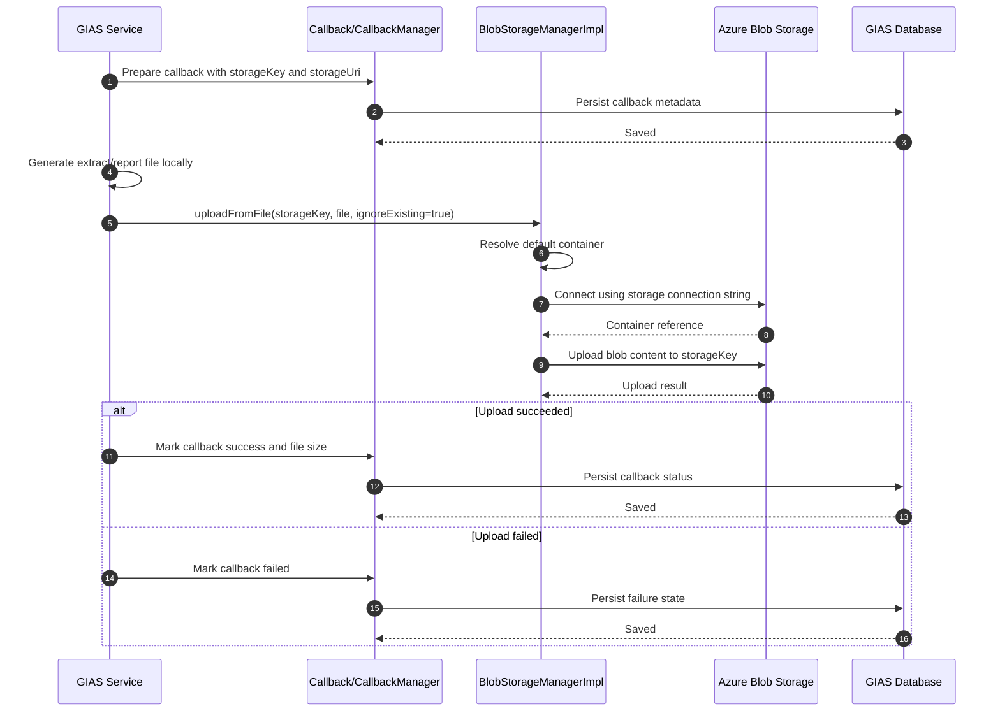
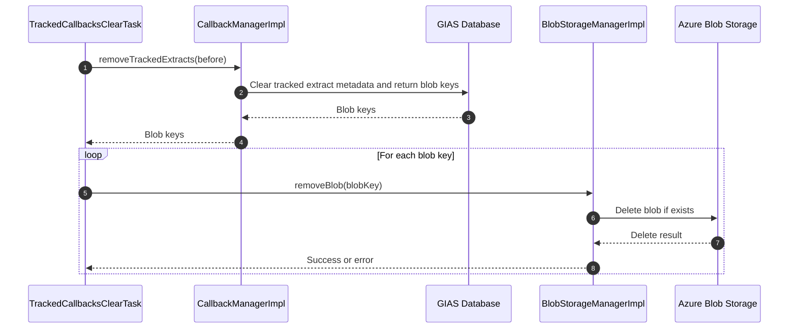

# Azure Blob Storage Integration

## Overview

Azure Blob Storage is the main external store for generated extract and report files.

The integration is used to:

- Upload generated files to blob storage
- Download blobs as files, text, or streams
- Check whether blobs exist
- Remove blobs
- Clear blob directories by prefix
- Generate storage keys and storage URIs for callback-based extract/report delivery


## Main Classes

### Storage abstraction

- `BlobStorageManager`
- `BlobStorageManagerImpl`

This is the main abstraction used by application code. It supports:

- `uploadFromFile`
- `uploadFromText`
- `uploadFromStream`
- `downloadBlobAsFile`
- `downloadBlobAsText`
- `downloadBlobToStream`
- `checkExistence`
- `removeBlob`
- `clearDirectory`
- `createStorageKey`
- `createStorageKeyWithDate`

### Configuration

- `BlobStorageConfiguration`
- `applicationContext-extracts.xml`

The main properties used are:

- `microsoft.azure.blob.storage.connectionString`
- `microsoft.azure.blob.storage.containerName`
- `microsoft.azure.blob.storage.containerUri`
- `microsoft.azure.blob.storage.clientExecutionTimeoutMsec`

### Callback and cleanup flows

- `Callback`
- `CallbackManagerImpl`
- `TrackedCallbacksClearTask`
- `ClearTempFolderBlobManagerImpl`

These classes tie blob storage to the lifecycle of generated output files.

## Configuration and Authentication

The blob integration is configured in `applicationContext-extracts.xml`

```xml
<bean id="blobStorageConfiguration" class="com.texunatech.utils.azure.blobstorage.BlobStorageConfiguration">
    <property name="connectionString" value="${microsoft.azure.blob.storage.connectionString}"/>
    <property name="containerName" value="${microsoft.azure.blob.storage.containerName}"/>
    <property name="containerUri" value="${microsoft.azure.blob.storage.containerUri}"/>
    <property name="clientExecutionTimeoutMsec" value="${microsoft.azure.blob.storage.clientExecutionTimeoutMsec}"/>
</bean>
```

Authentication to Azure Blob Storage is handled through an Azure Storage connection string

The default container is also configured centrally and used by `BlobStorageManagerImpl` unless a container name is explicitly passed.

## How Blob Access Works

`BlobStorageManagerImpl` uses Azure Storage SDK types such as:

- `CloudBlobClient`
- `CloudBlobContainer`
- `CloudBlockBlob`
- `CloudBlobDirectory`

The implementation:

- Resolves the target container
- Verifies the container exists
- Performs uploads, downloads, or deletions
- Logs Azure storage errors and rethrows them where appropriate

## Storage Key Generation

The integration uses generated storage keys for extract/report storage.

`BlobStorageManagerImpl` supports:

- `createStorageKey(...)`
- `createStorageKeyWithDate(...)`

These methods build keys using:

- Legacy vs REST extract prefixes
- An optional sub-prefix
- Optionally a date segment
- Optionally the full container URI

This allows callbacks and extracts to store both:

- A relative storage key
- A fully qualified storage URI

## Callback-Based Storage Model

The `Callback` entity stores blob-related metadata such as:

- `storageType`
- `storageKey`
- `storageUri`
- `dataSize`

The default storage type is:

- `AZURE_BLOB`

This means generated extracts and reports can be tracked in the application database while their file data lives in blob storage.

## Upload Use Cases

The Companies House MAT closure report generation flow in:

- `EdubaseCompaniesHouseUpdateManager`

This code:

- Generates a local CSV report
- Marks the callback as successful
- Uploads the report file using:
  - `blobStorageManager.uploadFromFile(callback.getStorageKey(), newReport.toFile(), true)`

This business logic produces the local file first and then pushes it to blob storage.

## Cleanup Flows

There are two not cleanup mechanisms.

### Tracked callback cleanup

`TrackedCallbacksClearTask`

- Removes tracked extract metadata older than a cutoff
- Receives a list of blob keys from `CallbackManager`
- Deletes those blobs from Azure Blob Storage using `blobStorageManager.removeBlob(...)`

### Local temp file cleanup

`ClearTempFolderBlobManagerImpl`

- Does not remove blobs from Azure directly
- Cleans local temporary files created during blob download or processing
- Deletes temp files such as `blobTmp*`

## Sequence Diagram



## Cleanup Sequence Diagram



