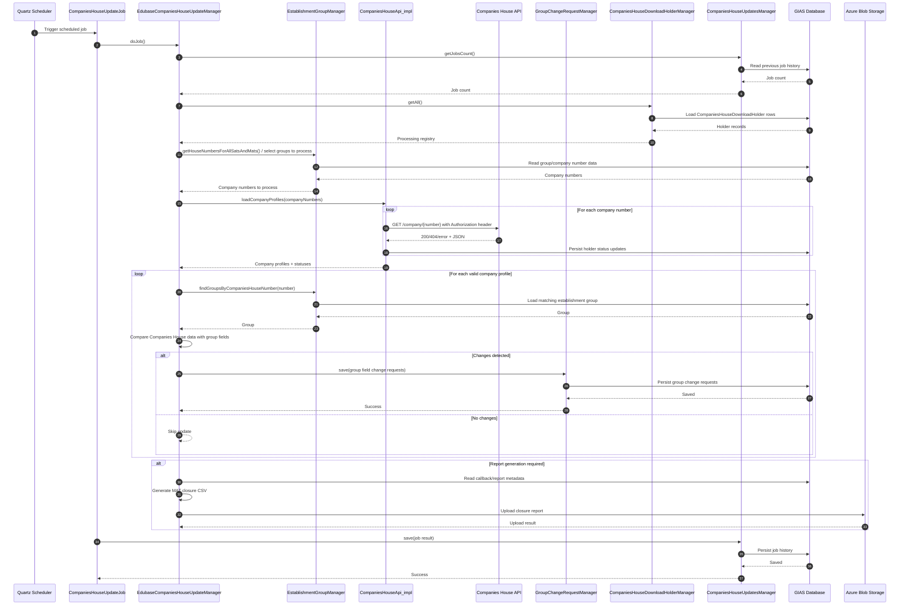

# Companies House Integration

## Overview

The GIAS back end service integrates with Companies House. This is to primarily to keep GIAS establishment group records, especially SATs and MATs, aligned with company data held by Companies House.

There are two Companies House integration paths in the codebase:

1. **Primary scheduled integration**
   - Uses the Companies House REST API
   - Reads Companies House numbers for relevant establishment groups
   - Runs as a Quartz scheduled job
   - Updates internal group records by creating group change requests
   - Generates a MAT closure report and uploads it to blob storage

2. **Older or alternate XML integration**
   - Uses `CompaniesHouseNumberProviderImpl`
   - Fetches XML and parses it with SAX
   - Present in the codebase, but the main operational trust/group sync appears to use the REST API path

## Main Classes

### Scheduled job orchestration

- `CompaniesHouseUpdateJob`
- `applicationContext-quartz.xml`
- `applicationContext-companiesHouseUpdate.xml`

This job is triggered on a cron schedule from the `companies.house.update.schedule` property.

### Core update manager

- `EdubaseCompaniesHouseUpdateManager`

This class coordinates the end-to-end process:

- Selects which Companies House numbers need processing
- Calls the Companies House API
- Uses basic auth
- Compares returned company data with current GIAS group data
- Creates `GroupChangeRequest` objects for changed fields
- Records processing outcomes
- Generates a MAT closure report

### Companies House API client

- `CompaniesHouseApi_impl`

This class:

- calls `https://api.companieshouse.gov.uk/company/{number}`
- sends an `Authorization` header using the configured API key
- parses JSON into `SimplifiedCompanyProfile`
- rate-limits requests to avoid Companies House throttling
- records response status per company number

### Persistence and tracking

- `CompaniesHouseDownloadHolder`
- `CompaniesHouseDownloadHolderManagerImpl`
- `CompaniesHouseUpdatesManagerImpl`

These classes track:

- which company numbers have been processed
- whether the last attempt succeeded, failed, or was not found
- job history and retry cycles
- closure metadata used in reporting

## What Data Is Updated

The scheduled sync compares Companies House data to the current GIAS establishment group record and may update fields such as:

- `GroupName`
- `OpenDate`
- `GroupPostcode`
- `GroupStreet`
- `GroupTown`
- `GroupLocality`

The manager does not update the group directly. Instead, it creates `GroupChangeRequest` records through `GroupChangeRequestManager`, which keeps the update aligned with the system's existing change-management model.

## Reporting and Blob Storage

When the job cycle resets or reaches its retry threshold, the system generates a MAT closure report.

This happens in:

- `EdubaseCompaniesHouseUpdateManager`
The report:

- is written as CSV
- is associated with a callback record
- is uploaded to Azure Blob storage via `BlobStorageManager`

This is used to report groups that are still open in GIAS but appear closed or inactive in Companies House.

## Sequence Diagram

## Older XML-Based Integration

There is also older Companies House code under:

- `CompaniesHouseNumberProviderImpl`
That implementation:

- builds a URL from configuration
- downloads XML
- parses it with a SAX handler into `CompaniesHouseData`

This appears to be separate from the main scheduled SAT/MAT sync flow, which now uses the JSON REST API client in `CompaniesHouseApi_impl`.

