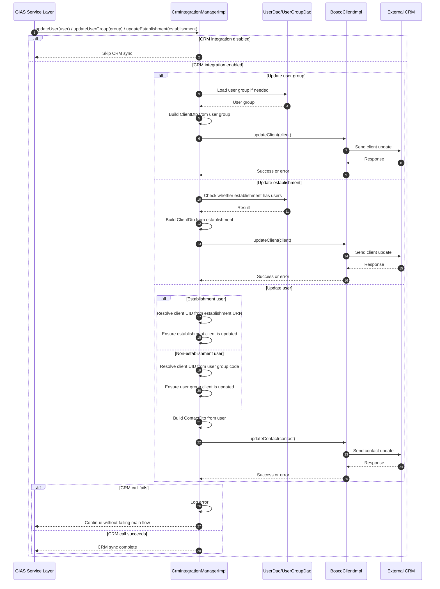

# CRM Integration

## Overview

This system integrates with an external CRM to keep client and contact records aligned with GIAS users, user groups, and establishments.

The integration is outbound from GIAS to CRM. It is used when:

- A user is created or updated
- A user group is created or updated
- An establishment is created or updated, where relevant

The implementation uses a CRM client called `BoscoClient`.

## Main Classes

### CRM integration manager

- `CrmIntegrationManager`
- `CrmIntegrationManagerImpl`

This is the main integration entry point. It is responsible for:

- Deciding whether CRM integration is enabled
- Constructing CRM client and contact payloads
- Pushing user groups to CRM as clients
- Pushing establishments to CRM as clients
- Pushing users to CRM as contacts

### Spring configuration

- `applicationContext-integration.xml`

This wires the CRM manager with:

- `crm.integration.enabled`
- `crm.wsdl.url`
- `crm.ws.username`
- `crm.ws.password`

## What Gets Sent to CRM

### User groups

User groups are pushed to CRM as client records.

For non-establishment user groups, the CRM client includes:

- Customer code
- Client type code derived from the internal user role
- Project UID
- Group code as client UID
- Group name

### Establishments

Establishments are also pushed to CRM as client records.

The CRM client includes:

- Establishment URN as client UID
- Establishment name
- Head office address
- Main email
- Main phone
- Website

### Users

Users are pushed to CRM as contact records.

The CRM contact includes:

- Username as contact UID
- Linked client UID
- First name
- Last name
- Email
- Phone
- Status, mapped to `ACTIVE` or `INACTIVE`

The target client UID depends on the user type:

- Establishment users are linked to their establishment URN
- Other users are linked to their user group code

## Role Mapping

The CRM integration maps internal user roles to CRM client type codes in `CrmIntegrationManagerImpl`:

- `ROLE_BACKOFFICE` -> `CMT`
- `ROLE_PRISM` -> `CST`
- `ROLE_STAKEHOLDER` -> `COM`
- `ROLE_ESTABLISHMNET` -> `EST`

If a role is not explicitly mapped, the integration falls back to:

- `OTH`

## Authentication

The CRM client is initialized with:

- WSDL location
- username
- password

This happens in [`CrmIntegrationManagerImpl`](C:/code/gias-dd-backend/src/main/java/com/texunatech/edubase/integration/crm/CrmIntegrationManagerImpl.java) when it constructs:

- `BoscoClientImpl(wsdlLocation, username, password)`

The CRM integration authenticates using configured credentials supplied to the Bosco CRM client.

## Enablement and Error Handling

The integration is gated by:

- `crm.integration.enabled`

If integration is disabled, the CRM manager exits without calling CRM.

If CRM calls fail:

- Errors are logged
- The application generally continues
- Some exception email code exists but is commented out in the current implementation

This means CRM sync failures are treated as non-fatal to the main GIAS transaction flow.

## Sequence Diagram

