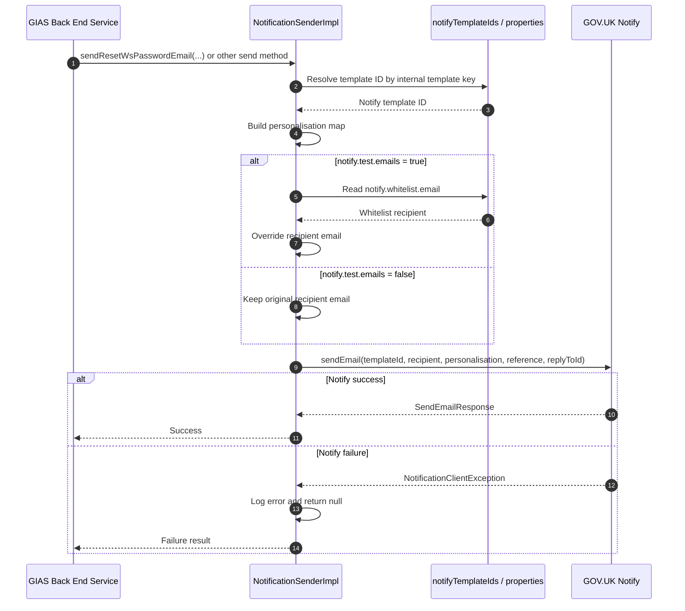

# GOV.UK Notify Integration

## Overview

GOV.UK Notify is used for  outbound email delivery.

The integration is implemented as a central notification service that:

- Selects a configured `NotificationClient`
- Resolves a Notify template ID
- Builds a personalisation map
- Sends the email through GOV.UK Notify

The Notify client has the following configurations:

- Production
- Whitelist
- Test

## Main Classes

### Spring configuration

- `applicationContext-email-notify.xml`

This file wires:

- `notifyMailSender`
- `notificationSender`
- The map of Notify template IDs

### Notify client factory

- `NotificationClientFactoryBean`

This chooses which `NotificationClient` to expose based on:

- `notify.mail.sender`

Supported modes are:

- `mailSenderProd`
- `mailSenderWhiteList`
- `mailSenderTest`

### Sender abstraction

- `NotificationSender`
- `NotificationSenderImpl`

This is the main application-facing integration layer. It contains many explicit methods for different notification types, such as:

- Welcome emails
- Password reset emails
- WS password reset emails
- Exception notifications
- Feedback notifications
- Bulk update notifications
- Reminder notifications
- Account expiry warnings
- Scheduled extract failure emails

## Configuration

The integration is configured in `applicationContext-email-notify.xml` using:

- `notify.mail.sender`
- `notify.api.key.production`
- `notify.api.key.whitelist`
- `notify.api.key.test`

It also defines a `notifyTemplateIds` map containing all Notify template IDs keyed by internal template names such as:

- `welcomeEmail`
- `resetWsPasswordEmail`
- `scheduleExtractFailure`
- `userAccountExpiresNotification`

## Authentication

Authentication with GOV.UK Notify is done by constructing the Notify client with an API key.

In `applicationContext-email-notify.xml`, each `NotificationClient` is created with a single constructor argument:

- production API key
- whitelist API key
- test API key

`NotificationClientFactoryBean` then selects which notification client to use.

## Runtime Sending Flow

At runtime, a business service calls a method on `NotificationSender`.

For example, `UserManagerImpl` calls:

- `notificationSender.sendResetWsPasswordEmail(...)`

The sender implementation then:

1. Resolves the internal template key to a GOV.UK Notify template ID
2. Builds the personalisation map
3. Chooses the configured recipient behavior
4. Calls `notificationClient.sendEmail(...)`

## Recipient Override Behavior

`NotificationSenderImpl` contains a test-email override:

- If `notify.test.emails` is `true`
- The real recipient is replaced with `notify.whitelist.email`

This means non-production or controlled test modes can force all emails to a safe address.

## Error Handling

If a Notify call fails:

- `NotificationSenderImpl` catches `NotificationClientException`
- Logs the error
- Returns `null`

In other words, Notify failures are generally logged rather than thrown back as hard errors from the sender itself.

## Sequence Diagram

