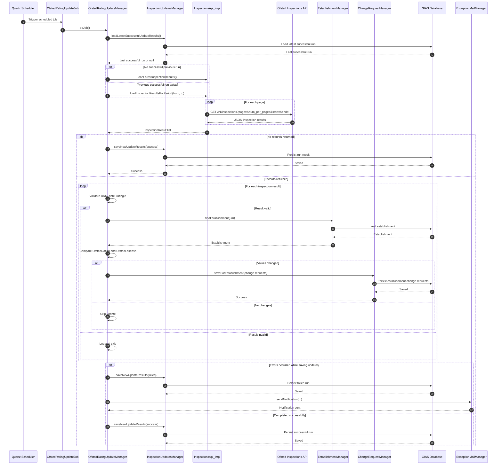

# Ofsted Integration

## Overview

The Ofsted integration is a scheduled pull of inspection results from Ofsted's inspections API, followed by internal change requests against establishment records.

The integration updates two main pieces of establishment data:

- `OfstedRating`
- `OfstedLastInsp`

It does not write these fields directly. Instead, it creates establishment change requests so the update follows the application's existing controlled change model.

## Main Classes

### Scheduled job orchestration

- [`OfstedRatingUpdateJob`](C:/code/gias-dd-backend/src/main/java/com/texunatech/edubase/service/quartz/OfstedRatingUpdateJob.java)
- [`applicationContext-quartz.xml`](C:/code/gias-dd-backend/src/main/resources/applicationContext-quartz.xml)
- [`applicationContext-ofstedRatingUpdate.xml`](C:/code/gias-dd-backend/src/main/resources/applicationContext-ofstedRatingUpdate.xml)

The job runs on the cron schedule defined by `ofsted.rating.update.schedule`.

### Core update manager

- [`OfstedRatingUpdateManager`](C:/code/gias-dd-backend/src/main/java/com/texunatech/edubase/service/establishment/ofsted/OfstedRatingUpdateManager.java)

This class:

- Determines the date range to request from the upstream API
- Validates returned inspection results
- Maps Ofsted inspection data to internal GIAS fields
- Loads the corresponding establishment by URN
- Creates establishment change requests where values differ
- Records job results
- Sends failure notifications by email

### Upstream Ofsted API client

- `InspectionsApi`
- `InspectionsApi_impl`

This client:

- Calls `https://inspections.api.beta.ofsted.gov.uk/v1/inspections`
- No authentication require, public api
- Uses paging with `page` and `num_per_page`
- Filters by `start` and `end` date
- Pages through the full result set
- Filters results to records where `urnQualifier == "ELS"`
- Enforces a timeout for the background fetch

### Job result persistence

- `InspectionUpdates`
- `InspectionUpdatesManager`
- `InspectionUpdatesManagerImpl`

These classes persist:

- Run date
- Whether the job failed
- Error text for failed runs

## How the Sync Window Works

The manager first checks the most recent successful update run.

- If there has been no successful run, it fetches the latest inspection results for the previous day only.
- If there has been a successful run, it fetches results from the last successful run date up to today.
- If the last successful run was more than 7 days ago, it limits the request window to the last 7 days.

This logic is implemented in `OfstedRatingUpdateManager`.

## What the Upstream API Returns

The integration expects inspection results containing at least:

- `urn`
- `inspectionDate`
- `ratingId`
- `urnQualifier`

Only results with `urnQualifier == "ELS"` are processed.

The API client retrieves these using:

- `GET https://inspections.api.beta.ofsted.gov.uk/v1/inspections`

with query parameters such as:

- `page`
- `num_per_page`
- `start`
- `end`

## Mapping to Internal Fields

The manager maps Ofsted judgement IDs to internal `OfstedRating` values as follows:

- `1` -> `OUTSTANDING`
- `2` -> `GOOD`
- `4` -> `INADEQUATE`
- `5` -> `REQUIRES_IMPROVEMENT`

If the returned value cannot be mapped, the result is treated as invalid and skipped.

The inspection date is parsed and mapped to:

- `OfstedLastInsp`

## How Records Are Updated

For each valid result:

1. The system parses the URN and loads the matching establishment.
2. It compares:
   - existing `OfstedRating`
   - existing `OfstedLastInsp`
3. If either value differs, it creates one or more `ChangeRequest` objects.
4. It groups requests by establishment URN.
5. It saves them through `ChangeRequestManager.saveForEstablishment(...)`.

This means the Ofsted integration participates in the standard GIAS change workflow.
## Failure Handling

If the job fails:

- The failure is recorded in `InspectionUpdates`
- An email notification is sent via `ExceptionMailManager`
- The recipient comes from `${inspectionsUpdateJob.email}`

If the upstream API returns no results, the job records a non-failed run and exits without creating any change requests.

## Sequence Diagram

