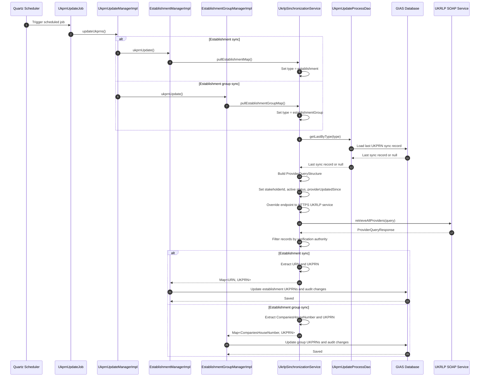

# UK Register of Learning Providers (UKRLP) Integration

## Overview

This system integrates with UKRLP to retrieve UK Provider Reference Number (UKPRN) mappings for:

- Establishments
- Establishment groups

The integration is implemented as a SOAP client and is used to pull provider records from UKRLP

It links:

- Estblishments URNs to UKPRNs
- Companies House numbers to UKPRNs

## Main Classes

### SOAP synchronization service

- `UkrlpSinchronizationService`

This is the main integration class. It:

- Connects to the UKRLP SOAP service
- No application level authentication
- Requests provider records updated since the last sync point
- Filters records by verification authority
- Builds internal maps for establishments and establishment groups

### Base SOAP client support

- `BaseWebServiceSynchronizationService`

This provides the shared SOAP client setup used by the synchronization service.

### Sync tracking

- `UkprnUpdateProcessDao`
- `UkprnUpdateProcess`

These are used to determine the last sync point for each sync type.

## Upstream Service

The integration uses the UKRLP SOAP service defined by:

- `${ukrlp.ws.wsdl.address}`

and forces the runtime endpoint to:

- `${ukrlp.ws.endpoint}`

with a default of:

- `https://webservices.ukrlp.co.uk/UkrlpProviderQueryWS6/ProviderQueryServiceV6`

This is configured and used in `UkrlpSinchronizationService`

## What the Service Pulls

The service supports two main pull modes:

- `pullEstablishmentMap()`
  - returns `Map<Long, Integer>`
  - maps `URN -> UKPRN`

- `pullEstablishmentGroupMap()`
  - returns `Map<String, Integer>`
  - maps `CompaniesHouseNumber -> UKPRN`

Both methods call a shared `pullAll(...)` method and then transform the provider records returned by UKRLP.

## How the Filtering Works

The service filters provider records by verification authority:

- Establishments use `DfE (Schools Unique Reference Number)`
- Establishment groups use `Companies House`

It also filters by:

- Active provider status: `A`
- Stakeholder id from `${ukrlp.ws.wsdl.stakeholder}`
- Updated-since date from the last recorded sync

Integration is incremental, does not peform a full historical pull.

## Sync Window Logic

For each sync type:

- `establishment`
- `establishmentGroup`

the service checks the most recent `UkprnUpdateProcess` record.

If one exists:

- It uses that record's `sinceDate` as `providerUpdatedSince`

If one does not exist:

- It uses a very early default date so the query can return the full applicable dataset

The query id is also derived from the last process record.

## Authentication

Implementation `UkrlpSinchronizationService`, does not have any explicit username/password or token handling.

The service:

- Creates the SOAP port from the WSDL
- Overrides the endpoint URL
- Submits the `retrieveAllProviders` request

## Sequence Diagram

