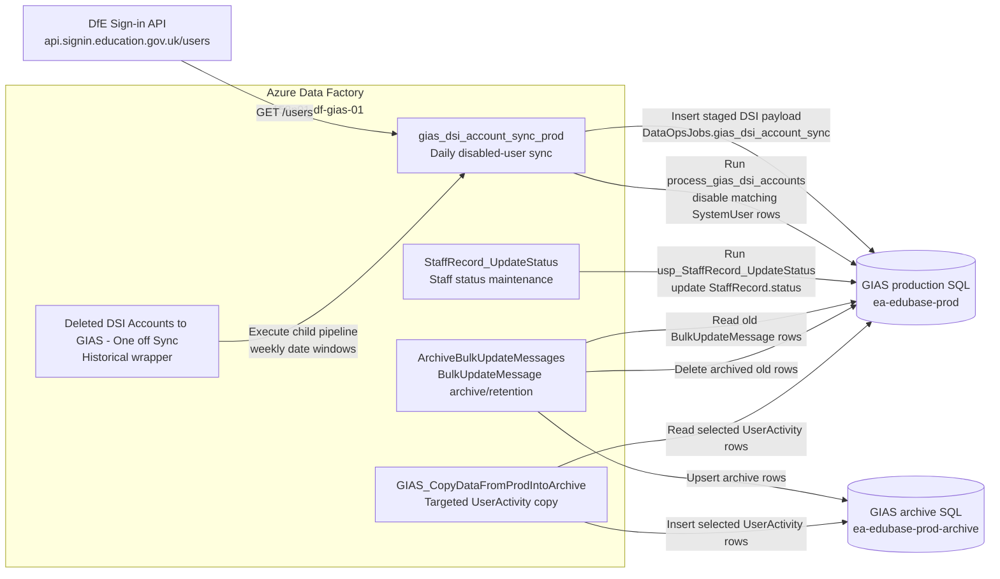

# S158 Data Factory Setup

This document describes the Azure Data Factory setup captured for Get Information about Schools production.

The Data Factory is `s158p01-df-gias-01` in resource group `s158p01-rg-dd-adf`. It contains five visible pipelines. The setup is pipeline, copy-activity and SQL stored-procedure based; no Data flows, Power Query resources or Change Data Capture resources were visible in the captured Factory Resources view.

Do not record secrets, keys, connection string values, passwords or tokens in this document.

## Overall Interpretation

Based on the captured configuration, `s158p01-df-gias-01` appears to be used as an internal scheduler and orchestration tool for maintaining GIAS data in `ea-edubase-prod-srv.database.windows.net`.

The visible pipelines either:

- Pull controlled internal source data into GIAS SQL and run SQL-side maintenance.
- Archive or copy rows from `ea-edubase-prod` to `ea-edubase-prod-archive`.
- Execute stored procedures that update operational GIAS SQL records.

The captured ADF setup is not the mechanism used by any external analytics system to consume GIAS data. No file/blob output datasets, S158 storage output, external-consumer delivery pipelines, data flows, Power Query resources, or API-facing export pattern were visible in the captured ADF evidence.

## High-Level Pipeline View



The diagram shows the important boundary: ADF is orchestrating reads and writes against GIAS SQL databases, plus one inbound DfE Sign-in API call. There are no outbound file, storage, analytics or external-consumer paths

## Pipeline Catalogue

| Pipeline | Brief description | Current status / interpretation |
| --- | --- | --- |
| `gias_dsi_account_sync_prod` | Daily sync from DfE Sign-in into GIAS for disabled-user processing. | Active scheduled production pipeline. |
| `Deleted DSI Accounts to GIAS - One off Sync` | Historical/backfill wrapper that runs `gias_dsi_account_sync_prod` over weekly date windows. | One-off/manual/historical pipeline; no recent trigger/run evidence captured. |
| `ArchiveBulkUpdateMessages` | Archives old bulk-update messages from production SQL to archive SQL, then deletes old production rows. | Active scheduled archive/retention pipeline. |
| `GIAS_CopyDataFromProdIntoArchive` | Copies selected `UserActivity` rows for a supplied username from production SQL to archive SQL. | Likely manual/support or historical utility; no recent trigger/run evidence captured. |
| `StaffRecord_UpdateStatus` | Runs SQL maintenance to mark staff records inactive when their step-down date has passed. | Active scheduled production maintenance pipeline. |

## Factory Overview

| Item | Value |
| --- | --- |
| Data Factory | `s158p01-df-gias-01` |
| Resource group | `s158p01-rg-dd-adf` |
| Subscription | `s158-getinformationaboutschools-production` |
| Tenant | `DfE Platform Identity` / `platform.education.gov.uk` |
| Location | `westeurope` |
| Resource type | Data Factory V2 |
| Managed identity | System-assigned |
| Known alert | `GIAS_ADF_FailedPipelineRuns` |

## Shared Connectivity

The Data Factory is a private-network consumer of the DFE T1 GIAS SQL logical server `ea-edubase-prod-srv.database.windows.net`.

| Component | Target | Notes |
| --- | --- | --- |
| Managed private endpoint `GiasConnection-Managedvnetprod` | GIAS SQL target in `rg-t1pr-edubase` | Captured as `Succeeded` and `Approved`. |
| `GIAS_ProdSQL_AsAzureDB` | `ea-edubase-prod` | Azure SQL Database linked service using `AutoResolveIntegrationRuntime (Managed Virtual Network)`. |
| `GIAS_ArchiveSQL_AsAzureDB` | `ea-edubase-prod-archive` | Azure SQL Database linked service using `AutoResolveIntegrationRuntime (Managed Virtual Network)`. |
| `GIAS_SQL` | `ea-edubase-prod` | SQL Server linked service used by stored-procedure based pipelines. |
| `DSIUsersRest` | `https://api.signin.education.gov.uk/` | REST linked service for DfE Sign-in users API. |
| `GIAS_KeyVault` | Azure Key Vault linked service | Used for credential references; secret values are not documented. |

SQL linked services use SQL authentication with password values held in Azure Key Vault. `DSIUsersRest` shows authentication type `Anonymous`, with an `Authorization` header sourced from Azure Key Vault.

No captured dataset or linked-service evidence shows use of `s158p01sagiasapid01`, `referencedata`, or `submissions`.

## Triggers

| Trigger | Type | Related pipeline | Captured behaviour |
| --- | --- | --- | --- |
| `GIAS_DSI_API_DailyExecution` | Schedule | `gias_dsi_account_sync_prod` | Daily at `20:00` UK local time. Description: `Trigger the disabled users pipeline daily at 8PM`. |
| `trgArchiveBulkUpdateMessages` | Schedule | `ArchiveBulkUpdateMessages` | Started trigger; schedule detail not fully captured in the finished notes. |
| `trgGIAS_StaffRecord_UpdateStatus` | Schedule | `StaffRecord_UpdateStatus` | Runs daily at about `01:00` local time in captured recent runs. |

The captured trigger list did not include `Deleted DSI Accounts to GIAS - One off Sync` or `GIAS_CopyDataFromProdIntoArchive`.

## Datasets

| Dataset | Type | Linked service | Table / source |
| --- | --- | --- | --- |
| `DSIUsersDS` | REST | `DSIUsersRest` | DfE Sign-in `/users` endpoint with dynamic date-window query. |
| `SqlServerTable_gias_dsi_account` | SQL Server | `GIAS_SQL` | `[DataOpsJobs].[gias_dsi_account_sync]` in `ea-edubase-prod`. |
| `dsGIASProd_BulkUpdateMessage` | Azure SQL Database | `GIAS_ProdSQL_AsAzureDB` | `[dbo].[BulkUpdateMessage]` in `ea-edubase-prod`. |
| `dsGIASArchive_BulkUpdateMessage` | Azure SQL Database | `GIAS_ArchiveSQL_AsAzureDB` | `[dbo].[BulkUpdateMessage]` in `ea-edubase-prod-archive`. |
| `dsGIASProd_UserActivity` | Azure SQL Database | `GIAS_ProdSQL_AsAzureDB` | `[dbo].[UserActivity]` in `ea-edubase-prod`. |
| `dsGIASArchive_UserActivity` | Azure SQL Database | `GIAS_ArchiveSQL_AsAzureDB` | `[dbo].[UserActivity]` in `ea-edubase-prod-archive`. |

## Pipeline Details

### `gias_dsi_account_sync_prod`

**Purpose:** synchronises disabled DfE Sign-in users into GIAS by staging API data and disabling matching GIAS users.

**Activities**

| Order | Activity | Type | Behaviour |
| --- | --- | --- | --- |
| 1 | `DSIRest_To_GIASDB` | Copy data | Calls DfE Sign-in REST API and inserts response data into SQL staging. |
| 2 | `Process_DSI_Users` | Stored procedure | Executes `[DataOpsJobs].[process_gias_dsi_accounts]` after the copy succeeds. |

**Consumes**

The source dataset is `DSIUsersDS`, backed by `DSIUsersRest`.

The captured relative URL expression is:

```text
@concat('https://api.signin.education.gov.uk/users?page=1&pageSize=1000&status=0&from=', uriComponent(dataset().StartDate) , '&to=', uriComponent(dataset().EndDate))
```

The request uses:

| Parameter | Meaning |
| --- | --- |
| `page=1` | Starts from page 1. |
| `pageSize=1000` | Requests up to 1000 users per page. |
| `status=0` | Filters DfE Sign-in users by status; exact business meaning still needs confirmation. |
| `from` | Dataset `StartDate` parameter. |
| `to` | Dataset `EndDate` parameter. |

The copy activity uses `GET` and has RFC5988 pagination enabled.

**Stages**

The sink dataset is `SqlServerTable_gias_dsi_account`, targeting `[DataOpsJobs].[gias_dsi_account_sync]`.

| REST response field | SQL column |
| --- | --- |
| `users` | `Data` |
| `numberOfRecords` | `numberOfRecords` |
| `page` | `page` |
| `numberOfPages` | `numberOfPages` |

The `Data` column stores a JSON array of DfE Sign-in user records. The payload includes user identity fields, organisation details, role assignments and user status. Personal data values are not recorded here.

**Performs**

The stored procedure `[DataOpsJobs].[process_gias_dsi_accounts]`:

- Selects the latest row from `[DataOpsJobs].[gias_dsi_account_sync]`;
- Parses the `Data` JSON with `OPENJSON`;
- Extracts `roleName`, `userId`, `email`, `givenName`, and `familyName`;
- Matches `dbo.SystemUser` by email where an enabled GIAS user exists;
- Disables matching GIAS users by setting `dbo.SystemUser.enabled = 0`;
- Logs one row per parsed DfE Sign-in user to `[DataOpsJobs].[gias_dsi_account_sync_Log]`;
- Deletes sync and log records older than one year.

The procedure does not create users, re-enable users, update roles, update organisations, or update permissions.

**Writes / Mutates**

| Target | Effect |
| --- | --- |
| `[DataOpsJobs].[gias_dsi_account_sync]` | Inserts staged API payload and paging metadata. |
| `[dbo].[SystemUser]` | Sets `[enabled] = 0` for matching email addresses. |
| `[DataOpsJobs].[gias_dsi_account_sync_Log]` | Inserts processing log rows. |
| `[DataOpsJobs].[gias_dsi_account_sync]` / log table | Deletes records older than one year. |

**Schedule / Runtime**

The pipeline is triggered by `GIAS_DSI_API_DailyExecution` daily at `20:00` UK local time. Recent captured successful runs usually completed in roughly two to five minutes. One captured run on 2026-05-04 failed on the REST source side with a DfE Sign-in HTTP 500; failure-mode investigation was out of scope.

### `Deleted DSI Accounts to GIAS - One off Sync`

**Purpose:** historical/backfill orchestration for the DSI disabled-account sync.

This pipeline does not perform its own REST or SQL processing. It loops over historical date windows and calls `gias_dsi_account_sync_prod`.

**Pipeline Variables**

| Variable | Type | Default value |
| --- | --- | --- |
| `CurrentStartDate` | `String` | `2024/02/01` |
| `CurrentEndDate` | `String` | `2024/02/07` |
| `LoopStartDate` | `String` | None |
| `LoopEndDate` | `String` | None |

**Activities**

The top-level activity is an `Until` activity named `Loop from StartDate to EndDate`.

Inside the loop:

| Order | Activity | Type | Behaviour |
| --- | --- | --- | --- |
| 1 | `Execute GIAS DSI Sync Pipeline` | Execute pipeline | Calls `gias_dsi_account_sync_prod` and waits for completion. |
| 2 | `Increment StartDate` | Set variable | Adds seven days to `CurrentStartDate`. |
| 3 | `Set CurrentStartDate` | Set variable | Copies `LoopStartDate` into `CurrentStartDate`. |
| 4 | `Increment EndDate` | Set variable | Adds seven days to `CurrentEndDate`. |
| 5 | `Set CurrentEndDate` | Set variable | Copies `LoopEndDate` into `CurrentEndDate`. |

The loop condition is:

```text
@greaterOrEquals(formatDateTime(variables('CurrentEndDate'),'yyyy/MM/dd'), formatDateTime('2025/03/18','yyyy/MM/dd'))
```

**Child Pipeline Call**

| Field | Value |
| --- | --- |
| Child pipeline | `gias_dsi_account_sync_prod` |
| Wait on completion | `true` |
| `StartDate` parameter | `@variables('CurrentStartDate')` |
| `EndDate` parameter | `@variables('CurrentEndDate')` |

**Consumes / Writes**

This pipeline indirectly consumes and mutates the same data as `gias_dsi_account_sync_prod`. Each loop iteration runs the child pipeline for the current weekly date window.

**Schedule / Runtime**

No recent trigger or last-7-days run evidence was captured. The name, date range and absence from the captured trigger/run views support treating it as a one-off/manual/historical backfill pipeline unless owner evidence says otherwise.

### `ArchiveBulkUpdateMessages`

**Purpose:** archive old bulk update processing messages from production into archive, then remove the old production rows.

**Activities**

| Order | Activity | Type | Behaviour |
| --- | --- | --- | --- |
| 1 | `SetCutoffUtc` | Set variable | Sets `CutoffUtc` to current UTC time minus one year. |
| 2 | `WakeArchiveDB` | Lookup | Runs `SELECT 1;` against the archive dataset. |
| 3 | `CopyBulkUpdateMessages` | Copy data | Copies qualifying rows from production to archive. |
| 4 | `DeleteFromProd` | Stored procedure | Deletes old production rows using the same cutoff. |

**Cutoff**

```text
@formatDateTime(addToTime(utcNow(),-1,'Year'),'yyyy-MM-ddTHH:mm:ss')
```

**Consumes**

Source dataset: `dsGIASProd_BulkUpdateMessage`, table `[dbo].[BulkUpdateMessage]` in `ea-edubase-prod`.

Source query:

```sql
SELECT
    id,
    [message],
    [time],
    bulkUpdate_id,
    skipped
FROM dbo.BulkUpdateMessage
WHERE [time] < CONVERT(datetime,'@{variables('CutoffUtc')}');
```

`dbo.BulkUpdateMessage` contains establishment-level bulk update processing and validation messages, including skipped updates, invalid values, not-found records and no-change outcomes.

**Performs**

`WakeArchiveDB` runs a lightweight `SELECT 1;` against `dsGIASArchive_BulkUpdateMessage`. This appears to wake or validate the archive database before the copy.

`CopyBulkUpdateMessages` writes rows to archive via stored procedure sink:

| Field | Value |
| --- | --- |
| Sink dataset | `dsGIASArchive_BulkUpdateMessage` |
| Write behaviour | Stored procedure |
| Stored procedure | `dbo.ArchiveBulkUpdateMessages_Upsert` |
| Table type | `dbo.ArchiveBulkUpdateMessages_TVP` |
| Table type parameter | `Rows` |

`DeleteFromProd` then calls:

| Field | Value |
| --- | --- |
| Linked service | `GIAS_ProdSQL_AsAzureDB` |
| Stored procedure | `dbo.ArchiveBulkUpdateMessages_DeleteOlderThan` |
| Parameter | `CutoffUtc` |

**Writes / Mutates**

| Target | Effect |
| --- | --- |
| Archive `[dbo].[BulkUpdateMessage]` | Upserts qualifying old rows into `ea-edubase-prod-archive`. |
| Production `[dbo].[BulkUpdateMessage]` | Deletes rows older than `CutoffUtc` after archive copy succeeds. |

**Schedule / Runtime**

The pipeline is related to started trigger `trgArchiveBulkUpdateMessages`. A captured recent successful run on 2026-05-02 took about six and a half minutes.

### `GIAS_CopyDataFromProdIntoArchive`

**Purpose:** copy selected `UserActivity` rows from production into archive.

The captured configuration is targeted to one `UserActivity_Username` parameter, not a general date-based archival pipeline.

**Activities**

| Order | Activity | Type | Behaviour |
| --- | --- | --- | --- |
| 1 | `Copy data from Prod into Archive` | Copy data | Copies matching `UserActivity` rows from production to archive. |

**Parameter**

| Parameter | Type | Notes |
| --- | --- | --- |
| `UserActivity_Username` | `String` | Used to filter production `UserActivity` rows. |

**Consumes**

Source dataset: `dsGIASProd_UserActivity`, table `[dbo].[UserActivity]` in `ea-edubase-prod`.

Source query:

```sql
select *
FROM UserActivity
where user_username = '@{pipeline().parameters.UserActivity_Username}'
```

Captured source columns:

| Column | Type |
| --- | --- |
| `id` | `decimal` |
| `date` | `datetime` |
| `type` | `nvarchar` |
| `user_username` | `nvarchar` |
| `details` | `nvarchar` |

**Writes**

Sink dataset: `dsGIASArchive_UserActivity`, table `[dbo].[UserActivity]` in `ea-edubase-prod-archive`.

Column mapping is direct:

| Source | Destination |
| --- | --- |
| `id` | `id` |
| `date` | `date` |
| `type` | `type` |
| `user_username` | `user_username` |
| `details` | `details` |

No production delete or mutation step is visible in the captured pipeline.

**Schedule / Runtime**

No trigger was captured for this pipeline, and it did not appear in the captured last-7-days pipeline runs. Treat it as likely manual/support or historical unless wider run history or owner evidence says otherwise.

### `StaffRecord_UpdateStatus`

**Purpose:** daily SQL maintenance for staff-record status.

**Activities**

| Order | Activity | Type | Behaviour |
| --- | --- | --- | --- |
| 1 | `Exec-usp_StaffRecord_UpdateStatus` | Stored procedure | Executes `[dbo].[usp_StaffRecord_UpdateStatus]` in `ea-edubase-prod`. |

The pipeline has no visible parameters or variables in the captured view.

**Consumes**

The ADF activity uses linked service `GIAS_SQL` and calls `[dbo].[usp_StaffRecord_UpdateStatus]`.

The procedure reads `[dbo].[StaffRecord]`, specifically:

- Column `[stepdownDate]`;
- Column `[status]`.

It also writes a run record to `[dbo].[AzureSQLMaintenanceLog]`.

**Performs**

The stored procedure:

- Inserts a maintenance-log row for `exec dbo.usp_StaffRecord_UpdateStatus`;
- Sets `@CurrentDate` to `cast(GetDate() as date)`;
- Updates `[dbo].[StaffRecord]`;
- Targets rows where `[stepdownDate] IS NOT NULL`, `[stepdownDate] < @CurrentDate`, and `[status] = 1`;
- Updates the maintenance-log row with an end time after completion.

The SQL comments say database triggers handle insert/update cases where `[deleted]`, `[forcedArchived]` or `[stepdownDate]` change. The scheduled ADF job handles the daily date-change scenario after midnight.

**Writes / Mutates**

| Target | Effect |
| --- | --- |
| `[dbo].[StaffRecord]` | Sets `[status] = 0` where step-down date is now in the past and current status is `1`. |
| `[dbo].[AzureSQLMaintenanceLog]` | Inserts and completes a maintenance-run log row. |

**Schedule / Runtime**

The pipeline is triggered by `trgGIAS_StaffRecord_UpdateStatus` and ran successfully daily at about `01:00` local time in the captured last-7-days view.

## Remaining Caveats

- The exact business meaning of DfE Sign-in user `status=0` should be confirmed against DfE Sign-in API semantics.
- The exact business meaning of `StaffRecord.status` values `0` and `1` should be confirmed if this document is used for business-process documentation.
- Pipeline `GIAS_CopyDataFromProdIntoArchive` appears manual/support or historical from captured evidence, but wider run history or owner context would be needed to prove it is unused.
- The reason for the `Deleted DSI Accounts to GIAS - One off Sync` backfill range `2024/02/01` to `2025/03/18` has not been confirmed.
- The archive database `ea-edubase-prod-archive` was recorded elsewhere as paused during the wider investigation, which may affect archive-linked pipeline viability.

## Source Material

- See [S158 Data Factory Investigation](../../../docs/infra/s158-data-factory-investigation.md)
- See [ADF Archive BulkUpdateMessages Reference](../../../docs/infra/reference/ADF/adf-archive-BulkUpdateMessages-pipeline.md)
- See [ADF DSI Disabled Accounts Reference](../../../docs/infra/reference/ADF/adf-syncing-disabled-accounts-from-DSI.md)
- See [DataOpsJobs SQL Reference](../../../docs/infra/reference/ADF/create-DataOpsJobs-objects.sql)
- See [StaffRecord SQL Reference](../../../docs/infra/reference/ADF/StaffRecord%20optimisation%20264108.sql)
