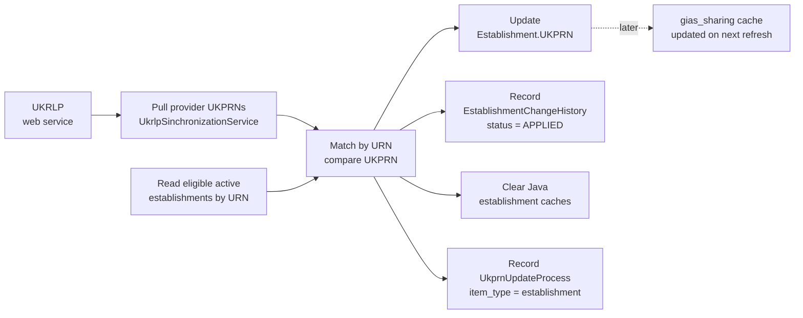
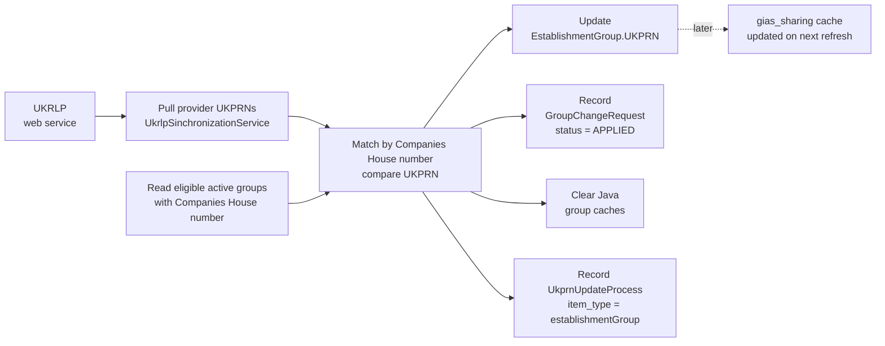
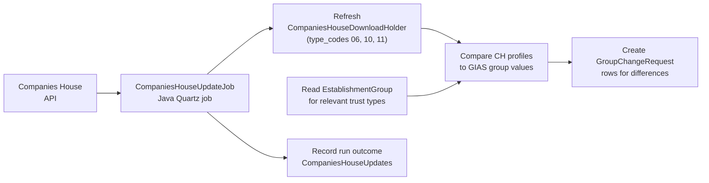
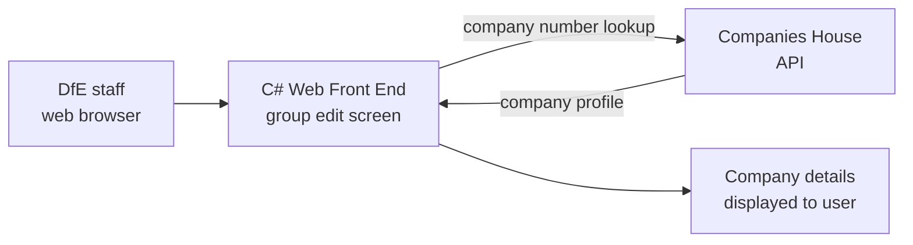
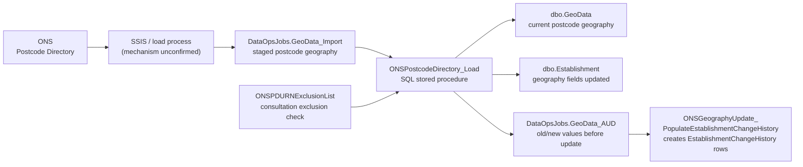
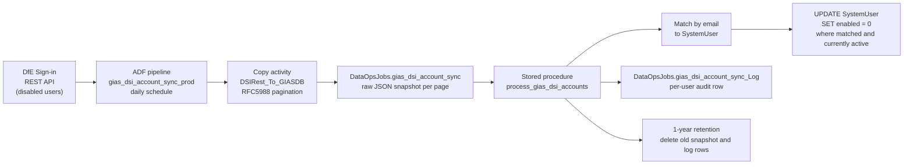

# GIAS Data Flows - Inbound

**Scope:** BAU current state. This document describes how external data enters GIAS. It covers active scheduled and batch import processes only; retired processes are noted at the end.

**Audience:** Technical stakeholders, architects and data owners.

**Related documents:**

- [Data stores catalogue](data-stores-catalogue.md)
- [Data architecture overview](overview.md)
- [Entity-relationship diagram portfolio](../entity-relationship-diagrams/README.md)
- [UKRLP integration](../../../service/back-end-component/integrations/ukrlp-integration.md)
- [S158 Data Factory setup](../../data-factory-setup.md)
- [Geography and postcode imports ERD](../entity-relationship-diagrams/geography-and-postcode-imports.md)
- [Companies House and master provider imports ERD](../entity-relationship-diagrams/companies-house-and-master-provider-imports.md)
- [Companies House integration](../../../service/back-end-component/integrations/companies-house-integration.md)

---

## Summary of Inbound Flows

| Flow | Source | Mechanism | Frequency | Target tables |
|---|---|---|---|---|
| UKPRN sync - establishments | UKRLP web service | Java Quartz job | Nightly (no UKPRN) / Monthly (change check) | `dbo.Establishment`, `dbo.EstablishmentChangeHistory` |
| UKPRN sync - groups | UKRLP web service | Java Quartz job | Same cadence | `dbo.EstablishmentGroup`, `dbo.GroupChangeRequest` |
| Companies House (scheduled) | Companies House API | Java scheduled job | Scheduled | `dbo.CompaniesHouseDownloadHolder`, `dbo.GroupChangeRequest`, `dbo.CompaniesHouseUpdates` |
| Companies House (interactive) | Companies House API | C# web front end | On demand | In-session lookup only (read) |
| Geography / postcode (ONS) | ONS Postcode Directory | SQL stored procedure (SSIS load) | Periodic | `DataOpsJobs.GeoData_Import`, `dbo.GeoData`, `dbo.Establishment`, `DataOpsJobs.GeoData_AUD` |
| DfE Sign-in disabled account sync | DfE Sign-in REST API | Azure Data Factory pipeline | Daily | `DataOpsJobs.gias_dsi_account_sync`, `dbo.SystemUser` |

All inbound flows are batch or scheduled. GIAS does not receive real-time event streams from any external source.

---

## 1. UKPRN Sync

UKPRN (UK Provider Reference Number) is issued by UKRLP and held on both establishment and group records in GIAS. A Java Quartz job (`UkprnUpdateJob`) calls the UKRLP web service and writes updated UKPRN values back to GIAS. The two paths use different match keys.

The UKPRN synchronisation behaviour is supported by the [UKRLP integration](../../../service/back-end-component/integrations/ukrlp-integration.md), the [core establishment ERD](../entity-relationship-diagrams/core-establishment.md), the [groups, trusts, federations and local authority ERD](../entity-relationship-diagrams/groups-trusts-federations-local-authority.md), and the [establishment identifier lifecycle ERD](../entity-relationship-diagrams/establishment-identifier-lifecycle.md).

### 1.1 Establishment Path

Establishments are matched to UKRLP provider records by URN. UKRLP returns a map of URN to UKPRN; the job compares these against current GIAS values and applies changed UKPRNs.

Welsh establishments and non-live statuses (archived, closed, proposed to open, quarantine, rejected) are excluded from the comparison. UKPRN changes are recorded as applied `EstablishmentChangeHistory` rows with actor `edubase`.

### 1.2 Group Path

Establishment groups (SATs, MATs) are matched to UKRLP provider records by Companies House number. The job returns a map of Companies House number to UKPRN.

Only active trusts and children's centre groups with a Companies House number are included.

---

## 2. Companies House Import

Companies House data is used to enrich and validate group/trust records. Two separate mechanisms exist: a Java scheduled job for batch import and a C# interactive lookup in the web front end.

Source evidence is in the [Companies House and master provider imports ERD](../entity-relationship-diagrams/companies-house-and-master-provider-imports.md), the [Companies House integration](../../../service/back-end-component/integrations/companies-house-integration.md), and the [companies-house-number front-end reference](../../../service/front-end-component/reference/companies-house-number.md).

### 2.1 Java Scheduled Import

The Java `CompaniesHouseUpdateJob` refreshes `CompaniesHouseDownloadHolder`, which caches Companies House company profiles for groups of type_codes 06 (MAT), 10 (SAT) and 11 (Sponsor). It compares fetched company data against current `EstablishmentGroup` values and creates `GroupChangeRequest` rows for any differences found. It does not directly update `EstablishmentGroup` records - changes enter the governed change-request workflow.

`CompaniesHouseUpdates` records the run outcome for each job execution. June 2026 usage evidence shows active writes to `CompaniesHouseDownloadHolder` (54,893 rows) and `CompaniesHouseUpdates` (112 rows).

### 2.2 C# Interactive Lookup

The C# web front end provides an interactive Companies House lookup on the group editing screens. This calls the Companies House API on demand to look up a specific company number and return company details to the user interface. It is a read-only lookup and does not write to the database directly.

---

## 3. Geography and Postcode Import (ONS)

ONS Postcode Directory data is imported periodically to maintain the postcode geography reference table (`dbo.GeoData`) and to update establishment geography fields (ward, LSOA, MSOA, parliamentary constituency, district, urban/rural).

Source evidence is in the [geography and postcode imports ERD](../entity-relationship-diagrams/geography-and-postcode-imports.md), the [geography and administrative classifications ERD](../entity-relationship-diagrams/geography-and-administrative-classifications.md), and the [Ordnance Survey integration](../../../service/back-end-component/integrations/ordnance-survey-integration.md).

### 3.1 Postcode Geography Import

The process has two stages: loading `DataOpsJobs.GeoData_Import` (currently via SSIS package, per procedure comments) and then running the SQL stored procedure `ONSPostcodeDirectory_Load` which applies the import.

The procedure validates imported geography codes against reference tables before applying changes. The `ONSPDURNExclusionList` suppresses parliamentary constituency updates for specific establishments. After applying changes, `GeoData_AUD` rows are used to create establishment change-history records.

June 2026 usage evidence shows active reads and writes on `DataOpsJobs.GeoData_Import` and reads on `ONSPDURNExclusionList`.

### 3.2 Administrative Area Reference Import

Separate import tables stage reference-list updates for administrative wards, districts, LSOAs, MSOAs and parliamentary constituencies. These feed the corresponding reference tables (`dbo.AdministrativeWard`, `dbo.DistrictAdministrative`, `dbo.LSOA`, `dbo.MSOA`, `dbo.ParliamentaryConstituency`). No active procedure code path was found for these tables in the current investigation; treat as staging inputs to a reference-refresh process pending operational confirmation.

---

## 4. DfE Sign-in Disabled Account Sync

An Azure Data Factory pipeline (`gias_dsi_account_sync_prod`) runs daily to synchronise disabled user accounts from DfE Sign-in into GIAS. Any user disabled in DfE Sign-in is also disabled in GIAS if a matching active user is found by email address.

Source evidence is in the [S158 Data Factory setup](../../data-factory-setup.md), the [users and permissions overview ERD](../entity-relationship-diagrams/users-permissions-overview.md), and the [production deployment architecture](../../deployment-architecture.md).

Key design properties:

- Disable-only: the pipeline never re-enables or creates user accounts.
- Match is by email address only; collation-dependent comparison.
- Full audit trail in `gias_dsi_account_sync_Log` at individual user level.
- REST ingestion retries up to six times before failing.
- SQL processing runs only after successful ingestion.

---

## 5. Retired Inbound Flows

### 5.1 Ofsted Inspection Data Import

The Ofsted and school-census import process previously documented during internal investigation is **no longer in use**. The captured `DataOpsJobs.Ofsted_*` staging table shapes are historical. Ofsted inspection grades and dates on establishment records now have a different provenance; the current update mechanism is not confirmed in the existing documentation.

### 5.2 School Census Import

The school census import staging tables (`DataOpsJobs.GIAS_SchoolCensus`, `DataOpsJobs.GIAS_SchoolCensus_Updates`, `DataOpsJobs.GIAS_IEBTSchoolCensus`, `DataOpsJobs.GIAS_IEBTSchoolCensus_Updates`) are documented in the same retired ERD. The census import process is no longer active.

