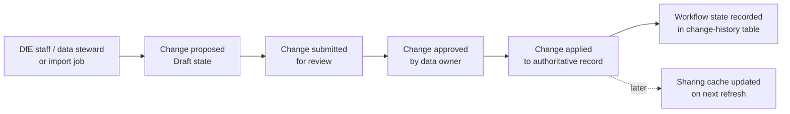
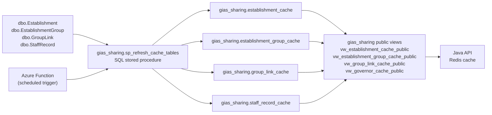
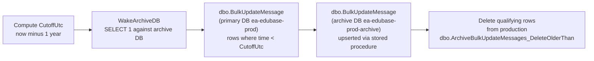
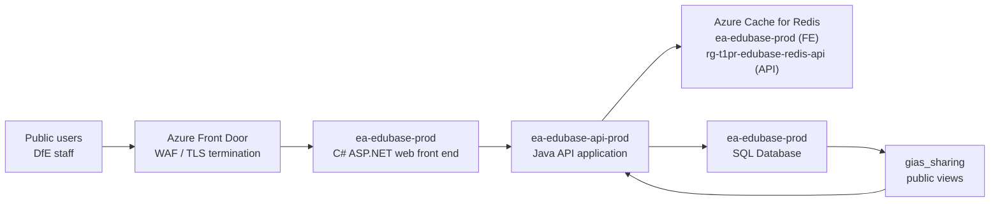
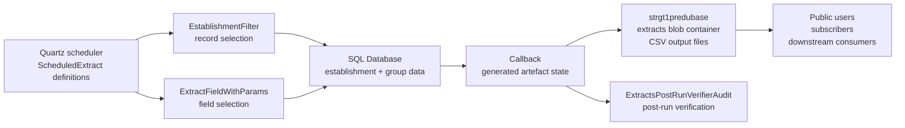
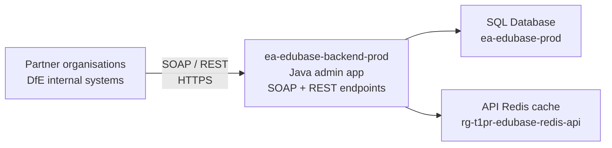
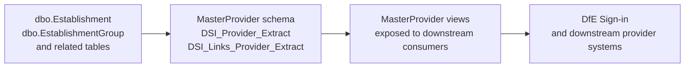

# GIAS Data Flows - Internal and Outbound

**Scope:** BAU current state. This document describes how data moves within the GIAS system and how it is published to external consumers. It covers the change-request workflow, internal cache projections, archive/retention pipelines and all outbound publication channels.

## Summary

### Internal flows

| Flow | Mechanism | Source | Target tables |
|---|---|---|---|
| Change-request workflow | Java application + SQL | User action or import job | `EstablishmentChangeHistory`, `GroupChangeRequest`, `StaffChangeRequest`, authoritative domain tables |
| Sharing cache refresh | SQL stored procedure (Azure Function trigger) | `dbo.Establishment`, `EstablishmentGroup`, `GroupLink`, `StaffRecord` | `gias_sharing.*` cache tables |
| Bulk update message archive | ADF pipeline `ArchiveBulkUpdateMessages` | `dbo.BulkUpdateMessage` (primary DB) | `dbo.BulkUpdateMessage` (archive DB) |

### Outbound flows

| Flow | Channel | Consumers | Format |
|---|---|---|---|
| Public web interface | Azure Front Door -> C# FE -> Java API | Public users, DfE staff | HTML |
| Scheduled CSV extracts | Quartz job -> Azure Blob Storage | Public users, subscribers, downstream systems | CSV files in `extracts` blob container |
| SOAP / REST API for partners | `ea-edubase-backend-prod` Java admin app | Partner organisations, DfE internal systems | SOAP / REST |
| DfE Sign-in provider extract | `MasterProvider` schema SQL views | DfE Sign-in and downstream provider systems | SQL view projection |
| gias_sharing public views | `gias_sharing.*` views | Java API, REST consumers | SQL / REST |

---

## Internal Flows

### 1. Change-Request Workflow

The change-request workflow is the primary internal data management process. Changes to establishment, group and staff data are not written directly to authoritative tables. They move through a defined workflow from draft to applied.

Three separate change-history tables handle the three data domains:

| Domain | Change-history table | Authoritative target |
|---|---|---|
| Establishments | `dbo.EstablishmentChangeHistory` | `dbo.Establishment` |
| Groups and trusts | `dbo.GroupChangeRequest` | `dbo.EstablishmentGroup` |
| Staff and governance | `dbo.StaffChangeRequest` | `dbo.StaffRecord` and governance tables |

The `EstablishmentField` and `GroupField` metadata tables control which fields can be changed through the workflow, what validation applies, which user groups can approve each field, and which user group owns each field. These tables are active runtime configuration, not passive reference data.

External import jobs (UKPRN sync, Companies House) bypass the manual approval workflow and write applied change-history rows directly. They are recorded with actor `edubase` and status `APPLIED`, making them visible in audit and change-history views.

For detailed ERD coverage see the [audit foundations and entity snapshots ERD](../entity-relationship-diagrams/audit-foundations-and-entity-snapshots.md), [audit table catalogue ERD](../entity-relationship-diagrams/audit-table-catalogue.md), [establishment change history and approval workflow ERD](../entity-relationship-diagrams/establishment-change-history-and-approval-workflow.md), [group change request workflow ERD](../entity-relationship-diagrams/group-change-request-workflow.md), and [staff change request workflow ERD](../entity-relationship-diagrams/staff-change-request-workflow.md).

---

### 2. Sharing Cache Refresh

The `gias_sharing` schema holds denormalised read projections of establishment, group, group-link and staff data. It provides a stable, flattened read model for the Java API and downstream consumers, decoupling public read access from the transactional domain tables.

The cache is refreshed by `gias_sharing.sp_refresh_cache_tables`, which is called by an Azure Function (not directly by the Java application).

The cache tables include UKPRN, establishment type, status, geography, group membership and staff role data. The public views expose a subset of columns shaped for API and REST consumer access.

June 2026 table-usage evidence shows active refresh activity on the main `gias_sharing` cache tables. The exact Azure Function name and refresh schedule are not confirmed in the current investigation.

For detailed ERD coverage see the [sharing and public cache ERD](../entity-relationship-diagrams/sharing-and-public-cache.md).

---

### 3. Archive Pipeline - Bulk Update Messages

The ADF pipeline `ArchiveBulkUpdateMessages` moves aged bulk-update-message rows from the production database to the archive database to enforce retention limits.

Steps in order: compute cutoff, wake archive database, copy qualifying rows to archive via `dbo.ArchiveBulkUpdateMessages_Upsert`, delete qualifying rows from production via `dbo.ArchiveBulkUpdateMessages_DeleteOlderThan`. The wake step accounts for the archive database having been paused; if the archive remains paused, this pipeline will fail at the wake or copy step.

A second archive pipeline, `GIAS_CopyDataFromProdIntoArchive`, copies user-activity rows for a single username from production to archive. This appears to be a targeted support or manual utility rather than a scheduled operational job.

---

## Outbound Flows

### 4. Public Web Interface

Public users and DfE staff access GIAS data through the C# web front end, which sits behind Azure Front Door.

The C# front end does not hold data; it routes all data requests through the Java API. The Java API reads from Redis cache first, falling back to the SQL database. The `gias_sharing` views provide the flattened read model for establishment and group queries.

Direct requests to the Java API hostname (`ea-edubase-api-prod.azurewebsites.net`) are currently publicly reachable without a WAF or perimeter control. This is a noted security gap; see the [production deployment architecture](../../deployment-architecture.md).

---

### 5. Scheduled CSV Extracts

Scheduled extract jobs run under the Quartz scheduler in the Java application. They query the database, produce CSV output files and write them to the `extracts` blob container in the `strgt1predubase` storage account.

Known extract files include:

| File pattern | Content |
|---|---|
| `edubaseall*` | All establishment records |
| `allgroupsdata` | All establishment groups |
| `alllinksdata` | Establishment-to-group links |
| `governance*` | Governance appointments |
| `allgroupslinksdata` | Group-to-group links |

Extract execution is logged in `ScheduledExtractLog`. Callback state and history are tracked in `Callback` and `CallbackHistory`. Post-run verification outcomes are recorded in `ExtractsPostRunVerifierAudit`. See the [scheduled extracts and callbacks ERD](../entity-relationship-diagrams/scheduled-extracts-and-callbacks.md), [scheduled extract access ERD](../entity-relationship-diagrams/scheduled-extract-access.md), and [Azure Blob Storage component](../../../service/back-end-component/storage/azure-blob-storage.md) for more detail.

---

### 6. SOAP / REST API for Partner Organisations

Partner organisations and DfE internal systems access establishment and group data through the Java admin application (`ea-edubase-backend-prod`), which exposes both SOAP and REST endpoints.

`ea-edubase-backend-prod` is currently publicly reachable on its App Service hostname without a WAF or perimeter control. It combines internal administrative traffic (JSP-based admin UI) with external integration traffic (SOAP/REST for partners). This mixed trust boundary is a current security gap; see the [production deployment architecture](../../deployment-architecture.md).

---

### 7. DfE Sign-in Provider Extract (MasterProvider Schema)

The `MasterProvider` schema provides a separate read projection of provider data for DfE Sign-in and downstream provider systems. It is exposed through SQL views rather than a service API.

The `MasterProvider` schema is a separate projection layer to the `gias_sharing` schema. It is shaped for provider-registry consumption by DfE Sign-in and related downstream systems rather than for public API access. Establishment status, UKPRN and provider identity fields are included.

For source evidence see the [Companies House and master provider imports ERD](../entity-relationship-diagrams/companies-house-and-master-provider-imports.md).

