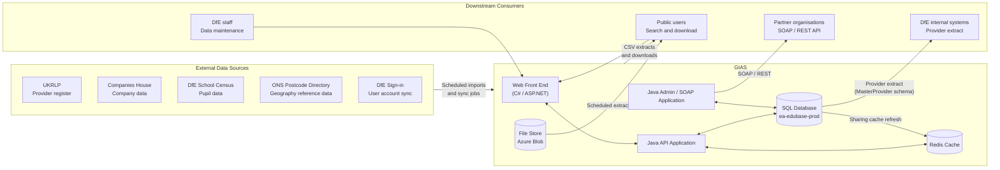

# GIAS Data Architecture - Overview

## 1. What GIAS Is

Get Information About Schools is the national register of education providers in England, maintained by the Department for Education. It holds the authoritative record of approximately 45,000 active and historic establishments - schools, academies, colleges, children's centres, and other registered providers - together with around 15,000 establishment groups including multi-academy trusts (MATs), single-academy trusts (SATs), federations, and school sponsors.

GIAS is primarily a **data stewardship and publication system**. It receives data from external sources, manages data quality through a controlled change-request workflow, and publishes data to public users, DfE staff, partner organisations and downstream DfE systems. It is not a transactional system in the operational sense - its central activity is the maintenance and authoritative publication of reference data about education providers.

---

## 2. Data Domains

GIAS data falls into ten distinct domains. Each domain has its own entity model, lifecycle and access rules.

| Domain | What it holds | Authoritative store |
|---|---|---|
| **Establishments** | Establishment identity, type, status, phase, details, location, identifiers and lifecycle links | `dbo.Establishment` and related tables |
| **Establishment groups** | Trusts (MAT, SAT), federations, sponsors, children's centre groups; group identity, status, addresses and membership | `dbo.EstablishmentGroup`, `dbo.GroupLink` |
| **Governance and staff** | Governance appointments, governance roles, trustees, governors, headteachers and related people data | `dbo.StaffRecord`, governance and staff tables |
| **Users and access control** | System users, user groups, role assignments, field-level permissions, row-level scope and tool entitlements | `dbo.SystemUser`, `dbo.UserGroup`, permission tables |
| **Reference and classification data** | Establishment types, statuses, phases, local authority codes, geography classifications, SEN categories, inspection grades and all code lists | Reference/lookup tables throughout `dbo` |
| **Audit and change history** | Change requests, proposed and applied values, approval decisions, workflow state and full revision history | `dbo.EstablishmentChangeHistory`, `dbo.GroupChangeRequest`, `dbo.StaffChangeRequest`, `*_AUD` tables |
| **Imports and external data** | Staging and import tables for UKRLP, Companies House, school census and geography/postcode data | `DataOpsJobs.*` schema and import tables |
| **Scheduled extracts and downloads** | Extract job configuration, callback definitions, extract execution logs and post-run verification | `dbo.Callback`, `dbo.ScheduledExtract`, extract log tables |
| **Sharing and publication cache** | Denormalised read cache for public and API access, flattened establishment and group data, sharing views | `gias_sharing.*` schema |
| **Front-end content and operations** | News articles, FAQs, notification templates, glossary items, user preferences, announcements and application logging | `FrontEnd.*` schema |

---

## 3. Key Identifiers

GIAS uses a small set of primary identifiers to connect data across domains. These are the most important for data architecture purposes.

| Identifier | What it identifies | Issued by | Key notes |
|---|---|---|---|
| **URN** | A single establishment (legal entity) | GIAS | Primary key of `dbo.Establishment`. The canonical identifier across the system. Academy conversion can create a new URN even where the school appears continuous. |
| **UID** | An establishment group | GIAS | Primary identifier for trusts, federations and sponsors in `dbo.EstablishmentGroup`. |
| **UKPRN** | A registered provider | UKRLP (external) | Held on both establishments and groups. Matched for establishments by URN, for SAT/MAT groups by Companies House number. Refreshed by scheduled UKRLP sync. |
| **LAESTAB / DfE number** | An establishment within a local authority | Derived | A user-facing composite of local authority code and establishment number. Not a physical database column - derived at display and search time. |
| **Companies House number** | An incorporated trust or company | Companies House (external) | Held on `EstablishmentGroup`. Used to match group UKPRN updates from UKRLP. |
| **username** | A GIAS system user | GIAS | Internal user account key. Appears as actor in audit, change history and workflow records. Separate from DfE Sign-in user identifiers. |

---

## 4. System Context

---

## 5. How Data Enters GIAS

GIAS receives data from five external sources through scheduled import jobs and a Data Factory pipeline. None of these are real-time; all are batch or scheduled processes.

**UKRLP** is the primary inbound integration. A Quartz-managed Java job calls the UKRLP web service, matches establishment UKPRN values by URN and group UKPRN values by Companies House number, updates the relevant `Establishment` and `EstablishmentGroup` records, writes change history rows, and clears Java caches. This runs on a scheduled cadence.

**Companies House** data is received via an ADF pipeline or import job that populates `dbo.CompaniesHouseUpdates` and related staging tables, allowing group/trust company data to be matched and updated.

**DfE school census data** feeds pupil-number and related fields into establishment records through the census import pipeline.

**ONS Postcode Directory data** is imported periodically to maintain `dbo.GeoData` and related geography classification tables, and to update establishment geography fields (ward, LSOA, MSOA, parliamentary constituency, district, urban/rural). This is a separate, batch relationship from the Ordnance Survey address lookup API, which is called at request time for postcode search and is not an inbound data import.

**DfE Sign-in** disabled-account data is received via an ADF pipeline that syncs user account status to keep GIAS system user records aligned with the identity provider.

Detailed integration notes are documented in [UKRLP integration](../../../service/back-end-component/integrations/ukrlp-integration.md), [Companies House integration](../../../service/back-end-component/integrations/companies-house-integration.md), [Ordnance Survey integration](../../../service/back-end-component/integrations/ordnance-survey-integration.md) and [S158 Data Factory setup](../../data-factory-setup.md).

---

## 6. How Data Is Maintained

GIAS data is maintained through a **controlled change-request workflow**. Changes are not written directly to authoritative tables; they are proposed, reviewed and approved before being applied.

The workflow applies to three data domains with separate change-request tables:

- **Establishment changes** - `dbo.EstablishmentChangeHistory`, tracking proposed and applied values for each field on each establishment.
- **Group/trust changes** - `dbo.GroupChangeRequest`, tracking changes to `EstablishmentGroup` records.
- **Staff and governance changes** - `dbo.StaffChangeRequest`, tracking changes to `StaffRecord` and governance appointment records.

Change requests move through workflow states (draft -> submitted -> reviewed -> approved -> applied). Each state transition is recorded. The `EstablishmentField` and `GroupField` metadata tables govern which fields can be changed through the workflow, what validation applies, who owns each field, and which user groups can approve changes.

Some data is also maintained through **bulk update** processes, which bypass the per-field workflow but are still subject to user group permissions and are logged.

External import jobs (UKRLP, Companies House and school census) can write data directly to establishment or group records and record the change in the change history tables as an applied change, bypassing the manual approval workflow.

---

## 7. How Data Leaves GIAS

GIAS publishes data through three primary channels.

**Public web interface and download portal.** The C# web front end (`ea-edubase-prod`) serves the public search, browse and download user interface. It routes requests through the Java API (`ea-edubase-api-prod`) to the SQL database and Redis cache. Public users can download establishment, group and governance data as CSV files directly from the portal.

**Scheduled CSV extracts.** The Quartz scheduler triggers extract jobs that query the database and write CSV files to the Azure Blob file store. These files are the primary data product for downstream consumers: the `edubaseall*` establishment extracts, `allgroupsdata`, `alllinksdata`, `governance*` extracts and `allgroupslinksdata` are refreshed on a scheduled basis. The `gias_sharing` schema provides a denormalised cache layer that flattens establishment and group data for extract and API performance.

**SOAP and REST API.** The Java admin application (`ea-edubase-backend-prod`) exposes SOAP and REST endpoints consumed by partner organisations and DfE internal systems. The `MasterProvider` schema provides a separate projection of provider data for DfE Sign-in and related downstream systems.

---

## 8. Data Security and Access

Access to GIAS data is controlled at three levels.

**Service perimeter.** The public web front end sits behind Azure Front Door with WAF. The Java API application and Java admin/SOAP application are directly reachable on their App Service hostnames without a WAF or perimeter control, which is a current security gap captured in the [production deployment architecture](../../deployment-architecture.md). SQL databases are accessed through private endpoints, not over public internet.

**User group and role.** GIAS uses a user group model (`dbo.UserGroup`, `dbo.SystemUser.UserGroupCode`) to assign roles to users. User groups control which tools, reports, documents and announcements a user can access. Row-level scope is enforced by local authority or organisation, so that LA users see only their own establishments and trust users see only their own trust's data.

**Field-level permissions.** The `EstablishmentField` and `GroupField` metadata tables control which user groups can view or edit each field on an establishment or group record. Field ownership assigns each field to a data-owning user group. These tables are the primary access-control mechanism for data maintenance operations and are a critical part of the data architecture: they are not passive reference data but active runtime configuration that governs the behaviour of the application.

Personal data (governance person records, headteacher names) is held in the database and is publicly visible in parts (role, establishment) and restricted in other parts (email address, appointment dates). Access to restricted fields is governed by user group field permissions.

---

## 9. Data Model Documentation

The [entity-relationship diagram portfolio](../entity-relationship-diagrams/README.md) documents the data model in detail. Each ERD covers a slice of the schema, with Mermaid diagrams and explanatory notes.

| ERD area | What it covers |
|---|---|
| Core | [Core establishment](../entity-relationship-diagrams/core-establishment.md), [groups and trusts](../entity-relationship-diagrams/groups-trusts-federations-local-authority.md), [users and permissions](../entity-relationship-diagrams/users-permissions-overview.md), [staff and governance](../entity-relationship-diagrams/staff-governance.md), [identifier lifecycle](../entity-relationship-diagrams/establishment-identifier-lifecycle.md) |
| Audit | [Audit foundations and entity snapshots](../entity-relationship-diagrams/audit-foundations-and-entity-snapshots.md), [audit table catalogue](../entity-relationship-diagrams/audit-table-catalogue.md), [change request approval and workflow access](../entity-relationship-diagrams/change-request-approval-and-workflow-access.md) |
| Imports | [Companies House and master provider imports](../entity-relationship-diagrams/companies-house-and-master-provider-imports.md), [geography and postcode imports](../entity-relationship-diagrams/geography-and-postcode-imports.md), [DataOps job control and logs](../entity-relationship-diagrams/dataops-job-control-and-logs.md) |
| Metadata | [Establishment field metadata and mapping](../entity-relationship-diagrams/establishment-field-metadata-and-mapping.md), [group and staff field metadata](../entity-relationship-diagrams/group-and-staff-field-metadata.md), [extract configuration and data dictionary](../entity-relationship-diagrams/extract-configuration-and-data-dictionary.md), [establishment classifications](../entity-relationship-diagrams/establishment-classifications.md) |
| Operations | [Scheduled extracts and callbacks](../entity-relationship-diagrams/scheduled-extracts-and-callbacks.md), [scheduler and batch runtime](../entity-relationship-diagrams/scheduler-and-batch-runtime.md), [bulk updates, triggers and processing](../entity-relationship-diagrams/bulk-updates-triggers-and-processing.md) |
| Permissions | [Establishment field permissions](../entity-relationship-diagrams/establishment-field-permissions.md), [row-level access and organisation scope](../entity-relationship-diagrams/row-level-access-and-organisation-scope.md), [tool permissions](../entity-relationship-diagrams/tool-permissions.md), [subscriber access and entitlements](../entity-relationship-diagrams/subscriber-access-and-entitlements.md) |
| Publication | [Sharing and public cache](../entity-relationship-diagrams/sharing-and-public-cache.md), [documents and content](../entity-relationship-diagrams/documents-and-content.md), [FAQs and feedback](../entity-relationship-diagrams/faqs-and-feedback.md), [news, announcements and notifications](../entity-relationship-diagrams/news-announcements-and-notifications.md) |
| Reference | [Provision and workforce indicators](../entity-relationship-diagrams/provision-and-workforce-indicators.md), [specialism and quality indicators](../entity-relationship-diagrams/specialism-and-quality-indicators.md), [legacy programme indicators](../entity-relationship-diagrams/legacy-programme-indicators.md), [operational status code lists](../entity-relationship-diagrams/operational-status-code-lists.md) |

The schema is large. The [GIAS DDL script](../gias-ddl-script.sql) and the [entity-relationship diagram portfolio](../entity-relationship-diagrams/README.md) are the starting points for schema investigation in the published documentation.
