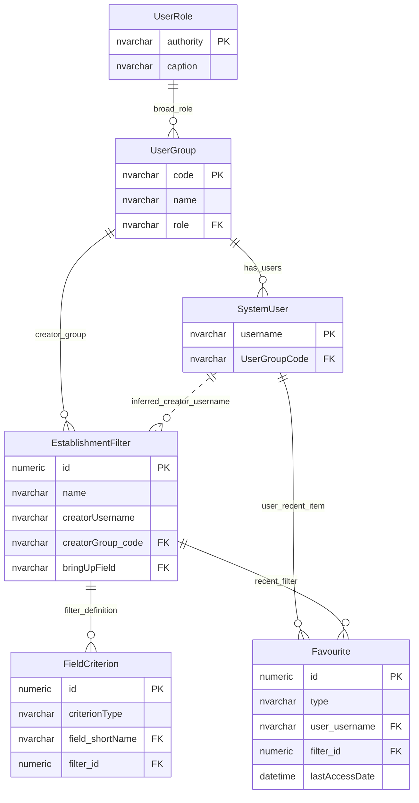

# Analysis Report And Filter Visibility

This page explains the visibility model for saved establishment filters and recent filter or extract links.

## Scope

This model covers:

- saved establishment filters;
- field criteria that define filters;
- recent filter and extract links for users;
- user and user-group ownership context.

Analysis-report tables are not shown in the diagram because the table-usage evidence marks `AnalysisReport` as an assumed not-used candidate.

## How To Read This Model

- A saved filter records both a creator username and a creator group.
- The creator group is used as part of the filter visibility model.
- Filter criteria are attached to a saved filter and refer to logical establishment fields.
- Favourite rows behave as recent quick links for an internal user.

## Application-Derived Insights

- Saved-filter visibility is partly personal and partly group based.
- A user's current group can affect which saved filters they can discover.
- Direct access to an item by identifier and list visibility should be treated as separate authorisation questions.
- The future model should make owner, sharing audience and direct-access checks explicit.

## Saved Filter Visibility



### EstablishmentFilter

Business-friendly pattern:

```text
For this reusable establishment selection,
which criteria define it,
which user created it,
and which user group may discover or reuse it?
```

### FieldCriterion

Business-friendly pattern:

```text
For this saved establishment filter,
which logical establishment field is being tested,
what type of test should be performed,
and what value should it be tested against?
```

### Favourite

Business-friendly pattern:

```text
For this internal user,
which saved filters or scheduled extracts have they used recently,
so they can be shown as quick links?
```

## Reading This Diagram

Use this model to separate filter ownership from field-level access. A saved filter may be visible because of creator or group rules, but the fields inside the filter still need to be checked against the user's field permissions.
