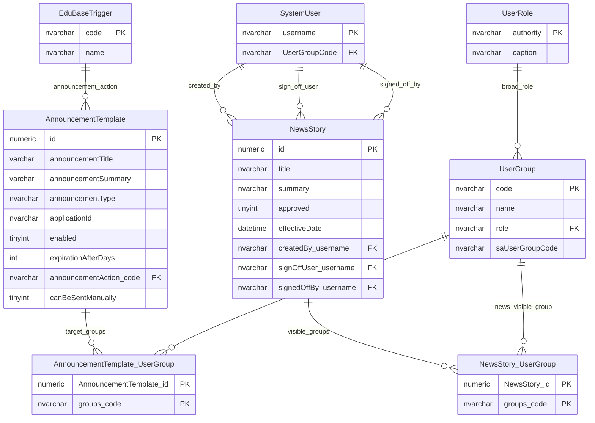

# Announcements And News Visibility

This page explains how announcement templates and news stories are targeted to user groups.

## Scope

This model covers:

- announcement template targeting;
- news story visibility;
- user group audiences;
- approval and effective-date gates for news content.

## How To Read This Model

- Announcements and news use user groups as audiences.
- Announcement templates can target one or more user groups.
- News stories can be visible to one or more user groups.
- News visibility also depends on approval state and effective date.

## Application-Derived Insights

- This is an audience-targeting model, not a field-permission model.
- Announcements combine message content, audience, trigger/action classification and publication controls.
- News stories combine content, approval, scheduling and audience visibility.
- Future modelling should separate content, audience, publication channel and publication event.

## Announcements And News Visibility



### AnnouncementTemplate

Business-friendly pattern:

```text
For this announcement type,
what message should be sent,
what action classifies it,
which audience groups should receive it,
and can it be published manually?
```

### AnnouncementTemplate_UserGroup

Business-friendly pattern:

```text
For this announcement template,
which user groups should receive or be targeted by the announcement?
```

### NewsStory

Business-friendly pattern:

```text
For this news item,
who created it,
who must sign it off,
when does it become visible,
and which user groups can see it?
```

### NewsStory_UserGroup

Business-friendly pattern:

```text
For this news story,
which user groups should see it in the portal?
```

## Reading This Diagram

Use this model to understand communications visibility. It answers who should see a message, not who can edit provider data.
