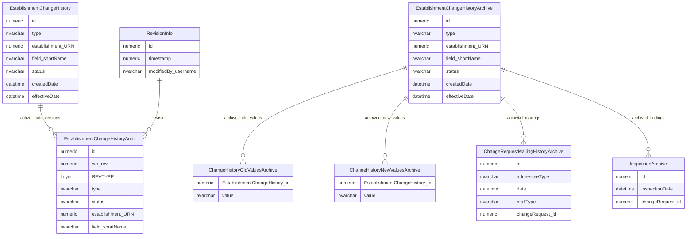
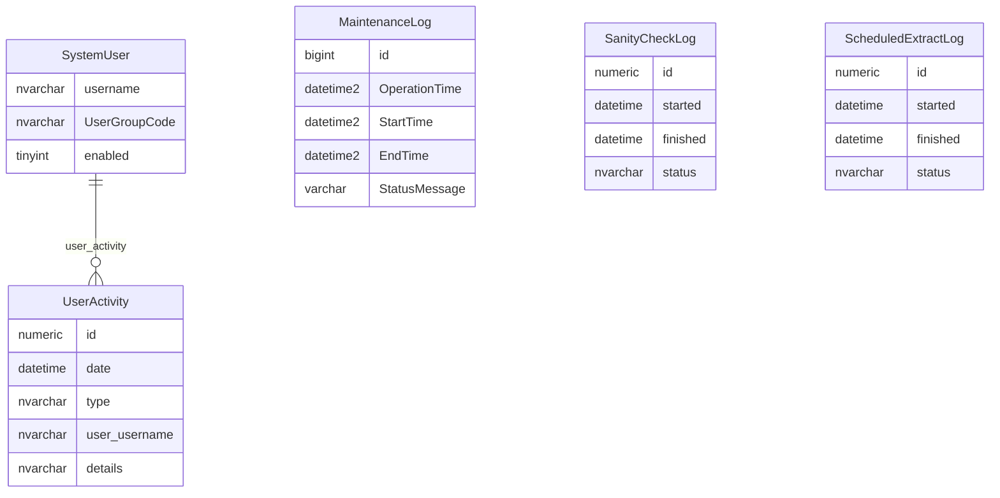
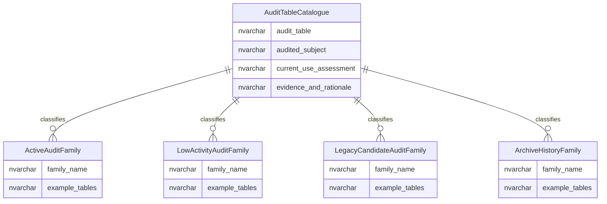

# Audit Archives And Retention Entity Relationship Diagram

This page explains the data model used for retained audit, archive, activity and operational history records.

## Scope

This view focuses on:

- establishment change-history archive concepts;
- multi-value old/new value archive concepts;
- change-request mailing and inspection archive concepts;
- activity and operational history;
- retention classification for audit and archive families.

It does not show the full audit catalogue or every audited table.

## How To Read This Model

The audit and archive model contains several different kinds of history:

- active business workflow history;
- technical audit snapshots;
- archived copies of historic workflow data;
- user activity and operational history;
- maintenance and extract logs;
- classification evidence used to decide what should be retained, migrated, archived or retired.

Archive tables should be treated as retained historical evidence. They may have meaningful relationships even where the schema does not enforce those relationships with physical foreign keys.

## Historic Audit And Archive Pattern



### EstablishmentChangeHistory

`EstablishmentChangeHistory` records business workflow and change-history rows for establishment changes.

Business-friendly pattern:

```text
For this establishment,
which field was changed or proposed for change,
what happened to that change,
and what evidence should be retained?
```

### EstablishmentChangeHistoryAudit

The audit form of establishment change history stores revisioned snapshots of change-history rows.

Business-friendly pattern:

```text
For this change-history row,
what did it look like at this audit revision?
```

### EstablishmentChangeHistoryArchive

The archive form of establishment change history represents retained historic copies of change-history workflow rows.

Business-friendly pattern:

```text
For this archived establishment change-history row,
what historic workflow evidence has been retained?
```

### ChangeHistoryOldValuesArchive

`ChangeHistoryOldValuesArchive` stores archived old values for multi-value changes.

Business-friendly pattern:

```text
For this archived multi-value change,
which previous values were retained?
```

### ChangeHistoryNewValuesArchive

`ChangeHistoryNewValuesArchive` stores archived new values for multi-value changes.

Business-friendly pattern:

```text
For this archived multi-value change,
which replacement values were retained?
```

### ChangeRequestMailingHistoryArchive

`ChangeRequestMailingHistoryArchive` stores retained evidence of mailings or notifications associated with historic change requests.

Business-friendly pattern:

```text
For this archived change request,
which mailing or notification evidence was retained?
```

### InspectionArchive

`InspectionArchive` stores retained inspection or sanity-check findings associated with historic change requests.

Business-friendly pattern:

```text
For this archived change request,
which inspection or sanity-check evidence was retained?
```

## Activity And Operational History



### UserActivity

`UserActivity` records user activity events.

Business-friendly pattern:

```text
For this user activity event,
who performed it,
when did it happen,
and what activity was recorded?
```

### MaintenanceLog

Maintenance logs record operational database maintenance activity.

Business-friendly pattern:

```text
For this maintenance operation,
when did it run,
what status was recorded,
and what operational evidence should be retained?
```

### SanityCheckLog

`SanityCheckLog` records sanity-check processing activity.

Business-friendly pattern:

```text
For this sanity check,
when did it run,
what status was recorded,
and what evidence should be retained?
```

### ScheduledExtractLog

`ScheduledExtractLog` records scheduled extract processing activity.

Business-friendly pattern:

```text
For this scheduled extract run,
when did it run,
what status was recorded,
and what evidence should be retained?
```

## Retention Classification



### AuditTableCatalogue

`AuditTableCatalogue` is the control view for classifying audit and archive table families for retention and rationalisation decisions.

Business-friendly pattern:

```text
For this audit, archive or history table,
what subject does it record,
how active is it,
and what retention or migration decision is needed?
```

## Reading This Diagram

These ERDs are explanatory views, not a deletion or retention schedule. Any archive or audit retirement decision still needs retention, legal, operational and business-owner confirmation.

