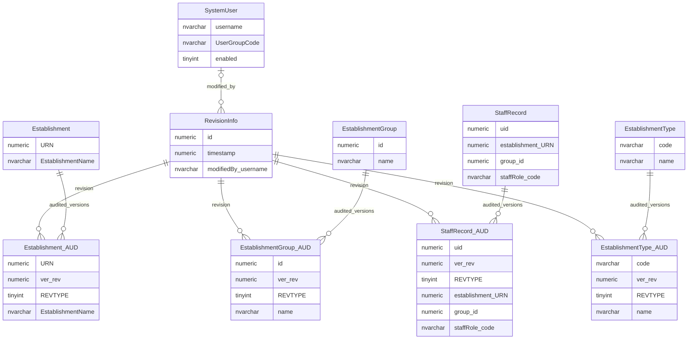

# Audit Foundations And Entity Snapshots

This page explains the shared audit pattern used to preserve point-in-time snapshots of selected business records.

## Scope

This view focuses on:

- audit revisions;
- the internal user associated with a revision;
- representative audited entity snapshots;
- the difference between technical audit snapshots and business change workflow.

It does not show every audit table.

## How To Read This Model

- `RevisionInfo` is the shared audit revision header.
- Each audited table has a matching audit table that stores historical snapshots.
- Audit rows are linked to a revision through `ver_rev`.
- Audit rows normally preserve entity state at a point in time, not just the field that changed.
- Technical audit snapshots are different from business change requests and approvals.

## Application-Derived Insights

- Audit snapshot rows are produced by the application persistence layer for selected audited entities.
- Most audited tables do not need table-specific application code to create audit rows.
- The application can read audit history when it needs historical versions, but most normal reads use the live tables.
- A single revision can group changes across more than one audited table.
- Direct database changes do not automatically become application audit history unless the change process deliberately creates matching audit records.
- The frontend consumes audit-related information through services; it does not own the audit table model.
- Audit snapshots are useful evidence of persisted state, but they do not explain why a business change was proposed, approved or rejected.

## Audit Foundations



### RevisionInfo

`RevisionInfo` gives audited snapshot rows a common revision identity, timestamp and associated internal user.

Business-friendly pattern:

```text
For this set of audited database changes,
when was the revision created,
and which internal GIAS user was associated with it?
```

### Audited Entity Tables

Audited entity tables preserve historical versions of live business records.

Business-friendly pattern:

```text
For this live business record,
which historical audited versions have been preserved?
```

### Audit Snapshot Tables

Audit snapshot tables store the audited state of a record at a revision.

Business-friendly pattern:

```text
For this business record and audit revision,
what audited state was persisted?
```

## Reading This Diagram

These ERDs are explanatory views, not a complete audit catalogue. Audit snapshots are retained evidence of persisted state; they do not explain the business reason for a change on their own.
