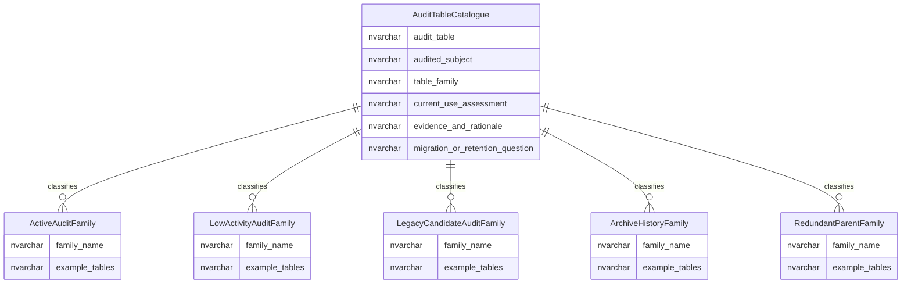

# Audit Table Catalogue

This page explains the audit table catalogue used to classify audit, archive and history tables for migration, retention and rationalisation decisions.

## Scope

This view focuses on:

- audit table families;
- current-use assessment;
- retention and migration interpretation;
- relationships between live data, audit snapshots and archive/history tables.

It does not list every audit table as a separate diagram entity.

## How To Read This Model

- The catalogue is a control view for audit migration and retention decisions.
- No observed activity is evidence for triage, not proof that a table can be deleted.
- Audit tables can be active, low-activity, legacy candidates, archive/history data or redundant-parent candidates.
- Retention decisions need business, operational, legal and data-owner confirmation.

## Application-Derived Insights

- Audit tables exist because the application and persistence model selected certain entities for snapshot auditing.
- Not every audit table is equally active or equally useful for business investigation.
- Some audit tables support current operational assurance, while others may only exist because older capabilities were once audited.
- Short-term read/write activity is not enough to decide retention, because audit data may be needed rarely but still be important.
- The catalogue should separate technical evidence from business retention decisions.
- Tables that look unused still need review for legal, operational, support and migration requirements.
- The application model can explain why an audit table exists, but ownership and retention policy decide what should happen to it.

## Audit Catalogue View



### AuditTableCatalogue

`AuditTableCatalogue` classifies audit, archive and history table families so they can be assessed consistently.

Business-friendly pattern:

```text
For this audit, archive or history table,
what subject does it record,
how active is it,
and what retention or migration decision is needed?
```

### ActiveAuditFamily

Active audit families are treated as current audit evidence unless a retention design says otherwise.

Business-friendly pattern:

```text
For this audit family,
is it active evidence that should be preserved or migrated?
```

### LowActivityAuditFamily

Low-activity audit families need review before migration or retirement decisions.

Business-friendly pattern:

```text
For this low-activity audit family,
is there a business, operational or legal reason to retain it?
```

### LegacyCandidateAuditFamily

Legacy candidate families may no longer support active business processes.

Business-friendly pattern:

```text
For this legacy audit family,
is it still needed for business history, assurance or support?
```

### ArchiveHistoryFamily

Archive/history families hold retained historical copies or operational history.

Business-friendly pattern:

```text
For this archive or history family,
what historical evidence is being retained?
```

## Reading This Diagram

This page is a classification view, not a retention schedule. It supports review and migration planning; it does not authorise deletion.
