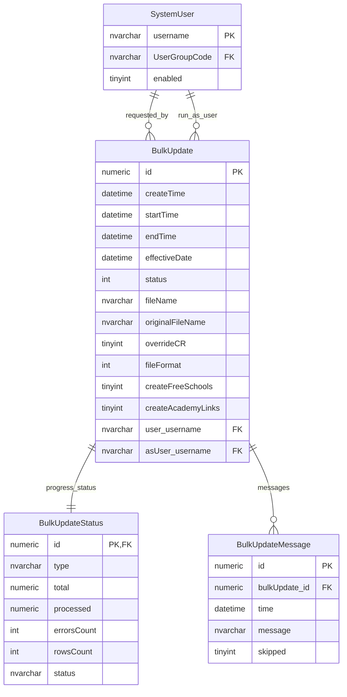
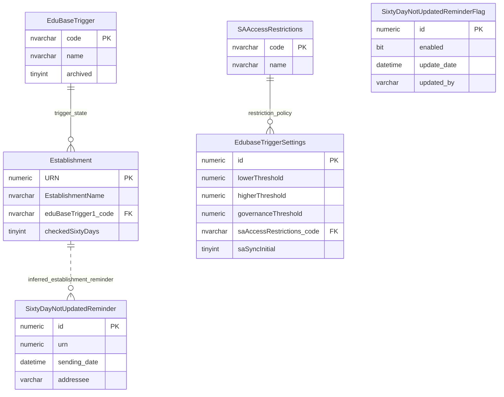
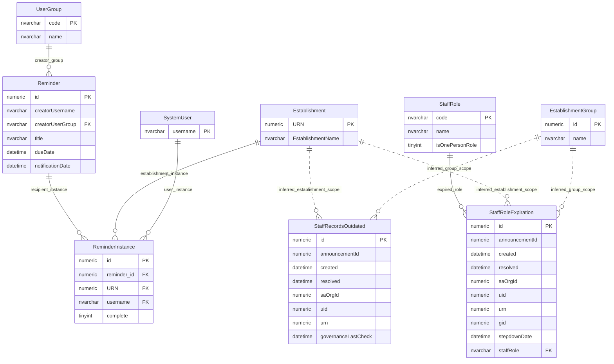
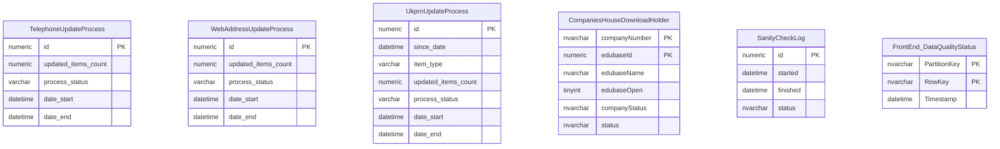

# Bulk Updates, Triggers And Processing

This page explains operational processing tables that record bulk updates, data-quality triggers, reminders and small background process logs.

## Scope

This model covers:

- bulk update job state, progress and messages;
- data-quality trigger settings and reminder state;
- governance reminder state;
- process logs for small background update jobs.

Scheduler runtime tables are covered separately in `scheduler-and-batch-runtime.md`.

## How To Read This Model

- These tables record process evidence rather than canonical provider facts.
- Some tables are initiated by users, such as bulk update files.
- Some tables are produced by automated checks, such as reminders and trigger state.
- Some relationships are inferred from identifiers rather than enforced by foreign keys.

## Application-Derived Insights

- Bulk updates can bypass or interact with change-request behaviour, so they are not just file uploads.
- Data-quality trigger state can lead to user-facing prompts or reminders.
- Governance reminder tables are derived from governance freshness and role-expiration rules.
- Future design should separate commands, process progress, derived reminders, integration holding rows and domain changes.

## Bulk Update Processing



### BulkUpdate, BulkUpdateStatus And BulkUpdateMessage

Business-friendly pattern:

```text
For this uploaded bulk update file,
who submitted it,
which identity should it run as,
what kind of update is it,
and what was the outcome?
```

The model separates the parent request, progress counts and detailed messages.

## Data-Quality Trigger And Reminder State



### EduBaseTrigger And EdubaseTriggerSettings

Business-friendly pattern:

```text
For this establishment,
what data-quality trigger state applies,
and what thresholds control the warning or issue?
```

### SixtyDayNotUpdatedReminder

Business-friendly pattern:

```text
For this establishment,
has a reminder been produced because the record has not been checked recently?
```

## Governance Reminder State



### Reminder And ReminderInstance

Business-friendly pattern:

```text
For this reminder,
which establishment or user received it,
and has that reminder instance been completed?
```

### StaffRecordsOutdated And StaffRoleExpiration

Business-friendly pattern:

```text
For this establishment or group,
does governance information need attention,
and has the reminder or announcement been created or resolved?
```

## Process Logs



### Process Log Tables

Business-friendly pattern:

```text
For this background process,
when did it run,
what outcome was recorded,
and what operational evidence was kept?
```

`InspectionUpdates` has been omitted because it is marked as having no observed production read or write activity in the 30-day table-usage evidence.

## Reading This Diagram

Use this model to understand operational evidence around changes and reminders. It should not be treated as a single generic jobs model, because each process has different ownership, retention and restart behaviour.
