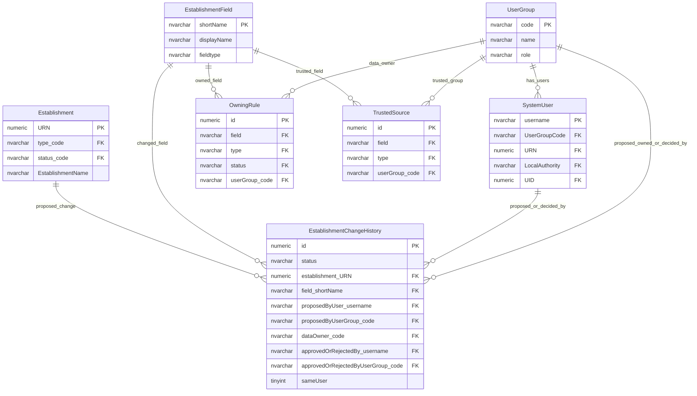
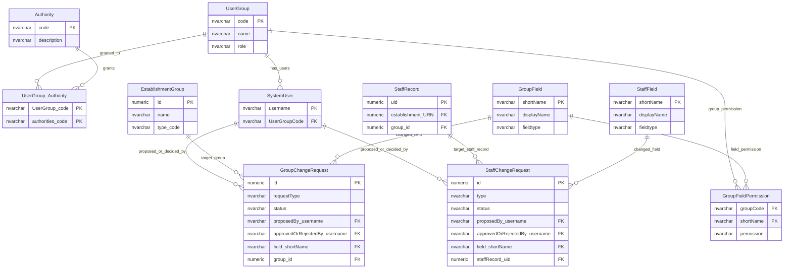

# Change Request Approval And Workflow Access

This page explains how proposed changes record proposal, ownership, trusted-source checks and approval decisions.

## Scope

This model covers:

- establishment change approval policy;
- group change actor and trusted-source context;
- staff change actor context;
- proposer and decision attribution.

## How To Read This Model

- Establishment changes have the richest configurable ownership and trusted-source model.
- Group changes use group-field permissions, authorities and organisation scope.
- Staff changes record proposer and decision provenance, but may be applied immediately.
- A change-request row does not always mean that a separate human approval step occurred.

## Application-Derived Insights

- Establishment, group and staff changes do not share one consistent approval model.
- Establishment workflow preserves proposer group, data owner and approver group more explicitly than group and staff workflows.
- Group and staff actor history may depend on a user's current group unless the request row snapshots that context.
- Future design should define a common change-decision vocabulary and then allow deliberate domain-specific differences.

## Establishment Change Approval



### OwningRule

Business-friendly pattern:

```text
For this establishment field, type and status,
which user group owns the data?
```

### TrustedSource

Business-friendly pattern:

```text
For this establishment field and type,
is the proposing user group trusted to make the change?
```

### EstablishmentChangeHistory

Business-friendly pattern:

```text
For this proposed establishment change,
who proposed it,
who owned the data,
who approved or rejected it,
and what decision state was recorded?
```

## Group And Staff Change Actors



### GroupChangeRequest

Business-friendly pattern:

```text
For this proposed change to an education provider group or one of its links,
what is changing,
who proposed it,
can it be applied immediately,
and who approved or rejected it?
```

### StaffChangeRequest

Business-friendly pattern:

```text
For this governance or staff-field change,
who performed the change,
and what change-request record preserves that action?
```

`FyiStakeholder` has been omitted because it is marked as having no observed production read or write activity in the 30-day table-usage evidence.

## Reading This Diagram

Use this model to understand change-decision responsibility. The future design should make proposer, owner, trusted source, approver, decision, effective date and applied date explicit.
