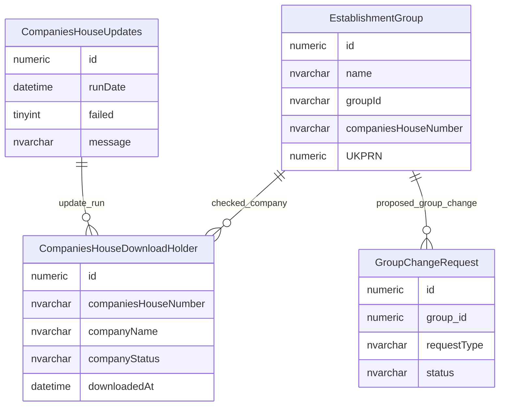
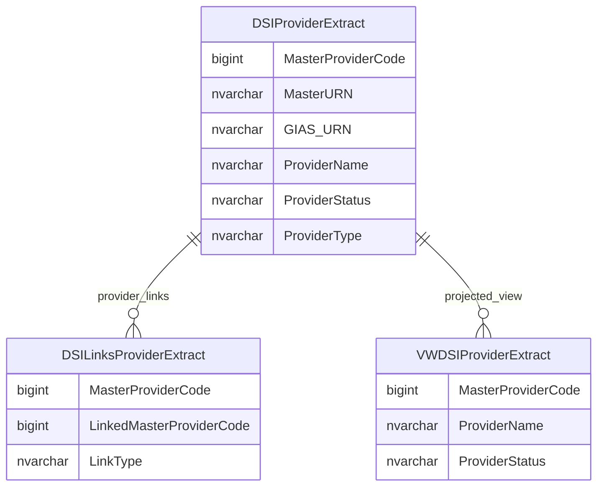

# Companies House And Master Provider Imports

This page explains import and extract data used to compare organisation group identifiers with Companies House and Master Provider data.

## Scope

This view focuses on:

- Companies House number checks for trusts and groups;
- update run tracking;
- proposed group changes from Companies House differences;
- Master Provider extract rows and provider links.

## How To Read This Model

- Companies House number is an important trust/group integration identifier.
- Companies House data is used to compare external company details with recorded group details.
- Differences can lead to proposed group changes rather than direct authoritative overwrites.
- Master Provider extract tables are downstream extract/projection data, not the core source of group identity.

## Application-Derived Insights

- Trust-style group matching depends heavily on Companies House number.
- Import and extract tables are operational integration structures, not core business entities.
- Group change requests are the stewardship mechanism for changes identified from external differences.
- Master Provider extract rows expose provider identifiers and relationships to downstream consumers.

## Companies House Import



### CompaniesHouseDownloadHolder

`CompaniesHouseDownloadHolder` stages Companies House response data for a Companies House number.

Business-friendly pattern:

```text
For this Companies House number,
which GIAS trust/group is being checked,
what did Companies House return,
and how does that compare with the recorded group data?
```

### CompaniesHouseUpdates

`CompaniesHouseUpdates` records update-run state for Companies House processing.

Business-friendly pattern:

```text
For this Companies House update run,
when did it run,
did it fail,
and what message or outcome was recorded?
```

### GroupChangeRequest

`GroupChangeRequest` can record proposed changes arising from Companies House differences.

Business-friendly pattern:

```text
For this Companies House difference,
which proposed group change should be raised for stewardship or approval?
```

## Master Provider Extract



### DSIProviderExtract

`DSIProviderExtract` exposes provider identifiers, names, classifications and status values to downstream consumers.

Business-friendly pattern:

```text
For this provider in the MasterProvider extract,
which identifiers, names, classifications and status values are being exposed to downstream consumers?
```

### DSILinksProviderExtract

`DSILinksProviderExtract` exposes relationships between Master Provider records.

Business-friendly pattern:

```text
For this MasterProvider provider,
which other MasterProvider provider is it linked to,
and what type of link is recorded?
```

### VWDSIProviderExtract

`VWDSIProviderExtract` is a projected view over Master Provider extract data.

Business-friendly pattern:

```text
For this MasterProvider extract view,
which provider values are made easier to consume?
```

## Reading This Diagram

These ERDs are explanatory views. Companies House and Master Provider tables should be read as integration and stewardship support structures, not as replacement source-of-truth provider records.

