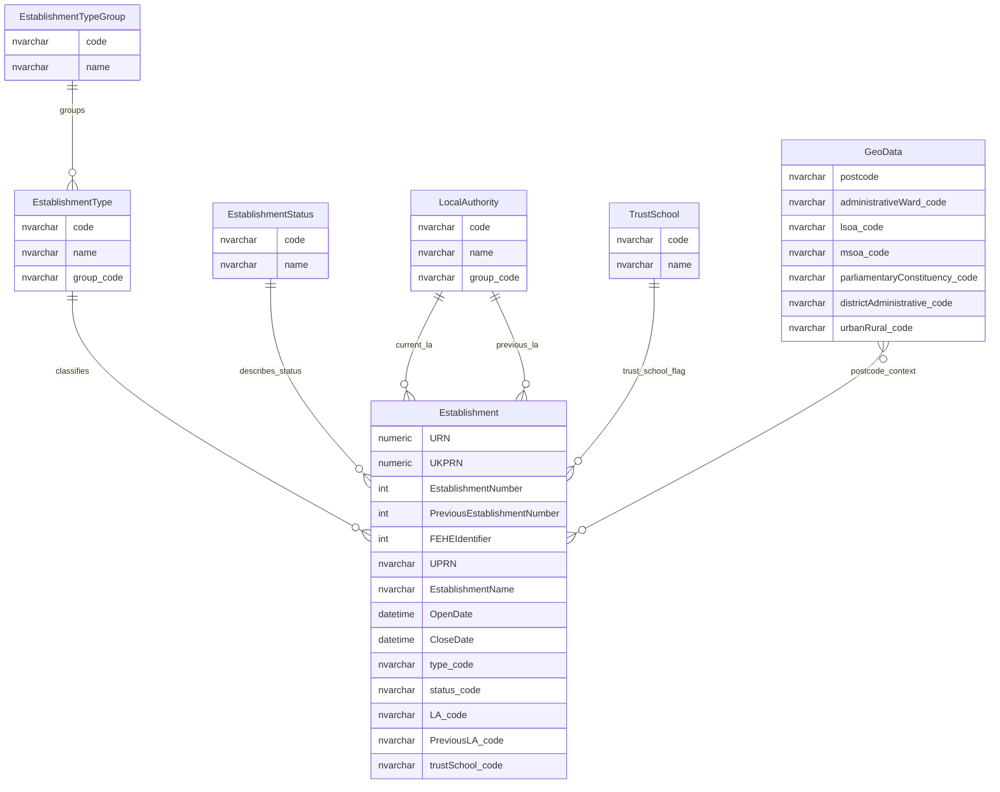
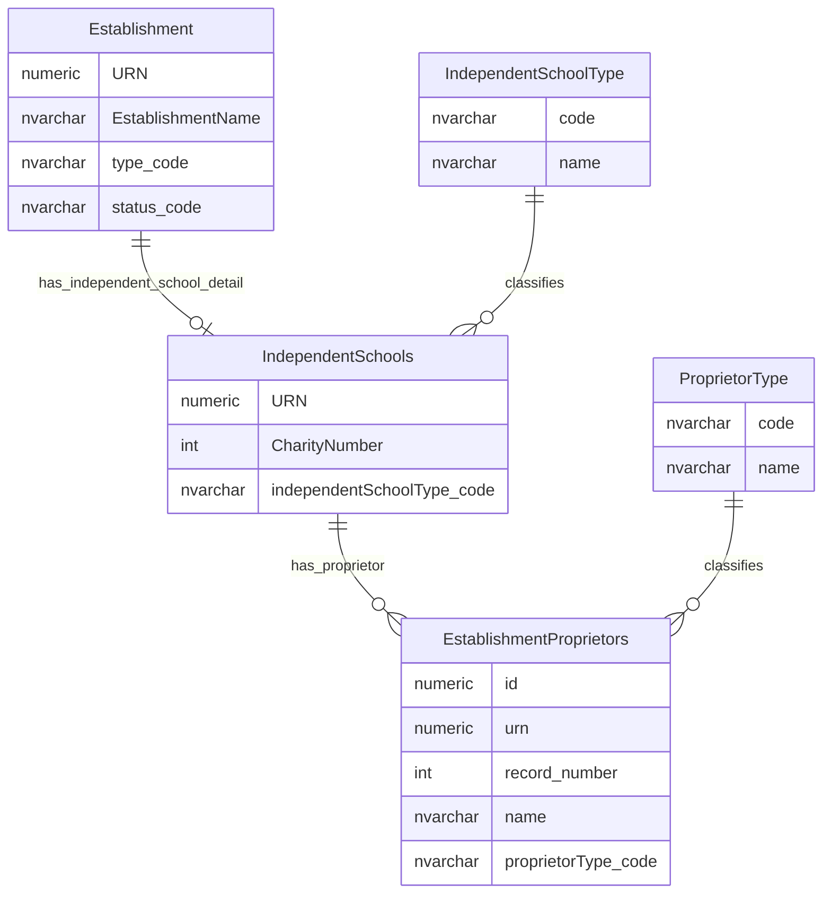
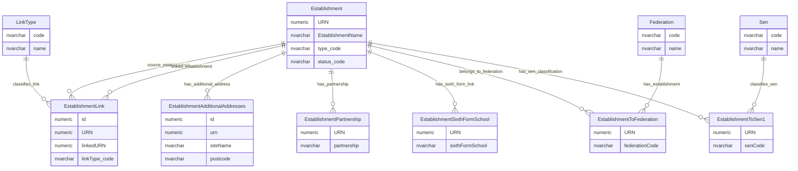

# Core Establishment Entity Relationship Diagram

This page explains the core establishment data model used to describe education provider records, their classification, lifecycle status, local authority context, location context and selected establishment relationships.

## Scope

This view focuses on:

- establishment identity and classification;
- local authority and postcode-derived geography context;
- independent school detail;
- establishment links and selected relationship tables;
- special educational needs classification.

It does not show audit, change-history, cache or permissions tables.

## How To Read This Model

The application behaviour shows some important business meaning that is not obvious from the table names alone:

- The DfE number / LAESTAB-style identifier is derived from local authority code plus establishment number. It is not stored as a single field.
- Establishment number is scoped by local authority. It should not be treated as globally unique on its own.
- Local authority is not just a display lookup. It affects identity, search, filtering and establishment-number allocation.
- Establishment type groups are not just reporting categories. They affect search, labels and type-specific behaviour.
- Some provider types behave as if they belong to more than one group. The physical schema shows a simpler relationship than the service behaviour.
- Additional addresses are a child collection of an establishment. Each additional address has its own establishment-scoped record number.
- Independent school data behaves like specialist detail attached to an establishment.
- SEN classification should focus on the current establishment-to-SEN relationship, rather than exposing historic numbered SEN bridge tables.
- Federation relationships are better understood through establishment group relationships than through the older federation lookup and bridge shape.
- Some fields and relationships exist for legacy compatibility, extracts or historic workflows. They should not always be read as the preferred conceptual model.

## Establishment Identity And Classification

This diagram shows the establishment as the central education provider record, with its type, status, local authority context and postcode-derived geography.



### Establishment

`Establishment` is the central table for an education provider record. It holds the provider identity, name, lifecycle status, provider type, local authority context, address and location fields, and other operational attributes.

Business-friendly pattern:

```text
For this education provider record,
what is its identity, classification, lifecycle state, location, contact detail and core operational context?
```

### EstablishmentType

`EstablishmentType` classifies the detailed type of provider, such as community school, academy converter, free school or pupil referral unit.

Business-friendly pattern:

```text
For this education provider record,
what detailed type of provider is it?
```

### EstablishmentTypeGroup

`EstablishmentTypeGroup` groups detailed establishment types into broader provider families.

Business-friendly pattern:

```text
For this establishment type,
which broader provider family does it belong to,
and how should that family affect search, display and type-specific behaviour?
```

### EstablishmentStatus

`EstablishmentStatus` describes the lifecycle state of an establishment, such as open, closed, proposed to open or created in error.

Business-friendly pattern:

```text
For this education provider record,
what lifecycle status applies?
```

### LocalAuthority

`LocalAuthority` provides the current and previous local authority context for an establishment. It also supports the derived DfE number / LAESTAB-style identifier when combined with `EstablishmentNumber`.

Business-friendly pattern:

```text
For this establishment,
which local authority context applies now or historically,
and how does that affect identity, search, permissions and establishment-number allocation?
```

### TrustSchool

`TrustSchool` records whether a maintained school is supported by a trust.

Business-friendly pattern:

```text
For this establishment,
is it supported by a trust?
```

### GeoData

`GeoData` maps a postcode to geography and administrative classification codes.

Business-friendly pattern:

```text
For this postcode,
which geography and administrative classification codes apply?
```

Notes:

- `URN` is the core establishment identifier.
- `LA_code` and `EstablishmentNumber` are used together to derive the DfE number / LAESTAB-style identifier.
- `PreviousLA_code` and `PreviousEstablishmentNumber` preserve previous local-authority-scoped identity context.
- The relationship between `GeoData` and `Establishment` is postcode-derived context rather than a direct establishment ownership relationship.

## Independent School Detail

This diagram shows specialist detail held for independent schools and their proprietors.



### IndependentSchools

`IndependentSchools` holds independent-school-specific detail associated with an establishment.

Business-friendly pattern:

```text
For this establishment,
where it is an independent-school-style provider,
what extra inspection, proprietor, boarding, fee, pupil, staff and IEBT detail applies?
```

### IndependentSchoolType

`IndependentSchoolType` classifies the kind of independent school.

Business-friendly pattern:

```text
For this independent-school detail record,
what kind of independent-school subtype is it?
```

### EstablishmentProprietors

`EstablishmentProprietors` holds repeatable proprietor records for independent-school detail.

Business-friendly pattern:

```text
For this independent school,
which numbered proprietor records are held,
and what contact/address details are recorded for each proprietor?
```

### ProprietorType

`ProprietorType` classifies the kind of proprietor, such as individual proprietor or proprietor body.

Business-friendly pattern:

```text
For this proprietor record,
what kind of proprietor is it?
```

Note:

- `IndependentSchools` is treated as specialist detail for establishments where the independent school classification applies.

## Establishment Relationships And Classification Links

This diagram shows selected direct relationship and bridge tables connected to an establishment.



### EstablishmentLink

`EstablishmentLink` records links from one establishment to another establishment, such as predecessor, successor, closure, amalgamation, merger or children's centre links.

Business-friendly pattern:

```text
For this establishment,
which other establishment is it linked to,
what kind of relationship is it,
and from what date does that relationship apply?
```

### LinkType

`LinkType` classifies the relationship recorded in `EstablishmentLink`.

Business-friendly pattern:

```text
For this establishment-to-establishment link,
what kind of relationship does the link represent?
```

### EstablishmentAdditionalAddresses

`EstablishmentAdditionalAddresses` holds additional site or address records for an establishment.

Business-friendly pattern:

```text
For this establishment,
which additional site or address records are held,
and which numbered address record is being created, changed or removed?
```

### EstablishmentPartnership

`EstablishmentPartnership` stores one or more partnership values against an establishment.

Business-friendly pattern:

```text
For this establishment,
what partnership values are recorded,
if this legacy/special-case field is still populated?
```

### EstablishmentSixthFormSchool

`EstablishmentSixthFormSchool` stores one or more sixth-form-school values against an establishment.

Business-friendly pattern:

```text
For this establishment,
what sixth-form-school values are recorded,
if this legacy/special-case field is still populated?
```

### EstablishmentToFederation

`EstablishmentToFederation` links an establishment to a federation lookup value.

Business-friendly pattern:

```text
For this establishment,
which legacy federation lookup value is it linked to?
```

### Federation

`Federation` is the lookup table for federation codes used by `EstablishmentToFederation`.

Business-friendly pattern:

```text
For this legacy federation code,
what federation value can an establishment be linked to?
```

### EstablishmentToSen1

`EstablishmentToSen1` links an establishment to one or more special educational needs codes.

Business-friendly pattern:

```text
For this establishment,
which current SEN provision or need codes are recorded?
```

### Sen

`Sen` is the lookup table for special educational needs classifications.

Business-friendly pattern:

```text
For this SEN code,
what SEN provision or need classification does it describe?
```

Notes:

- Establishment links allow one establishment to be related to another establishment, with the relationship classified by `LinkType`.
- Additional address rows hold extra sites or addresses linked to an establishment.
- Federation and SEN relationships are shown as bridge tables because the source schema represents them separately from the main establishment row.

## Reading This Diagram

These ERDs are explanatory views, not a complete schema catalogue. They show the main current-state relationships needed to understand establishment data.
