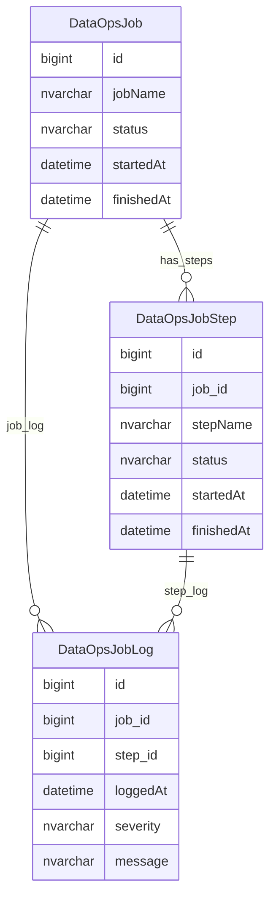

# DataOps Job Control And Logs

This page explains operational job-control and logging data used around DataOps processing.

## Scope

This view focuses on:

- job run control;
- job status and error logging;
- load or processing batches;
- operational evidence for import and maintenance processes.

## How To Read This Model

- Job-control tables are operational state, not domain data.
- Log rows explain whether a load or batch process ran, failed or produced output.
- Operational job metadata can be important for support and assurance even when it is not part of the provider model.

## Application-Derived Insights

- These tables should be modelled as operational observability and processing state.
- They should not become source-of-truth business entities in a target model.
- Retention requirements depend on support, audit and operational monitoring needs.
- Public documentation should explain the job-control purpose without exposing internal file paths or infrastructure detail.

## Job Control And Logs



### DataOpsJob

`DataOpsJob` represents an import, maintenance or data processing job run.

Business-friendly pattern:

```text
For this operational data job,
what process ran,
when did it run,
and what final status was recorded?
```

### DataOpsJobStep

`DataOpsJobStep` represents a step or stage within a data job.

Business-friendly pattern:

```text
For this operational data job,
which processing step ran,
and what happened at that step?
```

### DataOpsJobLog

`DataOpsJobLog` records messages, warnings or errors from job processing.

Business-friendly pattern:

```text
For this operational data job or step,
what message, warning or error was recorded?
```

## Reading This Diagram

These ERDs are explanatory views. Operational job tables support running, monitoring and troubleshooting data processes; they are not provider-domain records.

