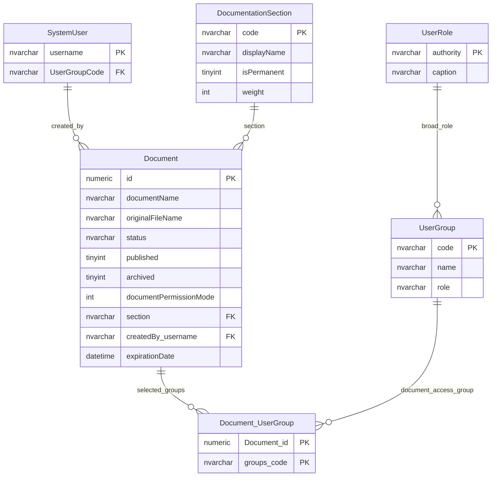

# Document Access

This page records the legacy document-access model and the current table-usage caveat.

## Scope

This model covers:

- document audience selection;
- document section/category;
- document publication and archive gates;
- user-group visibility modes.

The tables in this slice are marked as having no observed production read or write activity in the 30-day table-usage evidence. They are therefore shown as a legacy access model rather than as confirmed active product behaviour.

## How To Read This Model

- Documents can be linked to selected user groups.
- A document can also use a broader permission mode rather than selected groups.
- Publication and archive status affect whether a document appears in normal listings.
- Document section is taxonomy, not permission by itself.

## Application-Derived Insights

- Document access is a content visibility model, not a data-field permission model.
- Document audience, document lifecycle and document taxonomy are mixed in one area.
- Broad audience modes can grant access without a selected-group bridge row.
- Future design should separate document content, lifecycle, taxonomy and audience policy.

## Document Audience Model



### Document

Business-friendly pattern:

```text
For this document,
is access limited to selected user groups,
or is it available to a broader audience mode?
```

### Document_UserGroup

Business-friendly pattern:

```text
For this document,
which specific user groups are allowed to see it when the document is in selected-groups mode?
```

### DocumentationSection

Business-friendly pattern:

```text
For this document,
which document section does it belong to,
and is that section a permanent built-in section?
```

## Reading This Diagram

Use this model as a legacy document visibility pattern. If document publishing remains in scope, confirm whether this table set is still required before carrying it into a future model.
