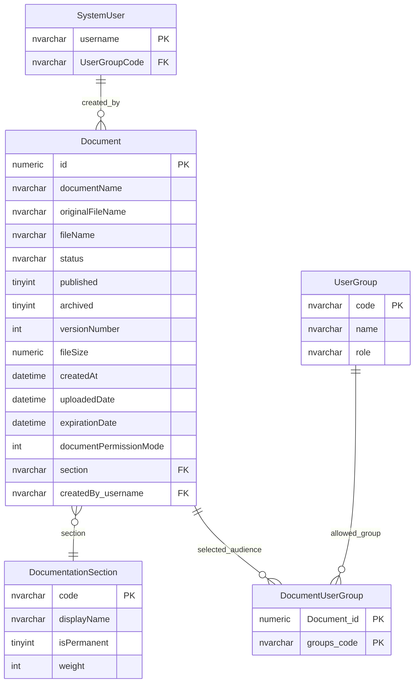
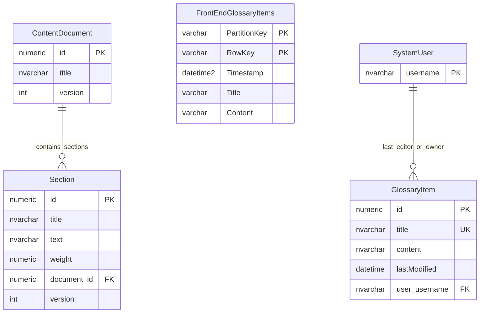

# Documents And Content

This page explains document library, content page and glossary content tables.

## Scope

This model covers:

- uploaded document metadata;
- document sections and selected audiences;
- content pages and page sections;
- glossary content in legacy and frontend shapes.

## How To Read This Model

- Uploaded documents are file metadata records, not the binary file itself.
- Document sections are content taxonomy.
- Document audience rules are covered in more detail in `document-access.md`.
- Content pages and glossary items are content-management artefacts, not provider records.

## Application-Derived Insights

- Document content, lifecycle, taxonomy and audience are mixed in the legacy document model.
- Frontend glossary content uses a different key shape from the legacy glossary table.
- Current table-usage evidence marks several legacy document/content tables as candidates for retirement.
- Future design should separate file storage, metadata, content taxonomy, lifecycle and audience policy.

## Document Library



### Document

Business-friendly pattern:

```text
For this uploaded document,
what file is stored,
what section does it belong to,
and is it published, archived or expired?
```

### DocumentationSection

Business-friendly pattern:

```text
For this document,
which document section or category does it belong to,
and is that section protected as permanent?
```

### DocumentUserGroup

Business-friendly pattern:

```text
For this document,
which specific user groups are selected as its audience?
```

## Content Pages And Glossary



### ContentDocument And Section

Business-friendly pattern:

```text
For this content page,
what sections make up the page,
and in what order should they be displayed?
```

### GlossaryItem

Business-friendly pattern:

```text
For this glossary entry,
what term and content should be displayed,
and who last owned or edited it?
```

### FrontEndGlossaryItems

Business-friendly pattern:

```text
For this frontend glossary entry,
what term and content should be displayed using the frontend content store?
```

## Reading This Diagram

Use this model to distinguish content management from provider data. If any legacy content capability is retained, confirm whether the legacy table or frontend content-store shape is the current source of truth.
