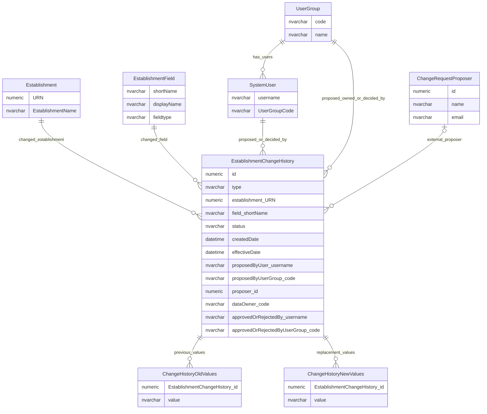
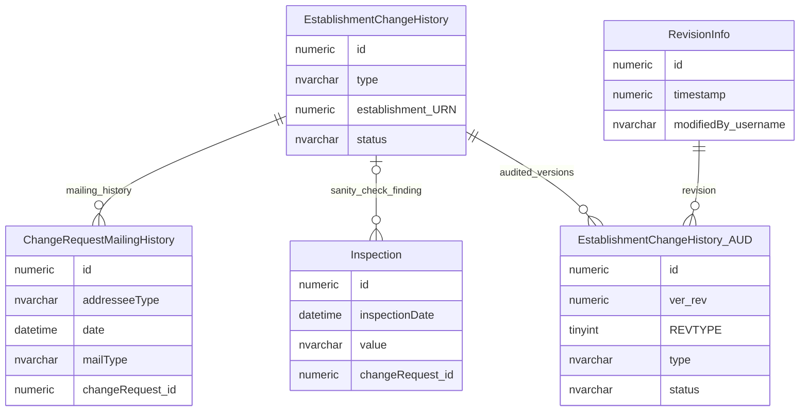

# Establishment Change History And Approval Workflow

This page explains how establishment field changes are proposed, assessed, approved, rejected, applied and retained as history.

## Scope

This view focuses on:

- establishment field change requests;
- proposer, owner and approver context;
- old and new values;
- mailing and inspection history;
- audit snapshots of change history.

## How To Read This Model

- `EstablishmentChangeHistory` is business workflow state, not only an audit log.
- A row can be pending, approved, rejected, applied or historical.
- The changed field is identified through establishment field metadata.
- Old and new values can be scalar or multi-value.
- User group context matters because change ownership and approval are group-based as well as user-based.

## Application-Derived Insights

- Establishment change history is used as the working record for change requests, not only as a passive history table.
- The application interprets the change type to decide which fields and value columns are meaningful.
- The application can apply some changes directly and route others through approval, depending on ownership and trusted-source rules.
- Field metadata is central to the workflow because it tells the application how a logical establishment field should be displayed, changed and validated.
- Multi-value changes need companion old/new value tables because one logical field change can involve a set of values.
- Mailing and inspection records are supporting evidence around the change workflow, not the source of the establishment data itself.
- Technical audit snapshots of change-history rows are separate from the business workflow recorded by the change-history table.

## Core Establishment Change Workflow



### EstablishmentChangeHistory

`EstablishmentChangeHistory` records proposed and completed changes to establishment fields.

Business-friendly pattern:

```text
For this establishment field change,
what was proposed,
who proposed it,
who owned and decided it,
what happened to it,
and what values existed before and after?
```

### ChangeHistoryOldValues

`ChangeHistoryOldValues` stores previous values for multi-value establishment changes.

Business-friendly pattern:

```text
For this multi-value establishment change,
which values were present before the change was applied or proposed?
```

### ChangeHistoryNewValues

`ChangeHistoryNewValues` stores proposed or applied replacement values for multi-value establishment changes.

Business-friendly pattern:

```text
For this multi-value establishment change,
which values were proposed or applied as the replacement values?
```

### ChangeRequestProposer

`ChangeRequestProposer` represents a proposer who is not recorded as a normal system user.

Business-friendly pattern:

```text
For this proposed establishment change,
who submitted the proposal when they are not represented as a system user?
```

## Supporting History And Inspection



### ChangeRequestMailingHistory

`ChangeRequestMailingHistory` records messages sent about a change request.

Business-friendly pattern:

```text
For this establishment change request,
which mailing or notification was sent,
to whom,
and when?
```

### Inspection

`Inspection` stores sanity-check or inspection findings associated with a change request.

Business-friendly pattern:

```text
For this establishment change request,
what inspection or sanity-check finding was recorded?
```

## Reading This Diagram

These ERDs are explanatory views, not a complete workflow specification. Approval rules, ownership rules and trusted-source rules should be read alongside the access-control and data-stewardship documentation.
