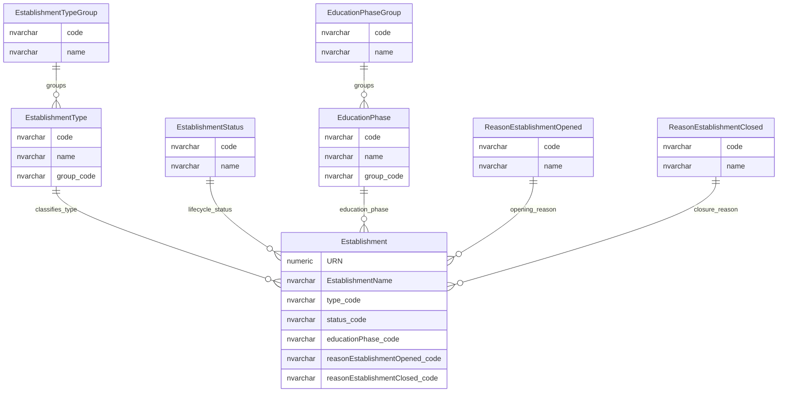
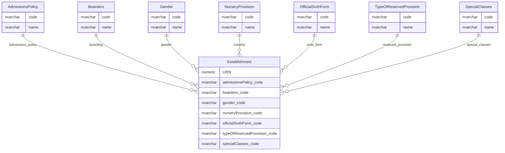
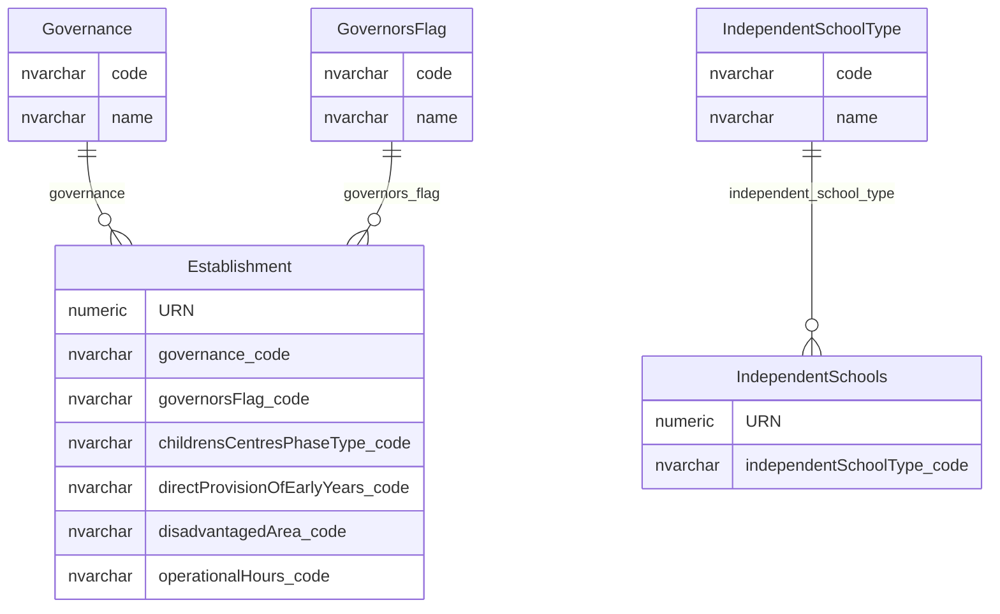

# Establishment Classifications

This page explains the reference and classification data used to describe establishments.

## Scope

This view focuses on:

- establishment type, type group, status and education phase;
- opening and closure reasons;
- provision and characteristic classifications;
- governance, early years and independent school classifications.

It does not show audit tables or inactive classification audit history.

## How To Read This Model

- Most classification tables use a common code-list pattern: `code`, `name`, archived state and display order or identifier.
- The physical database normally stores the `code`, while application and API layers may expose numeric IDs.
- Establishment type and education phase both use a detailed value plus broader group pattern.
- Some classification values affect behaviour, search, visibility and validation; they are not only display labels.
- Governance and early years meaning appears partly as lookup-coded attributes on the establishment record.

## Application-Derived Insights

- Establishment type groups affect labels, search, display and type-specific behaviour.
- Establishment status participates in visibility and workflow decisions.
- Some classification values exist for legacy or archived cases and should not automatically become active target reference data.
- The target model should preserve the distinction between detailed type and broader grouping, rather than collapsing them into one flat value.

## Core Establishment Classification



### EstablishmentType

`EstablishmentType` is the detailed type classification for an establishment.

Business-friendly pattern:

```text
For this education provider record,
what detailed type of provider is it?
```

### EstablishmentTypeGroup

`EstablishmentTypeGroup` groups detailed establishment types into broader provider families.

Business-friendly pattern:

```text
For this establishment type,
which broader provider family does it belong to?
```

### EstablishmentStatus

`EstablishmentStatus` describes the lifecycle state of an establishment.

Business-friendly pattern:

```text
For this education provider record,
what lifecycle status applies?
```

### EducationPhase

`EducationPhase` classifies the phase of education for an establishment.

Business-friendly pattern:

```text
For this establishment,
what phase of education does it provide?
```

### EducationPhaseGroup

`EducationPhaseGroup` groups detailed education phases into broader phase families.

Business-friendly pattern:

```text
For this education phase,
which broader phase group does it belong to?
```

## Provision And Characteristics



### Provision And Characteristic Code Lists

These tables classify provision or operational characteristics recorded on the establishment.

Business-friendly pattern:

```text
For this establishment,
which provision or characteristic value applies?
```

## Governance, Early Years And Independent School Classifications



### Governance And Early Years Code Lists

These tables classify governance and early-years attributes held directly on establishment records.

Business-friendly pattern:

```text
For this establishment,
which governance or early-years classification applies?
```

### IndependentSchoolType

`IndependentSchoolType` classifies independent-school detail records, not the main establishment type.

Business-friendly pattern:

```text
For this independent-school detail record,
what kind of independent-school subtype is it?
```

## Reading This Diagram

These ERDs are explanatory views, not complete reference-data seed lists. Active target values should be confirmed against production use and business ownership.

