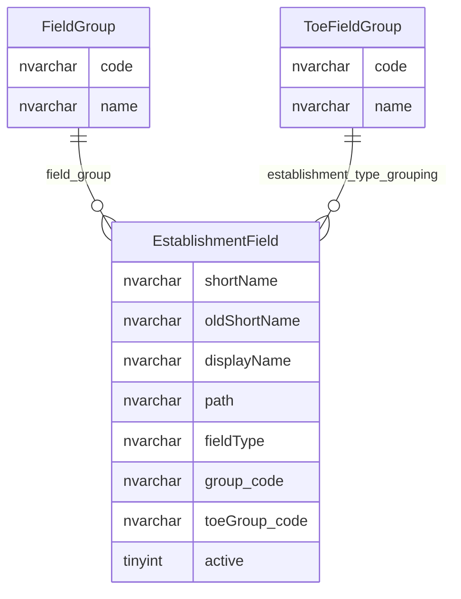
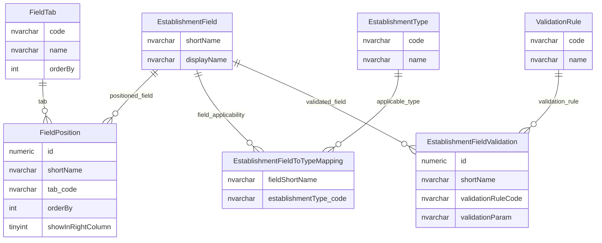

# Establishment Field Metadata And Mapping

This page explains how logical establishment fields are catalogued, displayed, validated, mapped and made applicable to establishment types.

## Scope

This view focuses on:

- logical establishment field metadata;
- display grouping, tabs and positions;
- establishment-type applicability;
- validation rules;
- extract and physical field mapping concepts.

## How To Read This Model

- `EstablishmentField` describes logical establishment fields, not the stored values themselves.
- One logical field can drive display, validation, permissions, extracts and change workflow.
- Field positioning controls where the field appears, not what value it stores.
- Applicability tables define which establishment types a field applies to.
- Validation rules attach reusable validation behaviour to logical fields.

## Application-Derived Insights

- Establishment fields are metadata-driven across display, editing, validation, extract and workflow behaviour.
- The logical field catalogue hides a lot of application behaviour behind one short name.
- Target modelling should not treat the wide `Establishment` table alone as the field model; the metadata controls how fields behave.
- Type-specific field rules are essential because not every establishment field applies to every provider type.

## Metadata Catalogue



### EstablishmentField

`EstablishmentField` is the central catalogue of establishment logical fields.

Business-friendly pattern:

```text
For this logical establishment field,
what is it called,
where is the value found,
how should it be handled,
and is it active?
```

### FieldGroup

`FieldGroup` groups establishment fields into broad functional areas.

Business-friendly pattern:

```text
For this establishment field,
which broad field group does it belong to?
```

### ToeFieldGroup

`ToeFieldGroup` groups fields by type-of-establishment applicability.

Business-friendly pattern:

```text
For this establishment field,
which type-of-establishment field grouping applies?
```

## Positioning, Applicability And Validation



### FieldPosition

`FieldPosition` controls where establishment fields appear.

Business-friendly pattern:

```text
For this logical establishment field,
where should it appear on the user interface?
```

### FieldTab

`FieldTab` is the tab catalogue used for establishment field display.

Business-friendly pattern:

```text
For this establishment field position,
which tab should contain the field?
```

### EstablishmentFieldToTypeMapping

`EstablishmentFieldToTypeMapping` controls which establishment types a field applies to.

Business-friendly pattern:

```text
For this logical establishment field,
which establishment types should use it?
```

### EstablishmentFieldValidation

`EstablishmentFieldValidation` attaches validation rules to establishment logical fields.

Business-friendly pattern:

```text
For this logical establishment field,
which validation rules apply?
```

### ValidationRule

`ValidationRule` is the reusable validation rule catalogue.

Business-friendly pattern:

```text
For this validation rule,
what reusable rule can be applied to a logical field?
```

## Reading This Diagram

These ERDs are explanatory views. Logical field metadata is a control model for application behaviour, not just documentation about columns.

