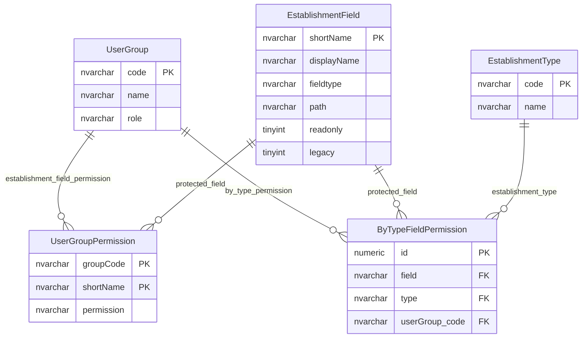

# Establishment Field Permissions

This page explains how user groups receive read or write permissions for logical establishment fields, including rules that vary by establishment type.

## Scope

This model covers:

- establishment field metadata used by permissions;
- user-group field permission levels;
- establishment-type-specific field permission;
- the relationship between general permission and type-specific permission.

## How To Read This Model

- `EstablishmentField` is metadata for a logical field, not the provider data itself.
- `UserGroupPermission` gives a user group a general permission for a field.
- `ByTypeFieldPermission` narrows use of a field to a specific establishment type and user group.
- Effective field access depends on multiple checks, not one table alone.

## Application-Derived Insights

- `WRITE` also implies read access in the current permission model.
- Type-specific field permission acts as an additional gate, not as the read/write level.
- The frontend generally receives fields after the backend has already applied these permission rules.
- Future design should keep field metadata, field applicability and access policy separate but connected.

## Establishment Field Permissions



### EstablishmentField

Business-friendly pattern:

```text
For this logical establishment field,
how is it named, displayed, found in the domain model,
validated, permissioned and mapped to stored data?
```

### UserGroupPermission

Business-friendly pattern:

```text
For this user group,
for this establishment field,
can the group read it, write it, or neither?
```

Permission meaning:

| Permission | Meaning |
| --- | --- |
| `NONE` | The group cannot read or write the field through this permission model. |
| `READ` | The group can read the field where other rules allow it. |
| `WRITE` | The group can read and write the field where other rules allow it. |

### ByTypeFieldPermission

Business-friendly pattern:

```text
For this user group,
for this establishment field,
on this establishment type,
is the field allowed to be used?
```

## Reading This Diagram

Use this model as the field-level access-control matrix for establishment data. Effective access should be understood as the combination of general permission, field applicability, type-specific permission and any workflow or ownership rules that apply to the change.
