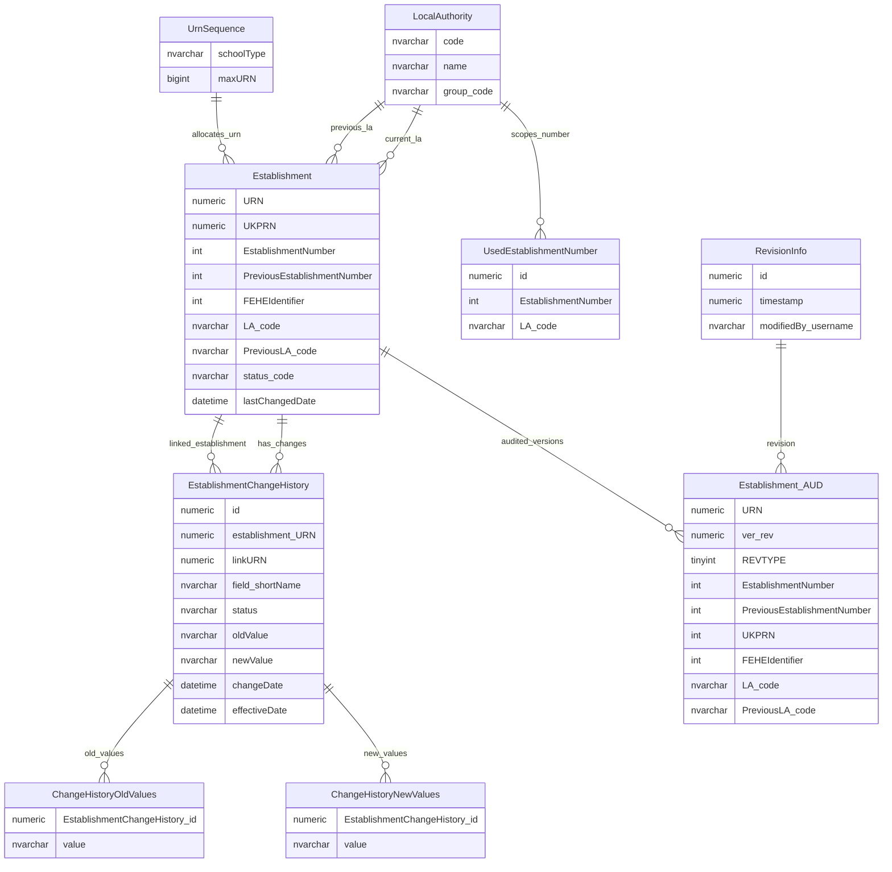

# Establishment Identifier Lifecycle Entity Relationship Diagram

This page explains the data model used to support establishment identity, local-authority-scoped establishment number allocation, previous identifiers and establishment identifier change history.

## Scope

This view focuses on:

- establishment identifiers;
- local authority context for DfE number / LAESTAB-style identifiers;
- establishment number allocation and anti-reuse;
- URN sequence allocation;
- establishment change history for identifier changes;
- audit revision context for establishment identifier snapshots.

It does not show wider establishment detail, group-level UKPRN synchronisation, sharing cache tables or the full audit catalogue.

## How To Read This Model

The application behaviour shows some important business meaning that is not obvious from the table names alone:

- `URN` is the main establishment identity and lifecycle anchor.
- A school can appear continuous to users while a new legal establishment record receives a new `URN`, especially around academy conversion.
- The DfE number / LAESTAB-style identifier is derived from local authority code plus establishment number.
- Establishment number is meaningful only with local authority context.
- Previous local authority code and previous establishment number preserve previous identity context.
- `UsedEstablishmentNumber` protects local-authority-scoped establishment numbers from reuse or accidental reallocation.
- `UrnSequence` is allocation state, not a relationship from one establishment to another.
- Establishment change history is business workflow/change evidence, not just technical audit.

## Identifier Lifecycle



### Establishment

`Establishment` holds the current and previous identifier fields for an education provider record.

Business-friendly pattern:

```text
For this establishment,
what are its current and previous identifiers,
including URN, UKPRN, LA code, establishment number and FE/HE identifier?
```

### LocalAuthority

`LocalAuthority` provides the local authority context needed to interpret local-authority-scoped establishment numbers.

Business-friendly pattern:

```text
For this establishment identifier,
which local authority provides the context for LAESTAB/DfE-number-style identifiers?
```

### UsedEstablishmentNumber

`UsedEstablishmentNumber` records establishment numbers that are unavailable within a local authority.

Business-friendly pattern:

```text
For this local authority,
which establishment numbers have already been used, reserved or blocked,
so that GIAS does not allocate the same LA plus establishment-number pair again?
```

### UrnSequence

`UrnSequence` stores allocation state for identifier families, including establishment URNs.

Business-friendly pattern:

```text
For this identifier family,
what is the latest allocated number,
and what value should GIAS allocate next?
```

### EstablishmentChangeHistory

`EstablishmentChangeHistory` records proposed, approved, rejected and applied changes to establishment fields.

Business-friendly pattern:

```text
For this establishment,
which field was changed or proposed for change,
what was the old value,
what was the new value,
and what happened to the change request?
```

### ChangeHistoryOldValues

`ChangeHistoryOldValues` stores previous values for multi-value establishment changes.

Business-friendly pattern:

```text
For this multi-value establishment change,
which values were present before the change was applied or proposed?
```

### ChangeHistoryNewValues

`ChangeHistoryNewValues` stores replacement values for multi-value establishment changes.

Business-friendly pattern:

```text
For this multi-value establishment change,
which values were proposed or applied as the replacement values?
```

### Establishment_AUD

`Establishment_AUD` stores point-in-time audited snapshots of the establishment row.

Business-friendly pattern:

```text
For this establishment,
at this audit revision,
what did the establishment row look like?
```

### RevisionInfo

`RevisionInfo` is the shared audit revision header.

Business-friendly pattern:

```text
For this audit revision,
when did the audited change happen,
and which internal user was associated with it?
```

## Reading This Diagram

These ERDs are explanatory views, not a complete schema catalogue. Identifier allocation and change history combine physical relationships with inferred allocation and audit patterns.

