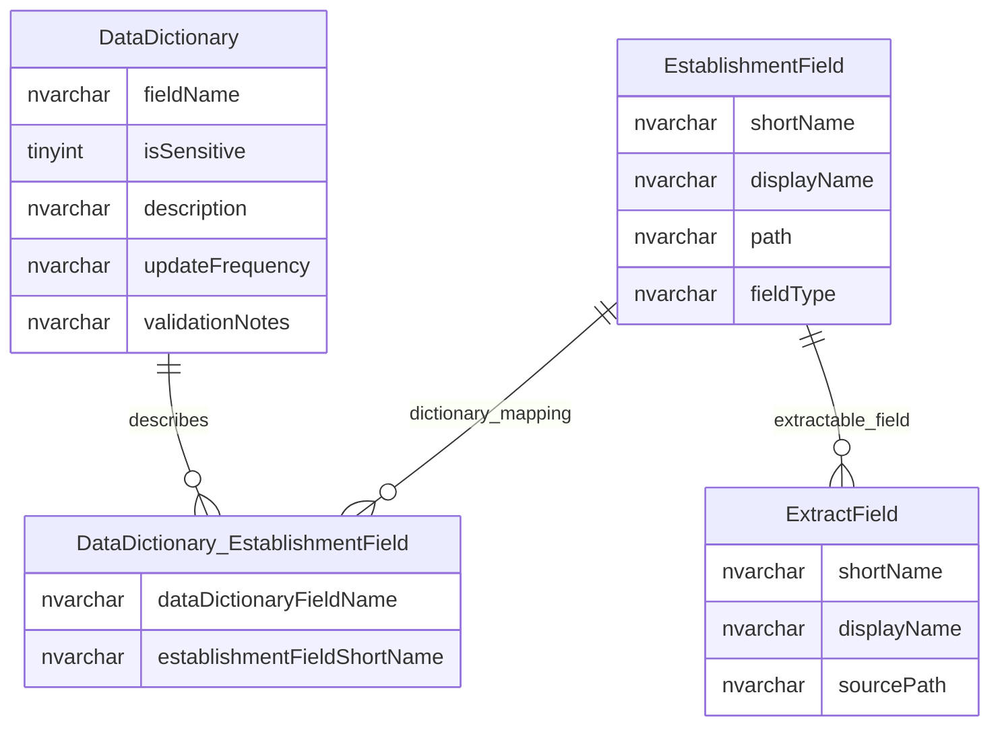

# Extract Configuration And Data Dictionary

This page explains metadata used to define extractable fields and describe data dictionary entries.

## Scope

This view focuses on:

- logical field definitions used for extracts;
- data dictionary descriptions and validation notes;
- field-to-dictionary relationships;
- business-friendly meaning of field metadata.

## How To Read This Model

- Extract configuration is metadata about what can be exported or described.
- The data dictionary explains field meaning, collection/update notes and validation guidance.
- Some dictionary entries are richer than others; null descriptions do not necessarily mean the field is unused.
- Data dictionary content is documentation and governance metadata, not the operational value itself.

## Application-Derived Insights

- Extract and dictionary metadata helps bridge physical columns, logical field names and business meaning.
- Validation text may describe business rules that are not fully enforced by database constraints.
- Target extracts should be designed from agreed logical fields, not from legacy column names alone.
- The data dictionary can inform public field descriptions but should be checked against current service behaviour.

## Extract And Dictionary Metadata



### DataDictionary

`DataDictionary` describes field meaning, update notes and validation guidance.

Business-friendly pattern:

```text
For this data field,
what does it mean,
how is it maintained,
and what validation or usage notes should users understand?
```

### DataDictionary_EstablishmentField

`DataDictionary_EstablishmentField` links data dictionary entries to logical establishment fields.

Business-friendly pattern:

```text
For this data dictionary entry,
which logical establishment field does it describe?
```

### ExtractField

`ExtractField` represents a field made available to extract or reporting processes.

Business-friendly pattern:

```text
For this extract field,
which logical value should be exported,
and how should it be labelled?
```

## Reading This Diagram

These ERDs are explanatory views. Data dictionary and extract metadata should be treated as descriptive/governance metadata and validated against current field behaviour.

