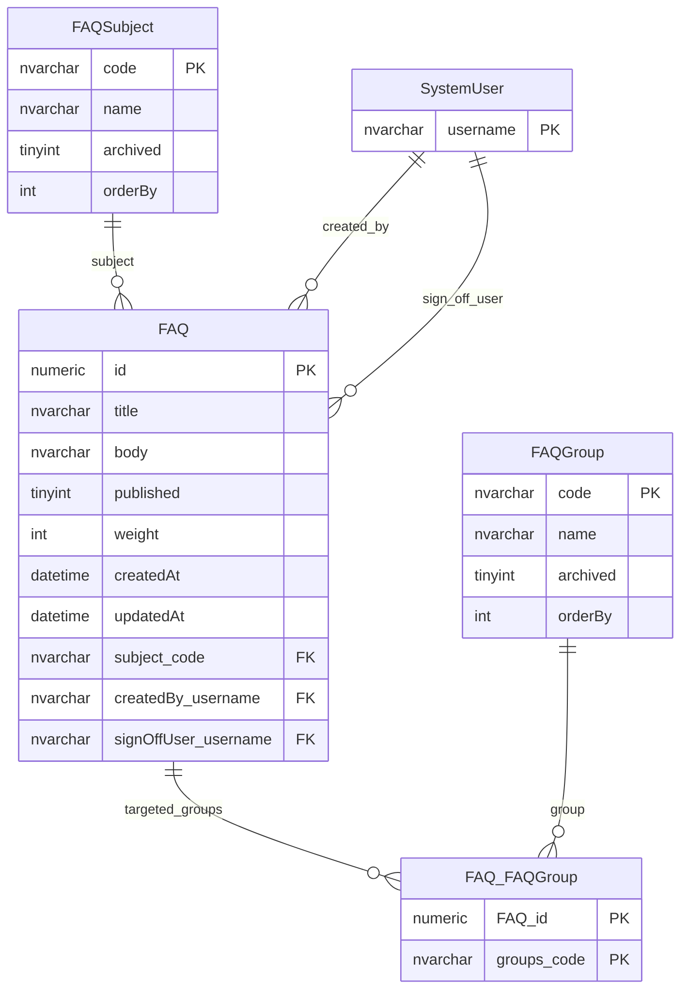
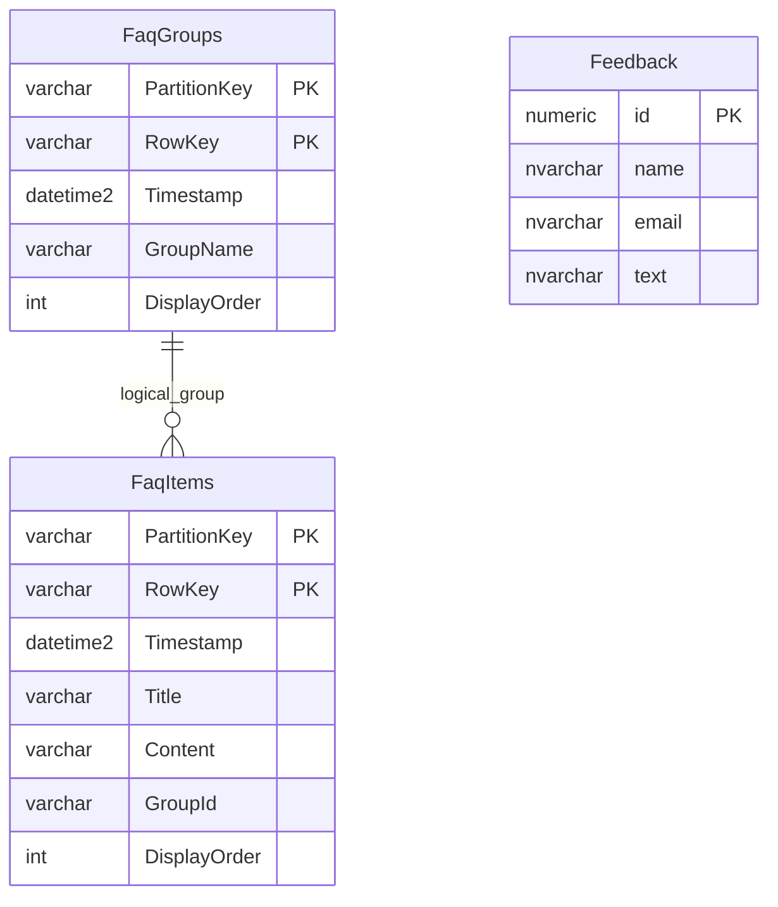

# FAQs And Feedback

This page explains FAQ and feedback content tables.

## Scope

This model covers:

- legacy FAQ authoring and sign-off;
- legacy FAQ subjects and groups;
- frontend FAQ groups and items;
- the simple legacy feedback table.

## How To Read This Model

- Legacy FAQs combine content, subject, audience grouping and sign-off.
- Frontend FAQs use a simpler content-store shape.
- Feedback is a standalone contact-text record in the captured schema.
- Legacy FAQ tables are candidates for retirement unless their workflow is confirmed as active.

## Application-Derived Insights

- The legacy FAQ model is more workflow-heavy than the frontend FAQ model.
- Legacy FAQ groups are not the same thing as frontend FAQ display groups.
- Feedback content contains user-submitted contact text and should be handled as content/support data, not reference data.
- Future design should choose one FAQ source of truth.

## Legacy FAQ Model



### FAQ

Business-friendly pattern:

```text
For this legacy FAQ,
what question and answer content should be shown,
which subject does it belong to,
which groups is it for,
and has it been signed off for publication?
```

### FAQSubject

Business-friendly pattern:

```text
For this legacy FAQ,
which subject or category classifies it?
```

### FAQGroup

Business-friendly pattern:

```text
For this legacy FAQ,
which audience or display group should it belong to?
```

## Frontend FAQ And Feedback



### FaqGroups And FaqItems

Business-friendly pattern:

```text
For this frontend FAQ item,
which display group contains it,
and in what order should it be shown?
```

### Feedback

Business-friendly pattern:

```text
For this feedback submission,
what contact details and message text were submitted?
```

## Reading This Diagram

Use this model to compare the legacy FAQ workflow with the simpler frontend FAQ store. They should not both be assumed to be active sources of truth.
