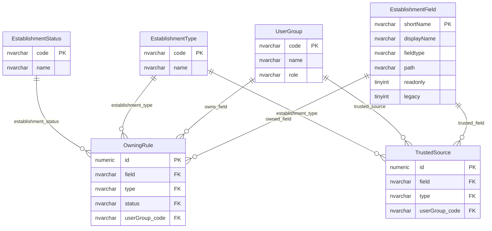

# Field Ownership And Trusted Source

This page explains the rules that connect establishment fields to data-owner groups and trusted-source groups.

## Scope

This model covers:

- ownership of establishment fields by type and status;
- trusted-source groups for establishment fields by type;
- the relationship between field metadata, establishment type, establishment status and user group.

## How To Read This Model

- Ownership is a workflow concept, not simply read or write permission.
- Trusted source is a change-decision concept, not simply field visibility.
- Ownership varies by establishment field, establishment type and establishment status.
- Trusted-source rules vary by establishment field and establishment type.

## Application-Derived Insights

- Ownership decides who is accountable for a field in a specific provider context.
- Trusted-source rules help decide whether a proposed change needs approval.
- Ownership and write permission are related in behaviour, but they are not the same concept.
- Future design should model ownership, permission and approval policy separately.

## Field Ownership And Trusted Source



### OwningRule

Business-friendly pattern:

```text
For this establishment field,
for this establishment type,
in this establishment status,
which user group owns the data?
```

`OwningRule` allows one owner for a field, establishment type and status combination.

### TrustedSource

Business-friendly pattern:

```text
For this establishment field,
for this establishment type,
which user groups are trusted sources?
```

Multiple trusted-source groups can exist for the same field and establishment type.

### EstablishmentField

Business-friendly pattern:

```text
For this ownership or trusted-source rule,
which logical establishment field does it govern?
```

## Reading This Diagram

Use this model to understand data stewardship responsibility. A user group may be able to read or write a field, but ownership and trusted-source status answer different workflow questions about accountability and approval.
