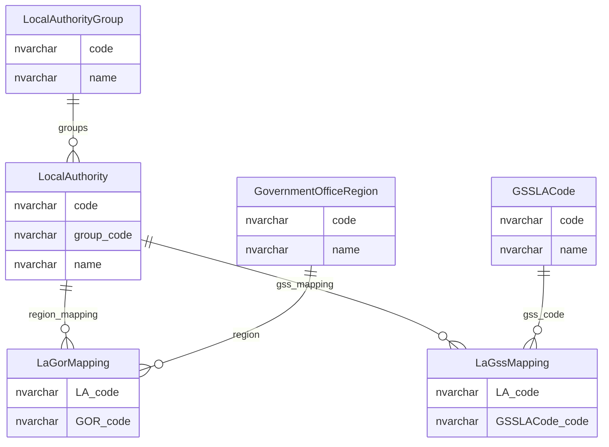
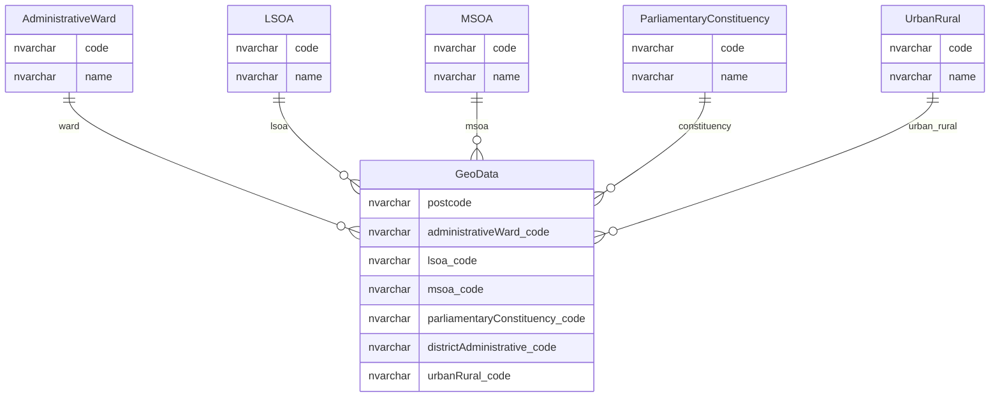

# Geography And Administrative Classifications

This page explains geography and administrative reference data used by establishments, local authorities and postcode-derived location context.

## Scope

This view focuses on:

- local authorities and local authority groups;
- government office regions and GSS local authority mappings;
- establishment geography columns;
- postcode-derived geography through `GeoData`;
- postcode and location average coordinates.

It does not show audit tables or staging tables marked as inactive.

## How To Read This Model

- Local authority is reference data with identity implications, not just geography.
- Establishments store many geography codes directly for main and contact addresses.
- `GeoData` maps postcodes to administrative and statistical geographies.
- Country fields reuse `Nationality`, which is a legacy naming mismatch.
- Some geography relationships are derived through postcode or mapping procedures rather than direct foreign keys.

## Application-Derived Insights

- Local authority participates in establishment identity, establishment-number scoping, user scope and group relationships.
- Postcode-derived geography supports display, search, filtering and classification.
- Target modelling should separate manually held geography, postcode-derived geography and imported/reference geography.
- Naming mismatches such as country values stored through `Nationality` should be corrected or clearly abstracted in public models.

## Local Authority And Region



### LocalAuthority

`LocalAuthority` is the core administrative authority reference table.

Business-friendly pattern:

```text
For this establishment, group or user scope,
which local authority context applies?
```

### LocalAuthorityGroup

`LocalAuthorityGroup` groups local authorities into broad subsets.

Business-friendly pattern:

```text
For this local authority,
which national or subset grouping does it belong to?
```

### LaGorMapping

`LaGorMapping` maps local authorities to Government Office Regions.

Business-friendly pattern:

```text
For this local authority,
which Government Office Region should be derived or defaulted?
```

### LaGssMapping

`LaGssMapping` maps local authorities to GSS local authority codes.

Business-friendly pattern:

```text
For this local authority,
which GSS local authority code should be used?
```

## Postcode-Derived Geography



### GeoData

`GeoData` maps a postcode to administrative and statistical geography classifications.

Business-friendly pattern:

```text
For this postcode,
which geography and administrative classification codes apply?
```

### Geography Code Lists

Administrative ward, LSOA, MSOA, parliamentary constituency and urban/rural tables provide geography code-list values.

Business-friendly pattern:

```text
For this geography code,
what geography or administrative area does it describe?
```

## Reading This Diagram

These ERDs are explanatory views. Geography values may be held, imported, mapped or derived, so target ownership rules need to distinguish those sources.

