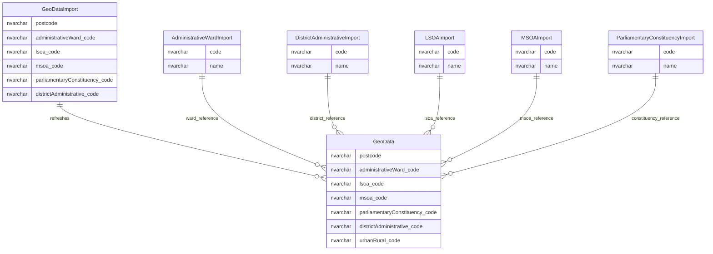

# Geography And Postcode Imports

This page explains import staging and refresh data used to maintain postcode, geography and administrative classification reference data.

## Scope

This view focuses on:

- postcode and geography import staging;
- reference data refresh for wards, districts, LSOA, MSOA and parliamentary constituencies;
- postcode-to-constituency import data;
- postcode-derived geography data used by establishments.

It does not show staging tables marked as having no observed activity.

## How To Read This Model

- Geography import tables are staging and refresh structures.
- `GeoData` is the operational postcode-to-geography reference table used by the wider establishment model.
- Import tables often have procedure-level relationships rather than physical foreign keys.
- Postcode and geography data supports display, search, filtering and statistical classification.

## Application-Derived Insights

- The user-facing application depends on the resulting geography values, not on the staging tables directly.
- The important business concept is postcode-derived geography context, not the import file shape.
- SQL procedures are a key part of this model because they transform staging rows into maintained geography reference data.
- Some import staging tables show active usage, while others should be treated as candidates for retirement or confirmation.

## Geography Import And Reference Data



### GeoDataImport

`GeoDataImport` stages postcode-to-geography data before it is loaded into the maintained geography reference table.

Business-friendly pattern:

```text
For this imported postcode,
which geography and administrative codes should be loaded or refreshed?
```

### GeoData

`GeoData` maps postcodes to geography and administrative classification codes.

Business-friendly pattern:

```text
For this postcode,
which geography and administrative classification codes apply?
```

### AdministrativeWardImport

`AdministrativeWardImport` stages administrative ward reference values.

Business-friendly pattern:

```text
For this imported ward code,
what name should be available to refresh the ward reference list?
```

### DistrictAdministrativeImport

`DistrictAdministrativeImport` stages district administrative reference values.

Business-friendly pattern:

```text
For this imported district administrative code,
what name should be available to refresh the district reference list?
```

### LSOAImport

`LSOAImport` stages Lower Layer Super Output Area reference values.

Business-friendly pattern:

```text
For this imported LSOA code,
what name should be available to refresh the LSOA reference list?
```

### MSOAImport

`MSOAImport` stages Middle Layer Super Output Area reference values.

Business-friendly pattern:

```text
For this imported MSOA code,
what name should be available to refresh the MSOA reference list?
```

### ParliamentaryConstituencyImport

`ParliamentaryConstituencyImport` stages parliamentary constituency reference values.

Business-friendly pattern:

```text
For this imported parliamentary constituency code,
what name should be available to refresh the parliamentary constituency reference list?
```

## Reading This Diagram

These ERDs are explanatory views. The import tables support refresh of reference data; the maintained geography reference data is what the wider establishment model consumes.

