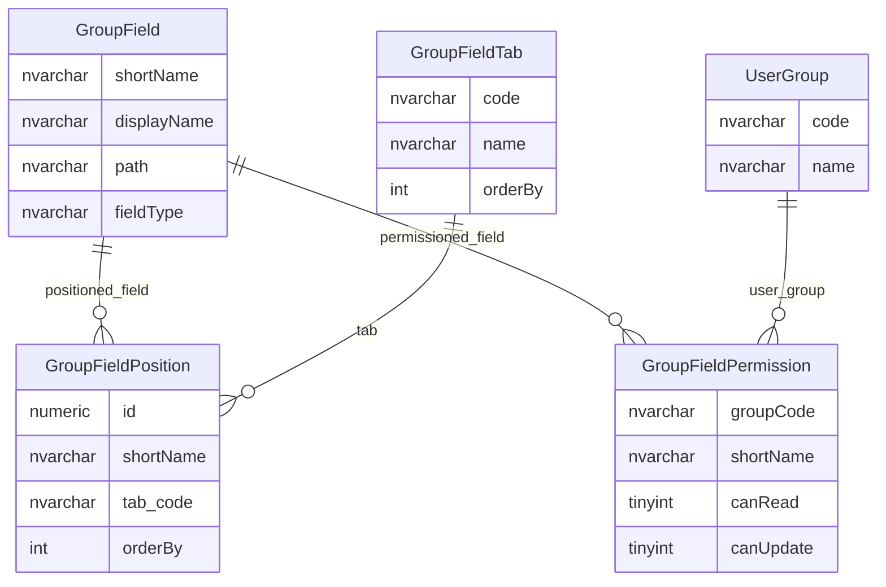
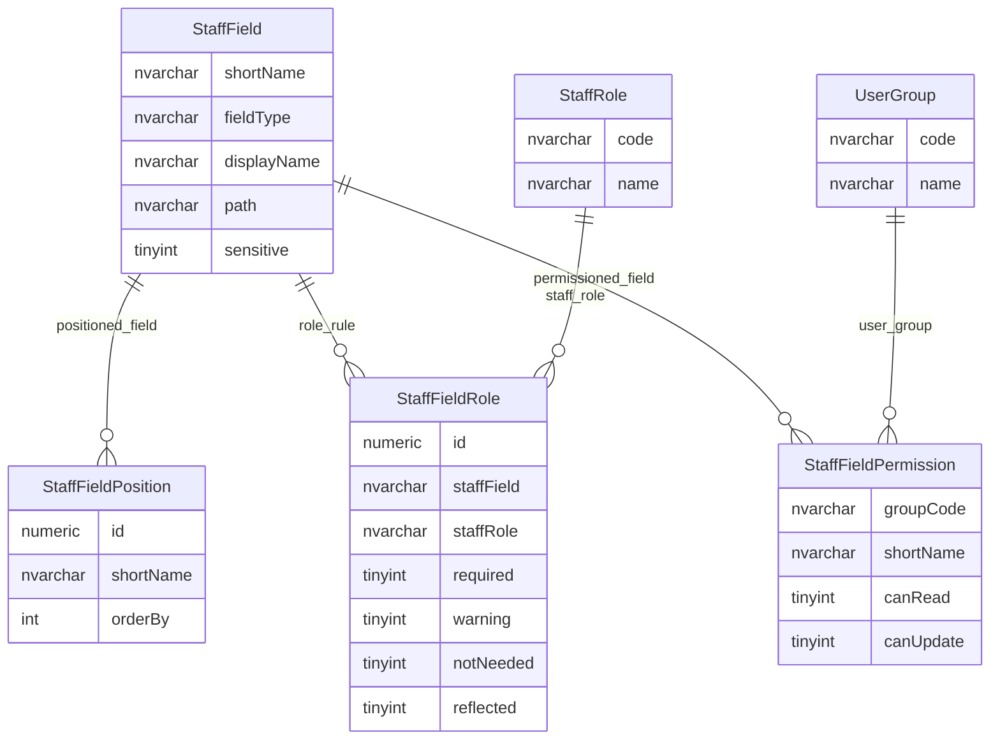

# Group And Staff Field Metadata

This page compares the metadata models used for organisation group fields and governance/staff fields.

## Scope

This view focuses on:

- group field metadata, positioning, validation and permissions;
- staff field metadata, positioning, role rules, validation and permissions;
- common patterns and differences between group and staff logical fields.

It does not show audit tables or validation tables marked as inactive.

## How To Read This Model

- Group and staff field metadata follow the same broad logical-field pattern.
- One logical field key can drive display, mapping, validation, permissions and change workflow.
- Group fields have a tab catalogue; staff fields use position and role-specific rules.
- Staff fields include role-specific behaviour such as required, warning-only, not-needed and reflected.
- Permission tables share the same basic grain: user group plus logical field.

## Application-Derived Insights

- Field metadata is a control model for runtime behaviour, not simply documentation.
- Group, staff and establishment field metadata repeat the same pattern but with domain-specific extensions.
- Target modelling could benefit from a shared logical-field abstraction, while preserving domain-specific rules.
- Validation tables marked with no observed activity should be checked before being carried forward.

## Group Field Metadata



### GroupField

`GroupField` is the metadata catalogue for logical fields on organisation groups, trusts, federations and children's-centre groups.

Business-friendly pattern:

```text
For this logical group field,
how is it named,
displayed,
found in the group model,
validated and controlled?
```

### GroupFieldPosition And GroupFieldTab

`GroupFieldPosition` and `GroupFieldTab` control where group fields appear.

Business-friendly pattern:

```text
For this logical group field,
where should it appear in the group user interface?
```

### GroupFieldPermission

`GroupFieldPermission` controls user-group access to group fields.

Business-friendly pattern:

```text
For this user group,
what can it read or update for this group field?
```

## Staff Field Metadata



### StaffField

`StaffField` is the metadata catalogue for logical governance/staff fields.

Business-friendly pattern:

```text
For this logical staff/governance field,
how is it named,
displayed,
found in the staff record model,
validated and controlled?
```

### StaffFieldPosition

`StaffFieldPosition` controls staff/governance field placement.

Business-friendly pattern:

```text
For this logical staff/governance field,
where should it appear in the user interface?
```

### StaffFieldRole

`StaffFieldRole` stores staff-role-specific field behaviour.

Business-friendly pattern:

```text
For this staff/governance role,
which fields are required, warning-only, not needed or reflected?
```

### StaffFieldPermission

`StaffFieldPermission` controls user-group access to staff/governance fields.

Business-friendly pattern:

```text
For this user group,
what can it read or update for this staff/governance field?
```

## Reading This Diagram

These ERDs are explanatory views. Field metadata is one of the main ways the legacy model turns broad physical tables into controlled logical fields.

