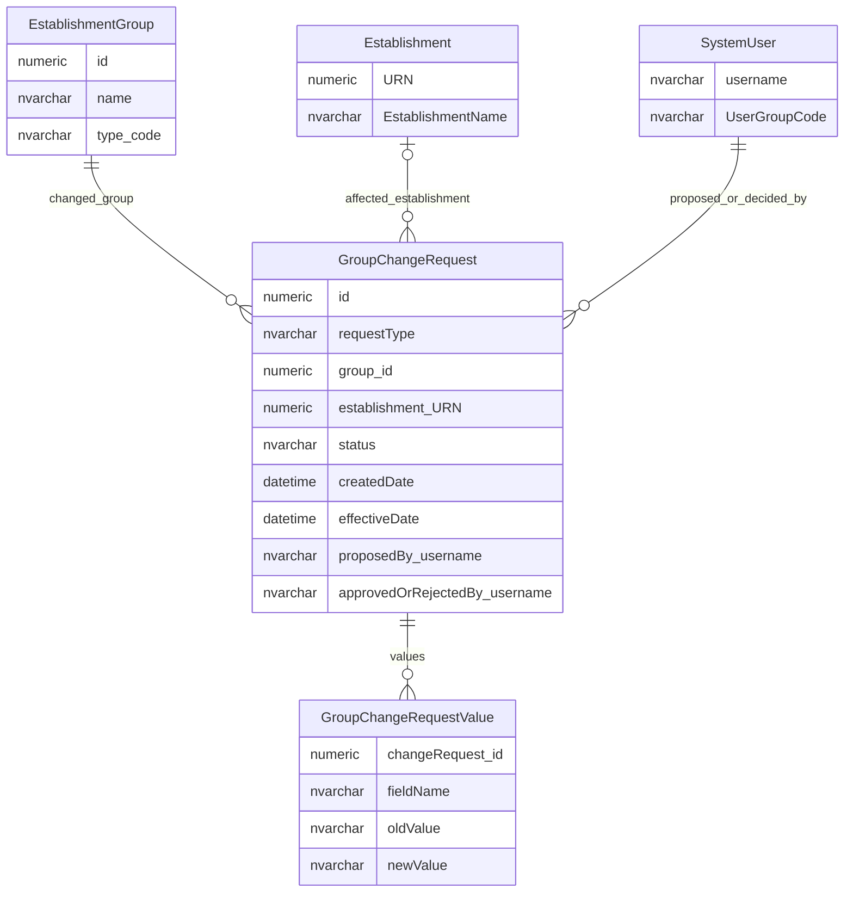
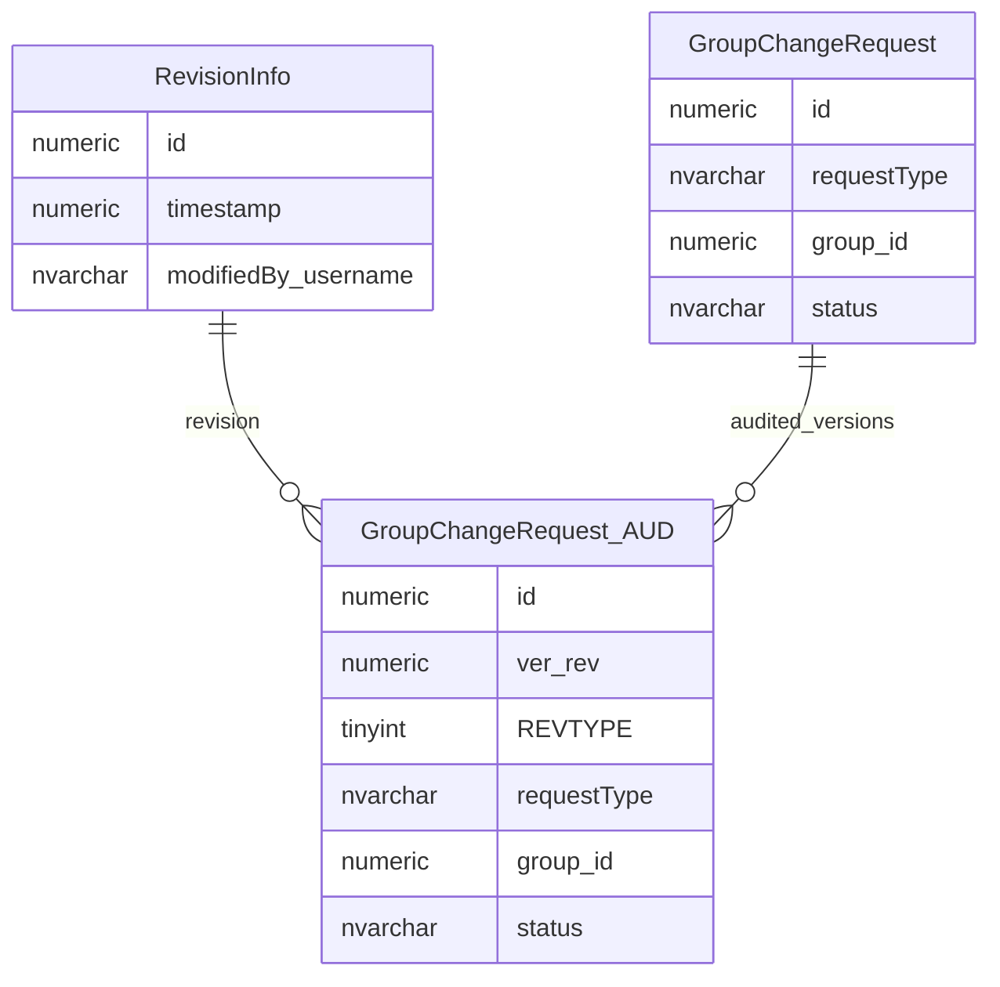

# Group Change Request Workflow

This page explains how changes to organisation groups and group relationships are proposed, decided and retained.

## Scope

This view focuses on:

- group change request envelope;
- affected organisation group;
- affected establishment where a group link is involved;
- proposer and decision user context;
- value payloads and audit snapshots.

## How To Read This Model

- `GroupChangeRequest` is a shared envelope for several kinds of group change.
- Different request types use different payload columns.
- A group change can affect group identity, group fields, establishment links or group-to-group relationships.
- Proposer and approver context is stored with the request.
- Audit snapshots preserve technical history of the request row.

## Application-Derived Insights

- Group change requests are interpreted by request type; the table is sparse because different changes need different payloads.
- The application treats group changes as workflow records with proposal, decision and effective-date state.
- Group relationship changes need to be understood alongside establishment-to-group and group-to-group relationship rules.
- The frontend receives group change history through service responses rather than working directly with the physical change-request table.
- Audit snapshots preserve the technical state of a group change request, but the request row carries the business workflow meaning.
- A cleaner target model would probably make each group-change type and payload shape more explicit than the current shared sparse table.

## Core Group Change Workflow



### GroupChangeRequest

`GroupChangeRequest` records a proposed, approved, rejected or applied change to an organisation group or group relationship.

Business-friendly pattern:

```text
For this organisation group change,
what was proposed,
which group or establishment was affected,
who proposed and decided it,
and what happened to the request?
```

### GroupChangeRequestValue

Group change request value payloads hold the old and new values used by a specific change request.

Business-friendly pattern:

```text
For this group change request,
which values were changed or proposed?
```

## Audit Snapshot Shape



### GroupChangeRequest_AUD

`GroupChangeRequest_AUD` stores audited snapshots of group change request state.

Business-friendly pattern:

```text
For this group change request and audit revision,
what request state and payload values were persisted at that point?
```

## Reading This Diagram

These ERDs are explanatory views. The request table is a sparse workflow table, so request type determines which payload columns are meaningful.
