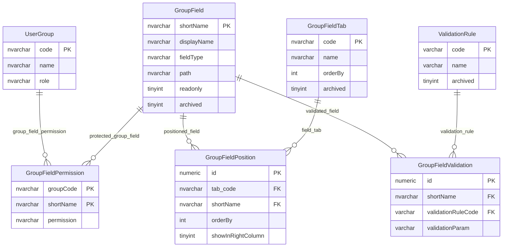

# Group Field Permissions And Metadata

This page explains metadata and permissions for fields on education provider groups, including trusts, federations and children's-centre groups.

## Scope

This model covers:

- group field metadata;
- group field read, write and trusted permissions;
- group field positioning and tabs;
- group field validation rules.

## How To Read This Model

- `GroupField` describes a logical group field, not the group record itself.
- `GroupFieldPermission` controls which user groups can use each logical group field.
- `GroupFieldPosition` and `GroupFieldTab` control display structure.
- `GroupFieldValidation` connects fields to reusable validation rules.

## Application-Derived Insights

- Group fields follow the same broad metadata-driven pattern as establishment fields.
- Group-field permissions include a trusted-source style value as well as read and write access.
- Some group-field metadata carries children's-centre-specific presentation labels.
- Future design should separate canonical group facts from context-specific display labels.

## Group Field Permissions And Metadata



### GroupField

Business-friendly pattern:

```text
For this logical group field,
how is it named, displayed, found in the group domain model,
positioned, validated and permissioned?
```

### GroupFieldPermission

Business-friendly pattern:

```text
For this user group,
for this group field,
can the group read it, write it, be trusted for it, or not use it?
```

### GroupFieldPosition And GroupFieldTab

Business-friendly pattern:

```text
For this logical group field,
which tab, column and display order should place it on the group UI?
```

### GroupFieldValidation

Business-friendly pattern:

```text
For this logical group field,
which validation rule must be applied,
and does the rule need a parameter?
```

## Reading This Diagram

Use this model to understand group-field governance. It combines access policy, display metadata and validation metadata around the logical field catalogue.
