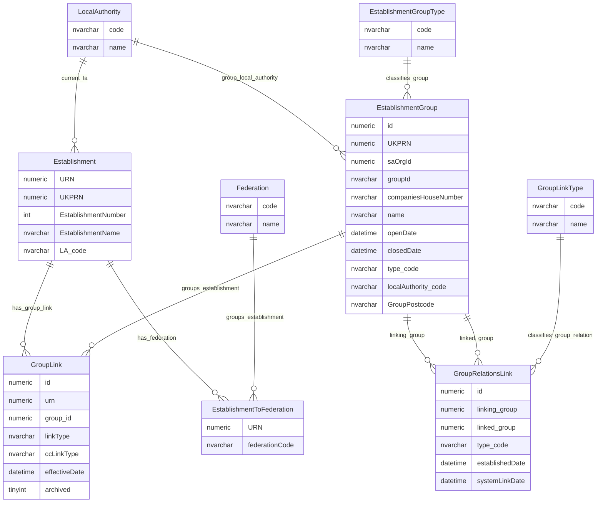
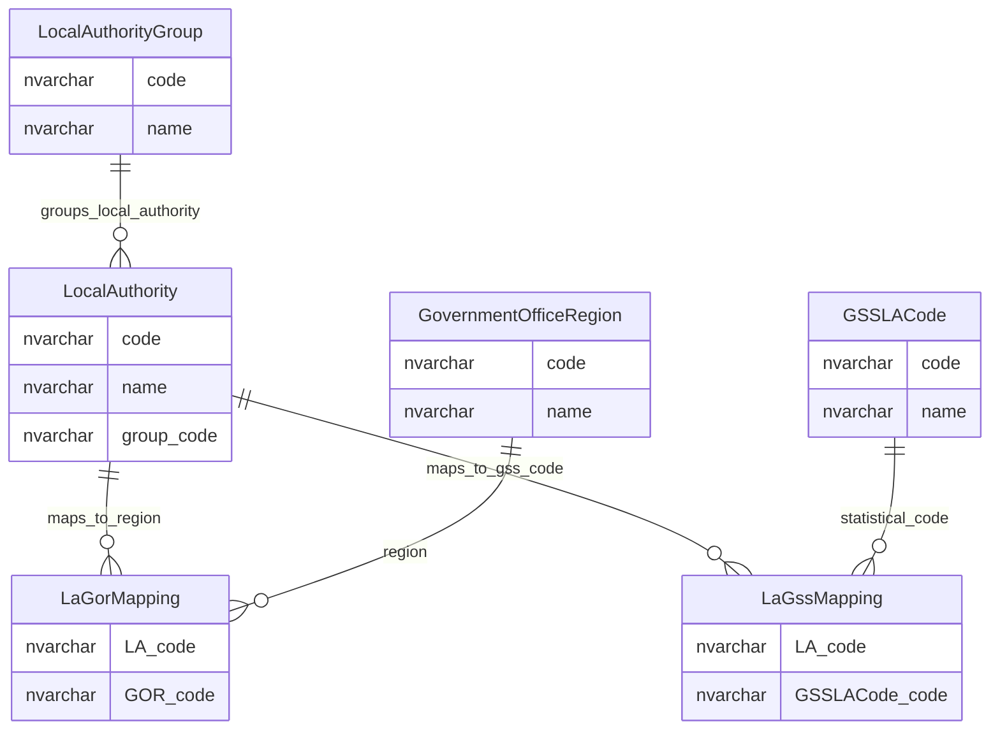

# Groups, Trusts, Federations And Local Authority Entity Relationship Diagram

This page explains the data model used to describe organisation structures around establishments, including trusts, sponsors, federations, children's centre groups, group-to-establishment links, group-to-group links and local authority geography mappings.

## Scope

This view focuses on:

- organisation groups around establishments;
- trust-style groups, including multi-academy trusts and single-academy trusts;
- links between establishments and groups;
- links between groups;
- federation links;
- local authority grouping and geography mappings.

It does not show audit, change-history, cache, permissions, staff or governance tables.

## How To Read This Model

The application behaviour shows some important business meaning that is not obvious from the table names alone:

- Trusts are represented as organisation groups. There is not a separate trust table in this model.
- `EstablishmentGroup` is broader than an academy trust. It can represent trusts, sponsors, federations, children's centre groups, collaborations and other group-like structures.
- `EstablishmentGroupType` classifies the kind of organisation group. It should not be confused with `EstablishmentTypeGroup`, which classifies the broad family of an establishment type.
- A group can have several identifiers: internal group UID, group ID, Companies House number, UKPRN and service/accounting identifiers. These should not be treated as interchangeable.
- SAT and MAT UKPRNs are matched through Companies House number, which makes Companies House number an important integration identifier for trust-style groups.
- Group status is derived from lifecycle fields such as open date, closed date and created-in-error state, rather than from a simple status lookup.
- `GroupLink` is the main relationship between an establishment and a group.
- `GroupRelationsLink` represents relationships between groups, such as predecessor/successor-style trust relationships.
- Federation data exists in an older lookup and bridge shape, but federation behaviour is better understood as an establishment group relationship.
- Local authority data is reference data with identity and filtering implications, not just a display list.

## Establishment Groups, Trusts And Federations

This diagram shows how establishments relate to organisation groups, group types, group-to-group relationships and federation links.



### EstablishmentGroup

`EstablishmentGroup` is the main table for organisation groups around establishments. It can represent trusts, multi-academy trusts, single-academy trusts, secure single-academy trusts, sponsors, children's centre groups, collaborations and other group-like structures.

Business-friendly pattern:

```text
For this organisation group, trust, sponsor or collaboration,
what is its identity, type, lifecycle state, address/contact detail,
and which establishments, groups, users and staff records relate to it?
```

### EstablishmentGroupType

`EstablishmentGroupType` classifies the kind of organisation group.

Business-friendly pattern:

```text
For this organisation group,
what kind of group is it?
```

Examples include federation, trust, school sponsor, multi-academy trust, children's centre group, children's centre collaboration, single-academy trust and secure single-academy trust.

### GroupLink

`GroupLink` records the relationship between an establishment and an organisation group.

Business-friendly pattern:

```text
For this establishment,
which group, trust, sponsor, federation or children's-centre group is it linked to,
and from what effective date does that link apply?
```

### GroupRelationsLink

`GroupRelationsLink` records relationships between organisation groups.

Business-friendly pattern:

```text
For this establishment group,
which other establishment group is it linked to,
what type of group-to-group relationship is recorded,
and when was that relationship established?
```

### GroupLinkType

`GroupLinkType` classifies group-to-group relationship types.

Business-friendly pattern:

```text
For this group-to-group relationship,
what kind of relationship does it represent?
```

### Federation

`Federation` is the legacy lookup table for federation codes used by `EstablishmentToFederation`.

Business-friendly pattern:

```text
For this legacy federation code,
what federation value can an establishment be linked to?
```

### EstablishmentToFederation

`EstablishmentToFederation` links an establishment to a federation lookup value.

Business-friendly pattern:

```text
For this establishment,
which legacy federation code is it linked to?
```

Notes:

- `EstablishmentGroup.id` is the main internal identifier used by group links, group relationships, staff/governance records, users and cache projections.
- `EstablishmentGroup.groupId` is a business-facing group identifier, but it is not the physical primary key.
- `EstablishmentGroup.companiesHouseNumber` is important for academy trust/provider matching and UKPRN synchronisation.
- `GroupLink` is the main bridge between establishments and organisation groups.
- `GroupRelationsLink` is the main bridge between one organisation group and another.
- The older federation lookup and bridge are shown because they are part of the physical current-state model, but federation behaviour should also be considered alongside organisation group relationships.

## Local Authority And Geography Mappings

This diagram shows how local authorities are grouped and mapped to Government Office Region and Government Statistical Service local authority codes.



### LocalAuthority

`LocalAuthority` is the reference table for local authority codes used by establishments, organisation groups and other operational areas.

Business-friendly pattern:

```text
For this establishment or organisation group,
which local authority context applies?
```

### LocalAuthorityGroup

`LocalAuthorityGroup` classifies local authorities into broad subsets.

Business-friendly pattern:

```text
For this local authority,
which national/subset grouping does it belong to,
and should it appear in English, Welsh or other LA-filtered views?
```

### LaGorMapping

`LaGorMapping` maps a local authority code to a Government Office Region code.

Business-friendly pattern:

```text
For this local authority,
which Government Office Region should be derived or defaulted?
```

### GovernmentOfficeRegion

`GovernmentOfficeRegion` is the lookup table for Government Office Region geography.

Business-friendly pattern:

```text
For this establishment or local authority,
which Government Office Region applies,
and should that geography value be displayed, searched or derived from the LA?
```

### LaGssMapping

`LaGssMapping` maps a local authority code to a Government Statistical Service local authority code.

Business-friendly pattern:

```text
For this local authority,
which GSS local authority code should be used,
or for this GSS code, which local authority does it map back to?
```

### GSSLACode

`GSSLACode` is the lookup table for Government Statistical Service local authority codes.

Business-friendly pattern:

```text
For this statistical local-authority code,
what GSS/ONS-style local authority value does it describe?
```

Notes:

- Local authority code is the key value used by establishments, organisation groups and mapping tables.
- Local authority group controls broad local authority subsets, such as English, Welsh or other filtered views.
- Government Office Region and GSS local authority codes support geography and statistical classification.

## Reading This Diagram

These ERDs are explanatory views, not a complete schema catalogue. They show the main current-state relationships needed to understand establishment groups, organisation relationships and local authority mappings.

