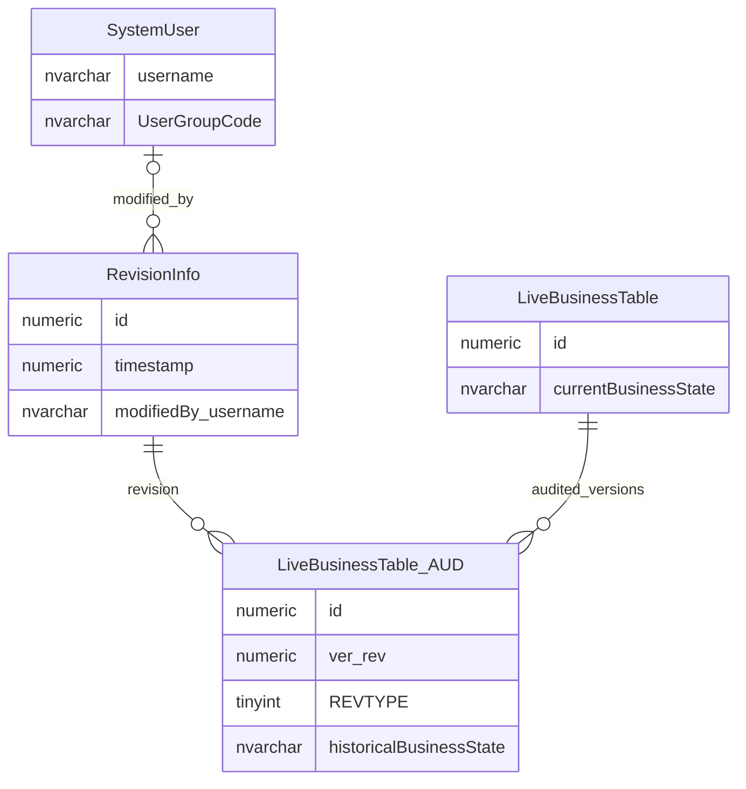

# Hibernate Envers Audit Pattern

This page explains the audit pattern used for technical entity snapshots.

## Scope

This view focuses on:

- audited live tables;
- matching audit tables;
- revision headers;
- revision type;
- the difference between audit snapshots and business change requests.

## How To Read This Model

- An audited live table stores current state.
- A matching audit table stores historical snapshots.
- `RevisionInfo` groups audited changes made in one transaction.
- `REVTYPE` says whether an audit row represents add, modify or delete.
- Audit snapshots are not event sourcing, workflow history or the database transaction log.
- Business change requests still need their own workflow data because audit snapshots do not explain business intent.

## Application-Derived Insights

- The application persistence layer creates audit snapshots for selected audited entities.
- One application save can create one revision and several audit rows across different audited tables.
- Audit tables usually record the state after a change, so field-level differences may need to be inferred by comparing snapshots.
- Direct SQL updates bypass the normal application audit mechanism unless the SQL process creates equivalent revision and audit rows.
- The frontend should treat audit history as service-provided evidence, not as a model it owns directly.
- Envers-style auditing is useful for technical assurance, but it does not replace a business event log, data stewardship workflow or approval history.
- When designing a future model, technical snapshot audit and business change workflow should be treated as separate but related capabilities.

## Audit Pattern



### LiveBusinessTable

The live business table stores the current state of a business record.

Business-friendly pattern:

```text
For this business record,
what is the current state?
```

### LiveBusinessTable_AUD

The audit table stores historical snapshots of the business record.

Business-friendly pattern:

```text
For this business record and audit revision,
what historical state was persisted?
```

### RevisionInfo

`RevisionInfo` groups audited changes into a shared revision.

Business-friendly pattern:

```text
For this audit revision,
when did the audited changes happen,
and which internal user was associated with them?
```

### REVTYPE

`REVTYPE` describes what happened to the audited entity.

| Value | Meaning |
| ---: | --- |
| `0` | Added |
| `1` | Modified |
| `2` | Deleted |

## Reading This Diagram

This is a conceptual audit-pattern diagram. Actual audited tables use their real live-table keys plus the audit revision key.
