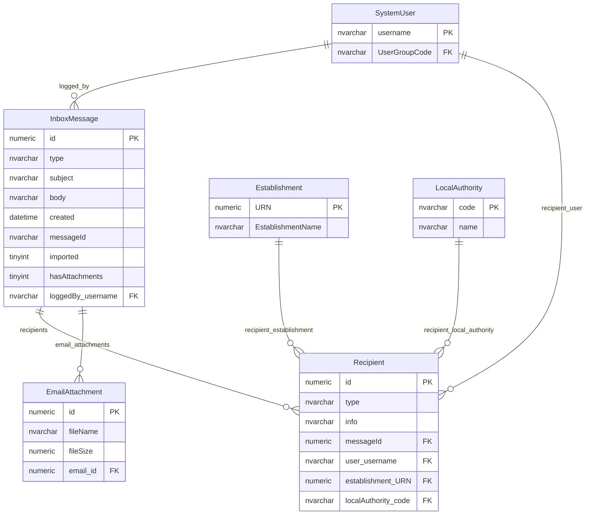
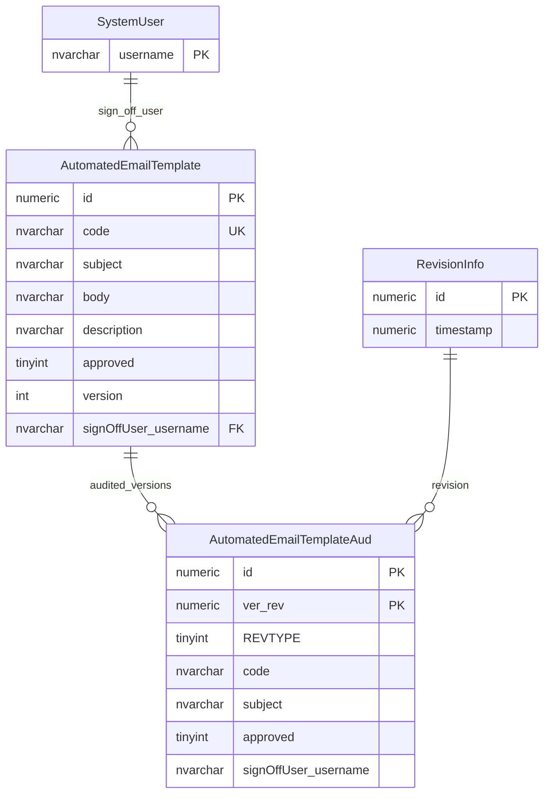

# Inbox Recipients And Email

This page explains legacy inbox messages, recipients, email attachments and automated email templates.

## Scope

This model covers:

- inbox messages;
- recipient scope;
- email attachments;
- automated email templates and template audit.

## How To Read This Model

- The inbox message table stores multiple communication types.
- A recipient can be linked to a user, establishment, local authority or free-form address information.
- Email attachments belong to inbox email messages, not to the document library.
- Automated email templates have approval and sign-off state.

## Application-Derived Insights

- Inbox messages mix email and phone-call concepts in one table.
- Recipient rows are both addressing data and scope data.
- Template approval is separate from message delivery evidence.
- Future design should model communication record, recipient, attachment, template and delivery outcome separately.

## Inbox Messages



### InboxMessage

Business-friendly pattern:

```text
For this communication record,
what message was recorded,
when was it created,
and was it imported or logged manually?
```

### Recipient

Business-friendly pattern:

```text
For this message,
who is it for, copied to or from,
and what user, establishment or local authority scope applies?
```

### EmailAttachment

Business-friendly pattern:

```text
For this email message,
which attachment filename and size were recorded?
```

## Automated Email Templates



### AutomatedEmailTemplate

Business-friendly pattern:

```text
For this automated email,
what subject and body template should be used,
and has it been approved for use?
```

## Reading This Diagram

Use this model to understand legacy communications storage. It should not be treated as the same concern as provider data, document publishing or change-request audit.
