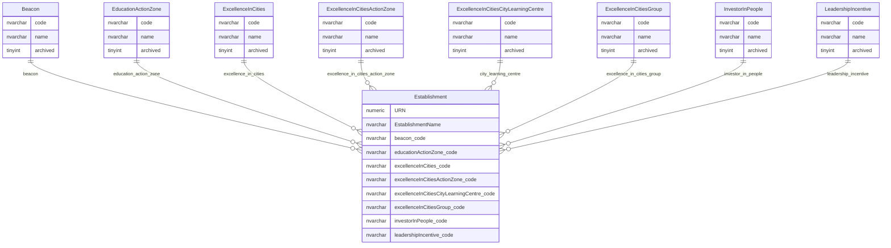

# Legacy Programme Indicators

This page explains legacy programme and initiative indicator reference data held against establishment records.

## Scope

This view focuses on:

- legacy Beacon classification;
- Education Action Zone classification;
- Excellence in Cities classifications;
- Investor in People classification;
- leadership incentive classification.

It does not show the wider establishment record, audit tables, permissions tables or inactive programme history.

## How To Read This Model

- These tables are reference data attached to an establishment by code.
- The values are mostly legacy programme indicators, so they should not automatically be read as current policy priorities.
- Some values are used for export, reporting or historic compatibility even where they are not prominent in the public website.
- The establishment record stores the code. Extract and cache projections can expose both code and name.

## Application-Derived Insights

- These indicators are part of the current establishment data export surface as code/name pairs.
- Most of the values behave like lookup classifications rather than standalone business entities.
- Some fields have type-specific validation or legacy short names in the application metadata.
- A future model should assess whether each indicator remains active business vocabulary, archive-only context, or compatibility data for existing extracts.

## Legacy Programme Indicator Model



### Beacon

`Beacon` classifies whether a legacy Beacon value applies to an establishment.

Business-friendly pattern:

```text
For this establishment,
does a legacy Beacon classification apply?
```

### EducationActionZone

`EducationActionZone` classifies the Education Action Zone value for an establishment.

Business-friendly pattern:

```text
For this establishment,
what Education Action Zone classification applies?
```

### ExcellenceInCities

`ExcellenceInCities` classifies the main Excellence in Cities value for an establishment.

Business-friendly pattern:

```text
For this establishment,
what Excellence in Cities classification applies?
```

### ExcellenceInCitiesActionZone

`ExcellenceInCitiesActionZone` classifies the Excellence in Cities action-zone value for an establishment.

Business-friendly pattern:

```text
For this establishment,
what Excellence in Cities action-zone classification applies?
```

### ExcellenceInCitiesCityLearningCentre

`ExcellenceInCitiesCityLearningCentre` classifies the Excellence in Cities city learning centre value for an establishment.

Business-friendly pattern:

```text
For this establishment,
what Excellence in Cities city learning centre classification applies?
```

### ExcellenceInCitiesGroup

`ExcellenceInCitiesGroup` classifies the Excellence in Cities group value for an establishment.

Business-friendly pattern:

```text
For this establishment,
what Excellence in Cities group classification applies?
```

### InvestorInPeople

`InvestorInPeople` classifies the Investor in People value for an establishment.

Business-friendly pattern:

```text
For this establishment,
what Investor in People classification applies?
```

### LeadershipIncentive

`LeadershipIncentive` classifies the leadership incentive value for an establishment.

Business-friendly pattern:

```text
For this establishment,
what leadership incentive classification applies?
```
