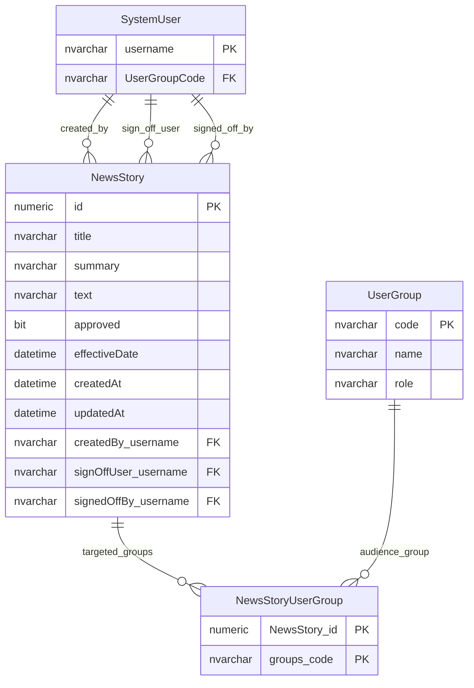
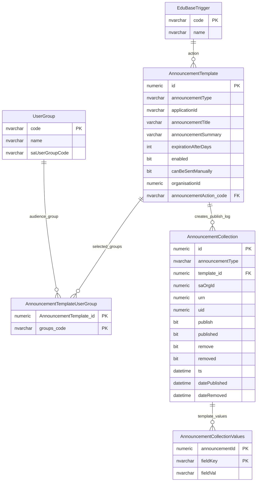
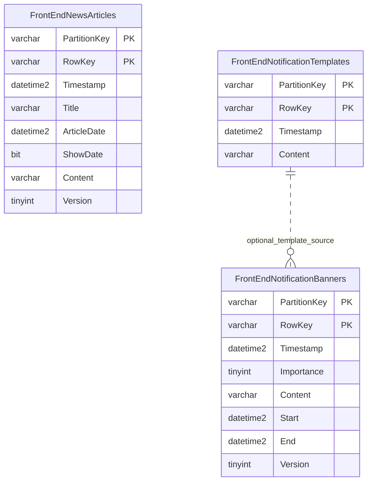

# News Announcements And Notifications

This page explains news, announcement and frontend notification tables.

## Scope

This model covers:

- legacy news stories and targeted user groups;
- legacy announcement templates and publication logs;
- frontend news articles;
- frontend notification templates and banners.

## How To Read This Model

- Legacy news stories combine content, approval and audience targeting.
- Announcement templates are used to create publish or remove attempts.
- Frontend notification tables use a content-store style key shape.
- Announcement publication identifiers are integration references, not physical foreign keys.

## Application-Derived Insights

- News and announcements are communication models, not provider facts.
- Legacy and frontend news models are separate shapes and should not be merged without confirming the source of truth.
- Announcement templates mix content, audience targeting, trigger/action classification and publication behaviour.
- Future design should separate message template, target audience, publication event and delivery state.

## Legacy News



### NewsStory

Business-friendly pattern:

```text
For this legacy news story,
what content should be shown,
from what effective date,
and which user groups should see it after approval?
```

### NewsStoryUserGroup

Business-friendly pattern:

```text
For this news story,
which user groups should see it?
```

## Legacy Announcements



### AnnouncementTemplate

Business-friendly pattern:

```text
For this announcement template,
what message should be prepared,
which trigger or action describes it,
which groups are targeted,
and can it be sent manually?
```

### AnnouncementCollection

Business-friendly pattern:

```text
For this generated announcement,
was it queued to publish or remove,
and what publication outcome was recorded?
```

## Frontend News And Notifications



### FrontEndNewsArticles

Business-friendly pattern:

```text
For this frontend news article,
what article content, date and version should be displayed?
```

### FrontEndNotificationBanners

Business-friendly pattern:

```text
For this frontend notification banner,
what content should be shown,
what importance does it have,
and when should it start and end?
```

## Reading This Diagram

Use this model to separate legacy portal communications from frontend content. News, announcements and banners are all communications, but they have different lifecycle and audience rules.
