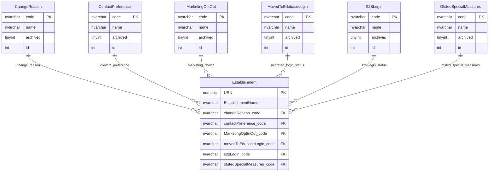
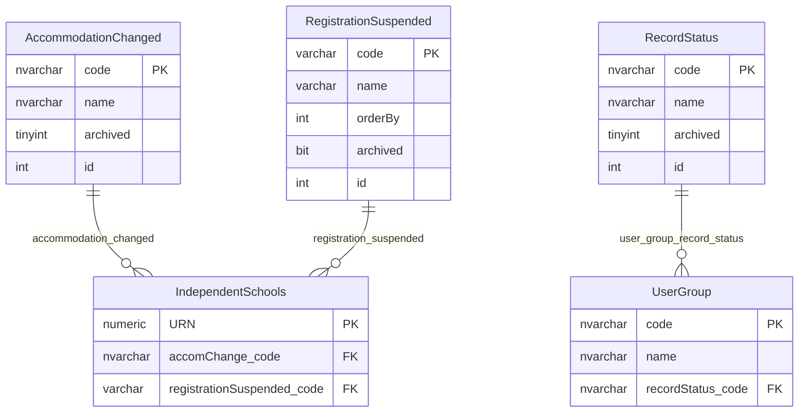
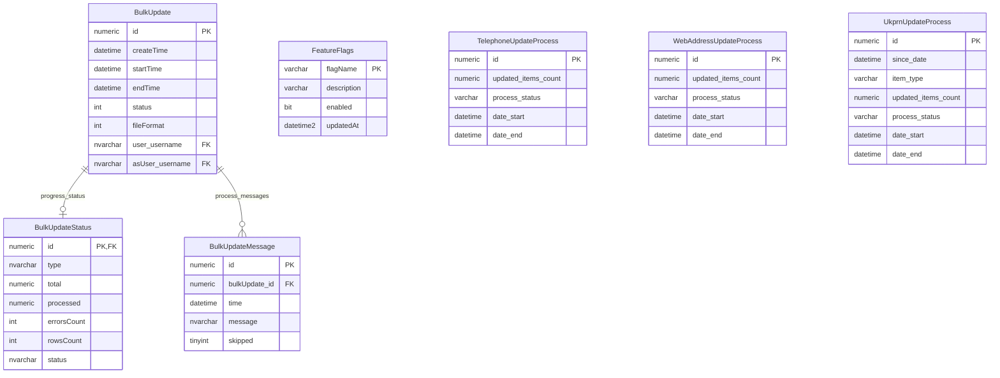

# Operational Status Code Lists

This page explains status, flag and operational code-list tables that support establishment records, independent-school details, user groups and background processing.

## Scope

This model covers:

- establishment operational support classifications;
- independent-school operational classifications;
- user-group record status;
- bulk-update status and progress;
- feature flags and small process-run state.

It does not cover core establishment lifecycle status, geography classifications or organisation group classifications.

## How To Read This Model

- Some statuses are normalised lookup values with a code, name and archived flag.
- Some process statuses are stored directly as text or integer fields.
- Feature flags are operational configuration, not business reference data.
- Process-run statuses describe operational execution, not provider facts.

## Application-Derived Insights

- The model mixes governed business-style code lists with technical process states.
- Establishment operational statuses support communication, login and inspection-related behaviour.
- Bulk update status is split between parent-run state, progress totals and detailed messages.
- Future modelling should separate business reference data from operational runtime state.

## Establishment Operational Code Lists



### Establishment Operational Code Lists

Business-friendly pattern:

```text
For this establishment record,
which support status, contact preference, login state or inspection-related flag applies?
```

These values sit alongside the provider record. They are not the same as the provider's open, closed or proposed lifecycle status.

## Independent-School And User Status



### Independent-School Operational Status

Business-friendly pattern:

```text
For this independent-school detail record,
has accommodation changed,
and is registration suspended?
```

### RecordStatus

Business-friendly pattern:

```text
For this user group,
what record status applies to the group itself?
```

`RecordStatus` is not the same concept as establishment status.

## Operational Process State



### BulkUpdate, BulkUpdateStatus And BulkUpdateMessage

Business-friendly pattern:

```text
For this bulk update run,
who ran it,
what progress was made,
and what messages or skipped rows were recorded?
```

### FeatureFlags

Business-friendly pattern:

```text
For this runtime feature,
is the feature enabled,
and when was the toggle last updated?
```

### Update Process Tables

Business-friendly pattern:

```text
For this operational update process,
when did it run,
how many items were updated,
and what process status was recorded?
```

`InspectionUpdates` has been omitted because it is marked as having no observed production read or write activity in the 30-day table-usage evidence.

## Reading This Diagram

Use this model to distinguish provider-facing operational classifications from process-state evidence. The same database area contains business-style code lists, feature toggles and technical process tracking, so those concepts should not be collapsed into one future reference-data model.
