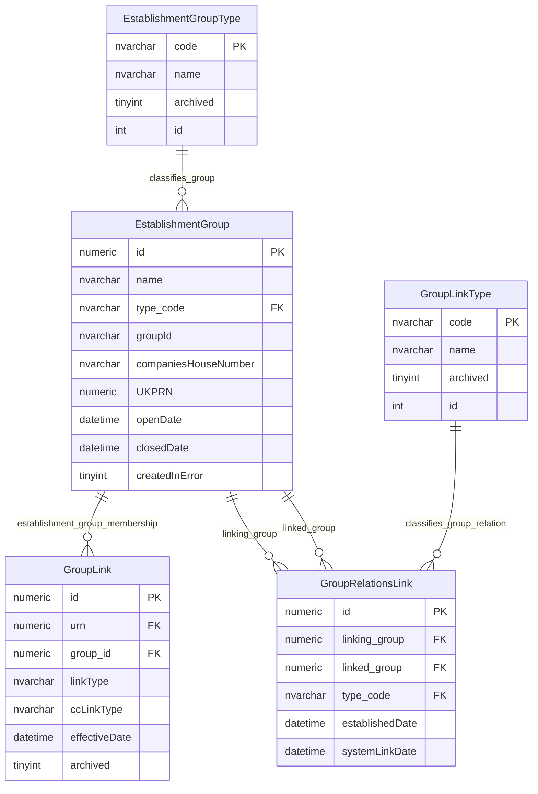
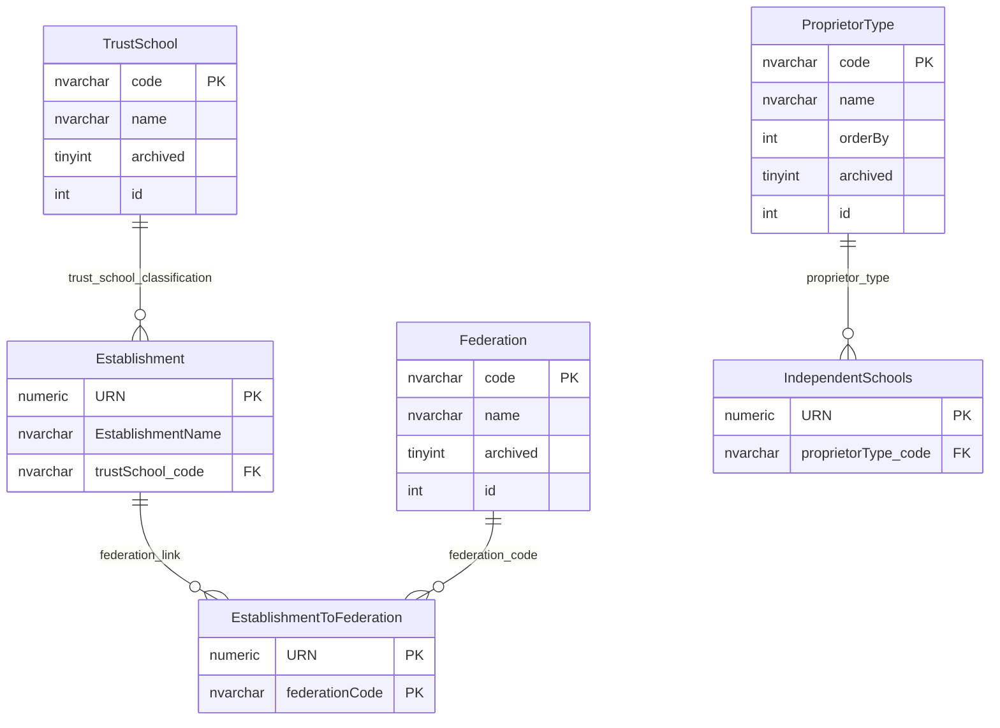

# Organisation Group Classifications

This page explains classification tables used to describe education provider groups, group links, federations, trust-school indicators and independent-school proprietor types.

## Scope

This model covers:

- group type classification;
- group-to-group relationship classification;
- establishment-to-group link classification where visible;
- federation and trust-school classification;
- independent-school proprietor type.

## How To Read This Model

- `EstablishmentGroupType` classifies the type of group or organisation.
- `GroupLinkType` classifies relationships between groups.
- `TrustSchool` is an establishment-level classification, not a trust organisation.
- Some legacy federation and sponsor tables are present but inactive and have been omitted from the public diagrams.

## Application-Derived Insights

- Group classification is separate from establishment type classification.
- The model contains both current group/trust structures and older federation support.
- Some link-type values are stored as plain fields without visible foreign-key enforcement.
- Future modelling should use business terms for provider organisations rather than carrying every legacy code-list name forward.

## Establishment Group Classification



### EstablishmentGroupType

Business-friendly pattern:

```text
For this education provider group,
what kind of group is it?
```

Examples include trust, multi-academy trust, single-academy trust, federation, school sponsor and children's-centre group.

### GroupLinkType

Business-friendly pattern:

```text
For this relationship between two groups,
what kind of relationship is being recorded?
```

`GroupLink.linkType` and `GroupLink.ccLinkType` are classification-like fields, but they are not shown as enforced lookup relationships here.

## Federation, Trust And Proprietor Classification



### TrustSchool

Business-friendly pattern:

```text
For this establishment,
is it classified as a trust school?
```

This is not the same as modelling a trust as an organisation.

### Federation

Business-friendly pattern:

```text
For this establishment,
which federation code is it linked to?
```

### ProprietorType

Business-friendly pattern:

```text
For this independent-school record,
what kind of proprietor is recorded?
```

`FederationType`, `FederationFlag` and `SchoolSponsorFlag` have been omitted because they are marked as having no observed production read or write activity in the 30-day table-usage evidence.

## Reading This Diagram

Use this model to separate three ideas: the type of a provider group, the relationship between groups, and establishment-level flags that describe trust or federation context. These are adjacent, but they are not one single classification.
