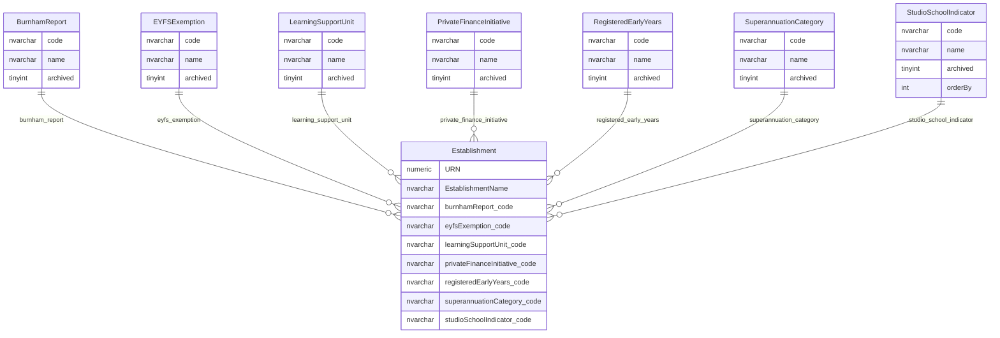

# Provision And Workforce Indicators

This page explains provision, early-years and workforce-related reference data held against establishment records.

## Scope

This view focuses on:

- Burnham Report classification;
- EYFS exemption classification;
- learning support unit classification;
- private finance initiative classification;
- registered early-years classification;
- superannuation category;
- studio-school indicator.

It does not show the wider establishment record, audit tables, permissions tables or detailed policy history for these values.

## How To Read This Model

- These tables are reference data attached to an establishment by code.
- The values describe provision, workforce or legacy programme characteristics.
- Some values are used for export, reporting or historic compatibility even where they are not prominent in the public website.
- The establishment record stores the code. Extract and cache projections can expose both code and name.

## Application-Derived Insights

- These indicators are part of the current establishment data export surface as code/name pairs.
- Some values have defaults or type-specific behaviour in the application.
- `StudioSchoolIndicator` is not the same as the establishment type for Studio Schools; it is a separate coded indicator.
- A future model should test whether each value belongs in public provider data, internal stewardship data or archive-only migration scope.

## Provision And Workforce Indicator Model



### BurnhamReport

`BurnhamReport` classifies the Burnham Report value held on an establishment.

Business-friendly pattern:

```text
For this establishment,
what Burnham Report classification applies?
```

### EYFSExemption

`EYFSExemption` classifies whether an establishment has an early-years foundation stage exemption.

Business-friendly pattern:

```text
For this establishment,
what EYFS exemption classification applies?
```

### LearningSupportUnit

`LearningSupportUnit` classifies the learning-support-unit value held on an establishment.

Business-friendly pattern:

```text
For this establishment,
what learning support unit classification applies?
```

### PrivateFinanceInitiative

`PrivateFinanceInitiative` classifies the private finance initiative status held on an establishment.

Business-friendly pattern:

```text
For this establishment,
what private finance initiative classification applies?
```

### RegisteredEarlyYears

`RegisteredEarlyYears` classifies the registered early-years value held on an establishment.

Business-friendly pattern:

```text
For this establishment,
what registered early-years classification applies?
```

### SuperannuationCategory

`SuperannuationCategory` classifies the superannuation category held on an establishment.

Business-friendly pattern:

```text
For this establishment,
what superannuation category applies?
```

### StudioSchoolIndicator

`StudioSchoolIndicator` classifies the studio-school indicator value held on an establishment.

Business-friendly pattern:

```text
For this establishment,
what studio-school indicator applies?
```
