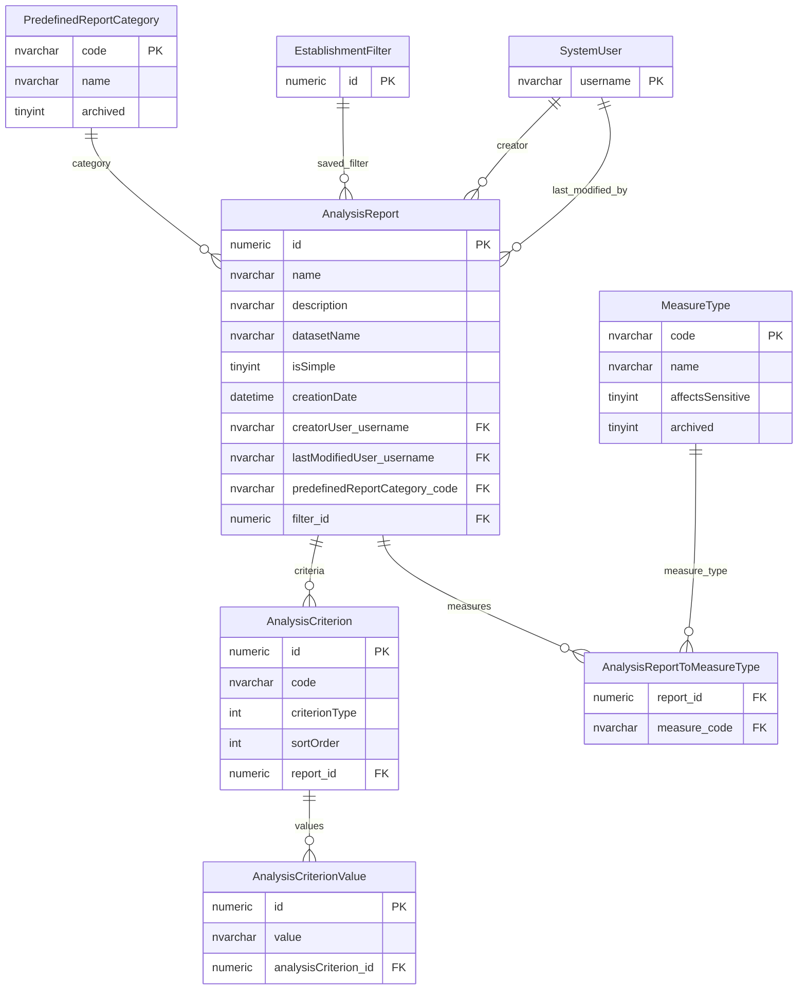
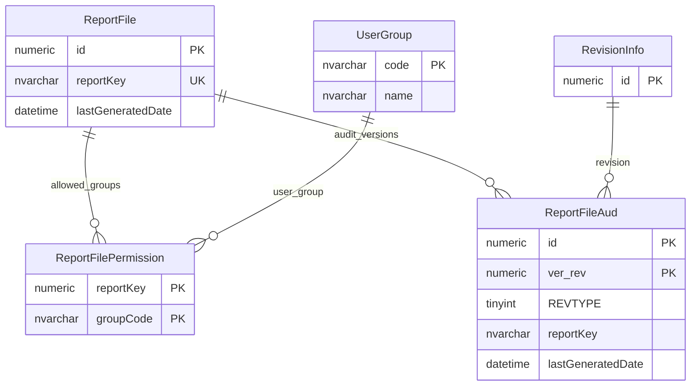

# Report And Content Artefacts

This page explains legacy analysis report definitions and generated report-file artefacts.

## Scope

This model covers:

- legacy analysis report definitions;
- report criteria and criterion values;
- analysis measure types;
- generated report files and user-group access;
- report-file audit versions.

## How To Read This Model

- An analysis report is a saved report definition, not a generated file.
- A report file is a generated artefact registered by report key.
- Report-file permission is user-group access to generated reports.
- Some legacy analysis-report tables are candidates for retirement unless the old analysis engine is confirmed as required.

## Application-Derived Insights

- Analysis reports and generated report files are separate concepts.
- Analysis criteria are meaningful only with the legacy analysis engine and dataset metadata.
- The report-file permission bridge uses a misleading column name for the report-file identifier.
- Future reporting should model report definition, generated artefact and audience explicitly.

## Analysis Reports



### AnalysisReport

Business-friendly pattern:

```text
For this saved analysis report,
what dataset, criteria, measures, optional filter and category define the report?
```

### AnalysisCriterion

Business-friendly pattern:

```text
For this analysis report,
which selected report dimension or filter is being applied?
```

### AnalysisCriterionValue

Business-friendly pattern:

```text
For this analysis criterion,
which selected value is included?
```

## Generated Report Files



### ReportFile

Business-friendly pattern:

```text
For this report key,
which generated report file exists,
and when was it last generated?
```

### ReportFilePermission

Business-friendly pattern:

```text
For this generated report file,
which user groups are allowed to access it?
```

## Reading This Diagram

Use this model to distinguish saved report definitions from generated report artefacts. These are related reporting concepts, but they need different future ownership and retention decisions.
