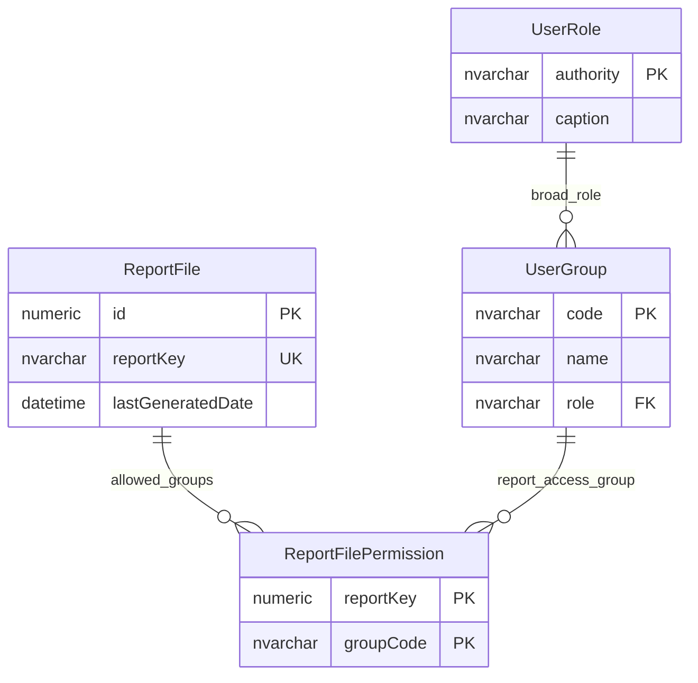

# Report File Access

This page explains the access model for generated report files.

## Scope

This model covers:

- configured generated report files;
- report-file access by user group;
- the broad role context for those user groups.

## How To Read This Model

- A report file has an internal identifier and a logical report key.
- User groups are linked to report files through a bridge table.
- The bridge column name is misleading: it stores the report-file identifier, not the textual report key.
- Report access is separate from field permissions, document access and scheduled extract access.

## Application-Derived Insights

- Report access is an explicit report/download visibility model.
- Some report restrictions are enforced by report-specific processing rules as well as the database bridge.
- Future design should distinguish report id, report key, generated artefact and audience.

## Report File Access



### ReportFile

Business-friendly pattern:

```text
For this report key,
which generated report file exists,
and when was it last generated?
```

### ReportFilePermission

Business-friendly pattern:

```text
For this report file,
which user groups are allowed to access it?
```

## Reading This Diagram

Use this model to understand access to generated reports. In a future model, the relationship should avoid naming a numeric report-file identifier as `reportKey`, because that hides the distinction between a database identifier and a stable logical report key.
