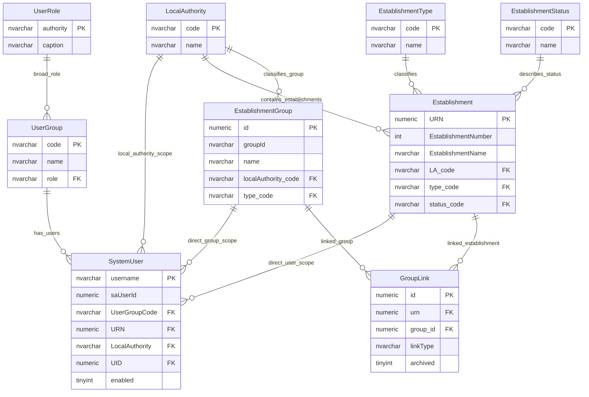

# Row-Level Access And Organisation Scope

This page explains how a user is associated with an establishment, local authority or education provider group, and how that scope contributes to row-level access decisions.

## Scope

This model covers:

- user group and broad role context;
- direct establishment scope;
- local authority scope;
- direct group scope;
- indirect establishment-to-group scope through group links.

## How To Read This Model

- `SystemUser` can carry one establishment, local authority or group scope.
- User group and broad role decide how those scope values are interpreted.
- Establishment type and status can further restrict visibility.
- The database relationships provide organisation context; they are not the whole access-control policy.

## Application-Derived Insights

- Row-level access is a combination of user group, broad role, organisation scope, establishment type and establishment status.
- Local authority and group scope are not just foreign keys; they must be interpreted by policy.
- Direct establishment scope and indirect group membership are different access paths.
- Future design should make scope claims and policy evaluation explicit.

## Organisation Scope Model



### SystemUser

Business-friendly pattern:

```text
For this signed-in user,
what organisation do they represent?
```

### UserGroup And UserRole

Business-friendly pattern:

```text
For this signed-in user,
which user group and broad role describe the policy context?
```

### Establishment, LocalAuthority And EstablishmentGroup

Business-friendly pattern:

```text
For this user scope,
which establishment, local authority or group records may be in scope?
```

## Reading This Diagram

Use this model to understand scope inputs for access-control decisions. The diagram shows the relationships that supply context; the final access decision still needs policy rules over role, group, status, type and scope.
