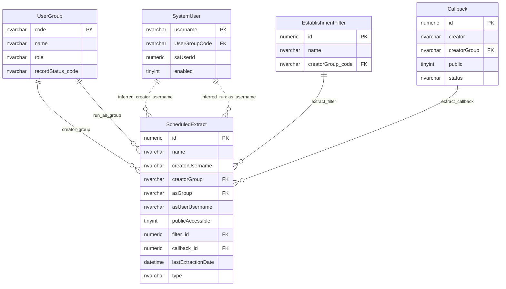

# Scheduled Extract Access

This page explains the access model for scheduled extracts.

## Scope

This model covers:

- scheduled extract ownership;
- run-as group and run-as user context;
- public extract access;
- extract filter and callback relationships.

## How To Read This Model

- A scheduled extract has a creator group and optional run-as group.
- Establishment-user access can depend on a specific creator or run-as username.
- Public access can bypass normal read restrictions.
- Scheduled extract access is separate from ordinary field permissions.

## Application-Derived Insights

- Scheduled extracts combine ownership, run-as identity, output generation and public accessibility.
- Listing an extract and requesting a specific extract are separate access checks.
- Run-as user identity depends on run-as group context.
- Future design should treat scheduled extracts as their own access-control subdomain.

## Scheduled Extract Access



### ScheduledExtract

Business-friendly pattern:

```text
For this scheduled extract,
which group created it,
which group or user should it run as,
and is it public enough to bypass normal read restrictions?
```

### EstablishmentFilter

Business-friendly pattern:

```text
For this scheduled extract,
which saved establishment filter decides the records included?
```

### Callback

Business-friendly pattern:

```text
For this scheduled extract,
which generated file or callback record provides the downloadable artefact?
```

## Reading This Diagram

Use this model to understand scheduled extract visibility. It combines group ownership, optional run-as context, specific establishment-user checks and public access behaviour.
