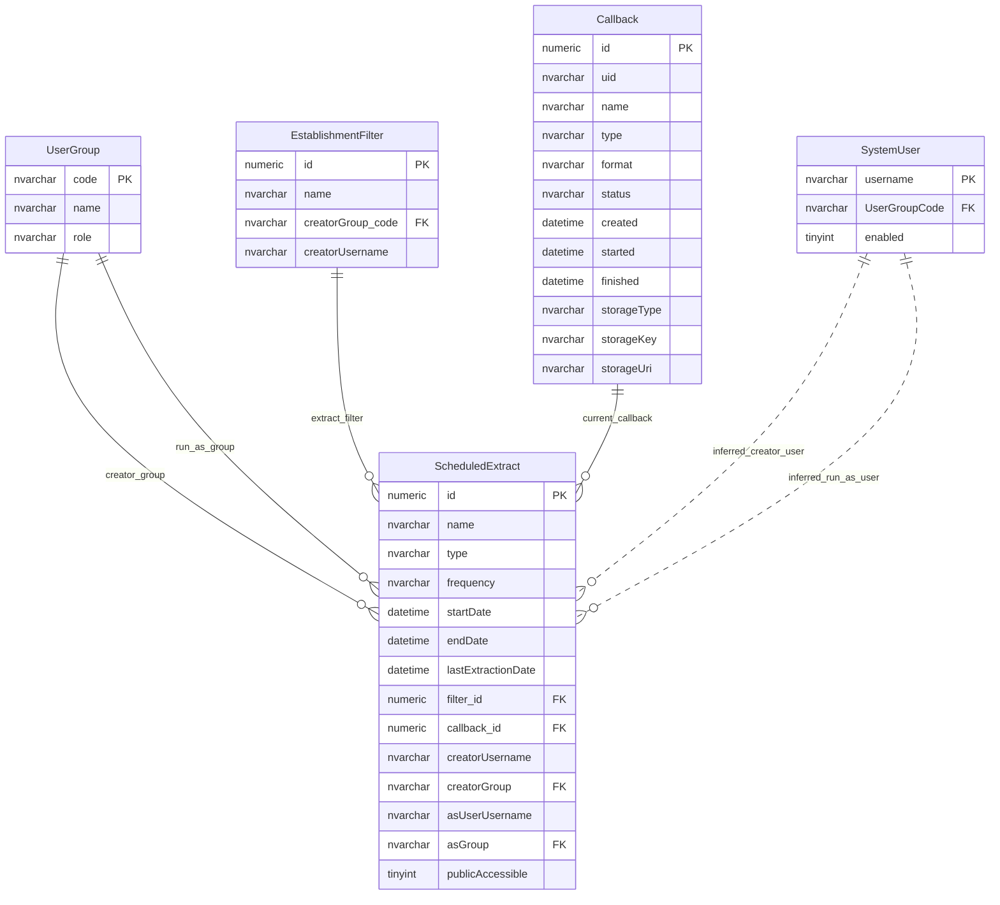
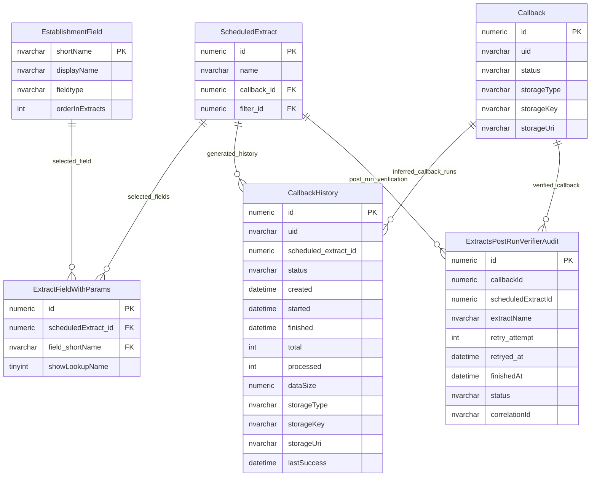
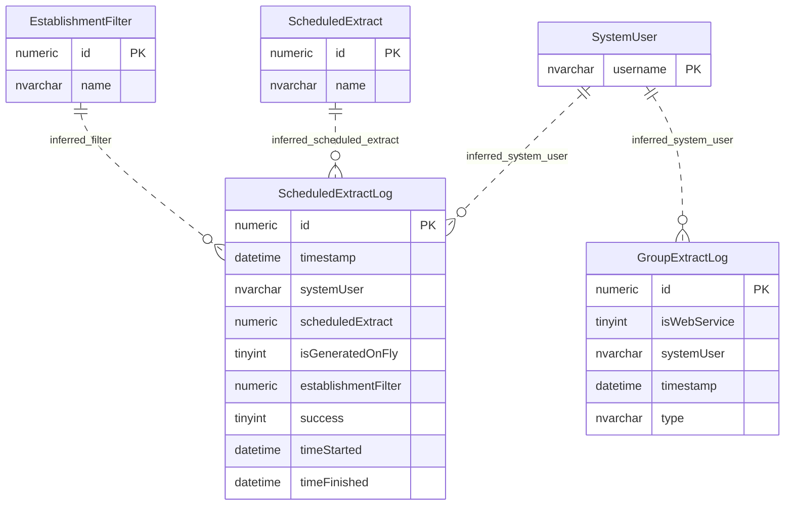

# Scheduled Extracts And Callbacks

This page explains scheduled extracts, selected extract fields, generated output artefacts, callback history and execution logs.

## Scope

This model covers:

- reusable scheduled extract definitions;
- saved filters and selected output fields;
- callback/output artefact state;
- callback history and post-run verification;
- execution logs for scheduled and generated extracts.

## How To Read This Model

- A scheduled extract is more than a file; it combines schedule, filter, fields, ownership and output state.
- A callback represents generated output state and storage information.
- Some history and verifier relationships are inferred by identifier columns rather than enforced by foreign keys.
- Access-control semantics for scheduled extracts sit alongside this model, but are not repeated here.

## Application-Derived Insights

- Scheduled extracts combine record selection, field selection, schedule, ownership and run-as context.
- Output state is split between current callback, callback history, generation logs and verification attempts.
- Future modelling should preserve the difference between extract definition, run, artefact, history and verification.

## Scheduled Extract Definition



### ScheduledExtract

Business-friendly pattern:

```text
For this reusable extract,
what should be generated,
when should it run,
which filter and fields should be used,
and under which ownership or run-as context?
```

### Callback

Business-friendly pattern:

```text
For this generated extract artefact,
what type and format is it,
where is it stored,
what state is it in,
and who created it?
```

## Extract Fields And Output History



### ExtractFieldWithParams

Business-friendly pattern:

```text
For this scheduled extract,
which establishment field should be included,
and should lookup names be shown?
```

### CallbackHistory

Business-friendly pattern:

```text
For this generated extract run,
what happened to the callback,
where was the output stored,
and did it complete successfully?
```

### ExtractsPostRunVerifierAudit

Business-friendly pattern:

```text
For this generated extract callback,
what verification attempt ran,
when did it run,
what was the outcome,
and how is it correlated with other processing evidence?
```

## Execution Logs



### ScheduledExtractLog

Business-friendly pattern:

```text
For this scheduled or generated-on-the-fly extract run,
who ran it,
which scheduled extract or filter was used,
when did it start and finish,
and did it succeed?
```

### GroupExtractLog

Business-friendly pattern:

```text
For this group extract download or web-service request,
who requested it,
when did it run,
and what kind of extract was produced?
```

`ExtractionLog` has been omitted because it is marked as having no observed production read or write activity in the 30-day table-usage evidence.

## Reading This Diagram

Use this model to distinguish scheduled extract definitions from generated extract outputs. The definition, selected fields, callback, history, execution log and verification evidence are separate concepts.
