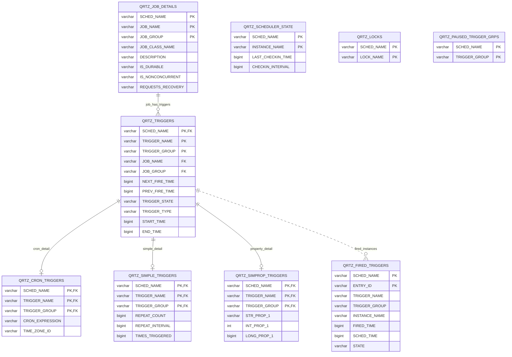
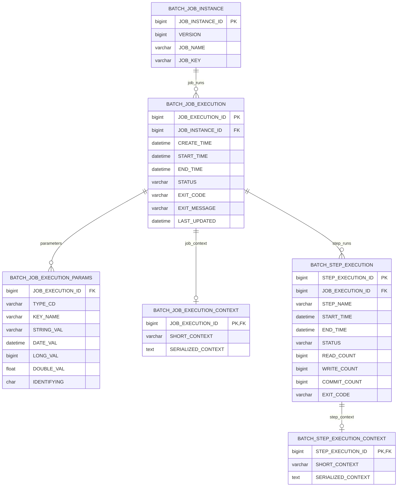
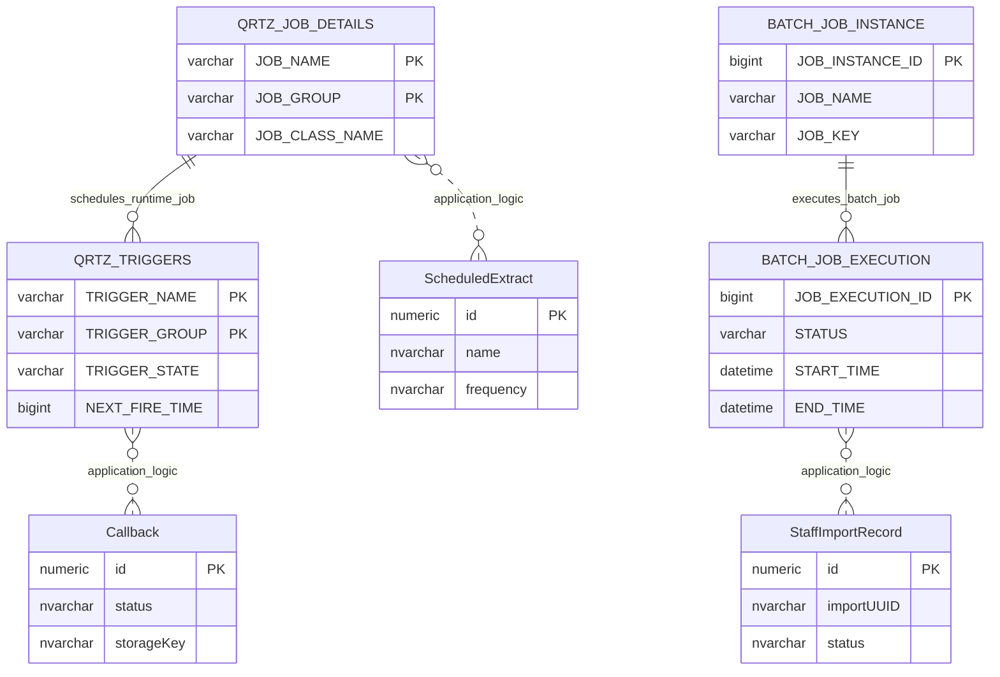

# Scheduler And Batch Runtime

This page explains the runtime tables used by Quartz Scheduler and Spring Batch.

These tables support scheduled and batch processing. They are operational infrastructure, not education provider business-domain entities.

## Scope

This model covers:

- Quartz scheduler job and trigger runtime tables;
- Spring Batch job, execution, step and parameter runtime tables;
- the boundary between framework runtime state and provider-facing operational records.

## How To Read This Model

- Quartz tables hold scheduler jobs, triggers, fire times, locks and scheduler heartbeat state.
- Spring Batch tables hold job instances, executions, parameters, step executions and restart context.
- Runtime tables do not physically own provider facts.
- Application jobs connect runtime state to business work such as extracts, callbacks, imports and reminders.

## Application-Derived Insights

- Scheduler and batch tables are high-volume operational state, not business history.
- Future design should decide whether this runtime state remains in the application database or moves to platform orchestration.
- Scheduled extracts, staff imports, cache refreshes and reminders may need different scheduling patterns.
- Business history should be held by domain records or events, not by framework runtime tables.

## Quartz Scheduler Runtime



### Quartz Runtime Tables

Business-friendly pattern:

```text
For this scheduled job,
what job should run,
which trigger fires it,
when is it next due,
and which scheduler instance is managing it?
```

`QRTZ_BLOB_TRIGGERS` and `QRTZ_CALENDARS` have been omitted because they are marked as having no observed production read or write activity in the 30-day table-usage evidence.

## Spring Batch Runtime



### Spring Batch Runtime Tables

Business-friendly pattern:

```text
For this batch job run,
which job instance ran,
which parameters identified it,
which steps ran,
how many records were read or written,
and what status or exit message was recorded?
```

## Runtime Boundary



### Runtime Boundary

Business-friendly pattern:

```text
For this scheduled or batch process,
which runtime state supports the execution,
and which provider-facing record records the business outcome?
```

## Reading This Diagram

Use this model to avoid treating scheduler rows as business history. Scheduler and batch tables explain how work runs, but the meaningful business result belongs in provider records, extract records, import records, reminders or audit events.
