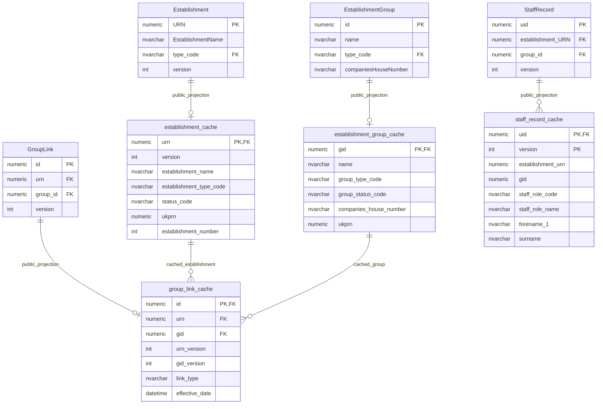
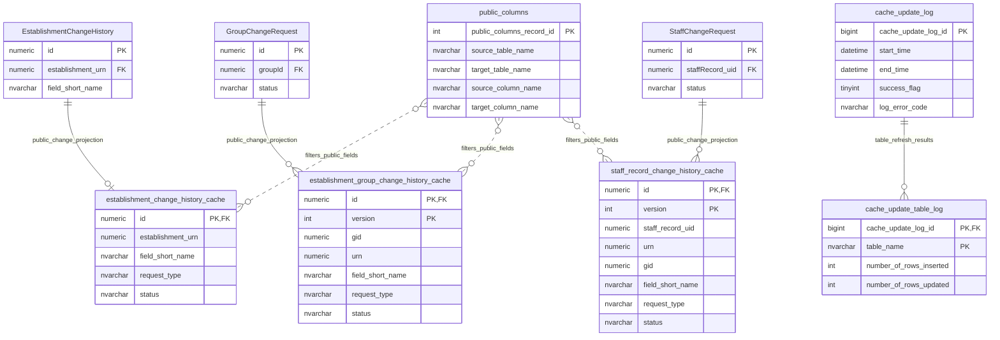

# Sharing And Public Cache

This page explains the public sharing cache model in the `gias_sharing` schema.

## Working Assumption

The strong working assumption is that the cache tables provide a stable public/read model for a REST API or downstream data-sharing consumer.

Evidence:

- Public views exist for establishment, group, group-link and governance cache data.
- The group-link public view description says it supports a REST API consumer and decouples that API from changes to underlying core and cache table structures.
- The cache refresh procedure is documented as being called by an Azure Function.
- Table-usage evidence shows refresh activity for the main cache tables and cache update logs.
- The cache tables are denormalised around published establishment, group, group-link and governance views rather than edit workflows.

The exact named consumer has not yet been identified. Treat the consumer as an assumed public/read API or downstream sharing contract until the refresh function and view readers are traced.

## Scope

This model covers:

- public establishment cache;
- public group cache;
- public group-link cache;
- public governance/staff cache;
- public change-history cache;
- cache refresh logging and public-column selection.

## How To Read This Model

- Cache tables are read-model projections, not editable source records.
- Public views expose the cache shape to consumers.
- `public_columns` controls which change-history fields can be included in public change history.
- Cache update logs record refresh runs and per-table refresh outcomes.

## Application-Derived Insights

- The sharing cache is a publication/read model boundary.
- It decouples downstream consumers from transactional table structure.
- Change-history publication is filtered separately from source change history.
- Future design should decide whether this remains SQL cache projection, API read model, event projection or another publication contract.

## Public Cache Projection



### EstablishmentCache

Business-friendly pattern:

```text
For this establishment,
what public establishment details should be made available without joining the operational establishment model?
```

### EstablishmentGroupCache

Business-friendly pattern:

```text
For this education provider group,
what public group details should be made available without joining the operational group model?
```

### GroupLinkCache

Business-friendly pattern:

```text
For this establishment and group relationship,
what public relationship details should be shared?
```

### StaffRecordCache

Business-friendly pattern:

```text
For this governance role record,
what public governance details should be shared?
```

## Public Change History And Refresh



### Public Change History Cache

Business-friendly pattern:

```text
For this source change-history record,
is the changed field allowed to appear in public change history,
and what public change details should be shared?
```

### PublicColumns

Business-friendly pattern:

```text
For this source table and column,
which target cache table and column is allowed for public projection?
```

### CacheUpdateLog

Business-friendly pattern:

```text
For this cache refresh run,
when did it start and finish,
did it succeed,
and what per-table refresh results were recorded?
```

## Reading This Diagram

Use this model as the publication boundary for public/shareable data. The cache is intentionally shaped for stable read access and should not be confused with the transactional establishment, group or governance source model.
